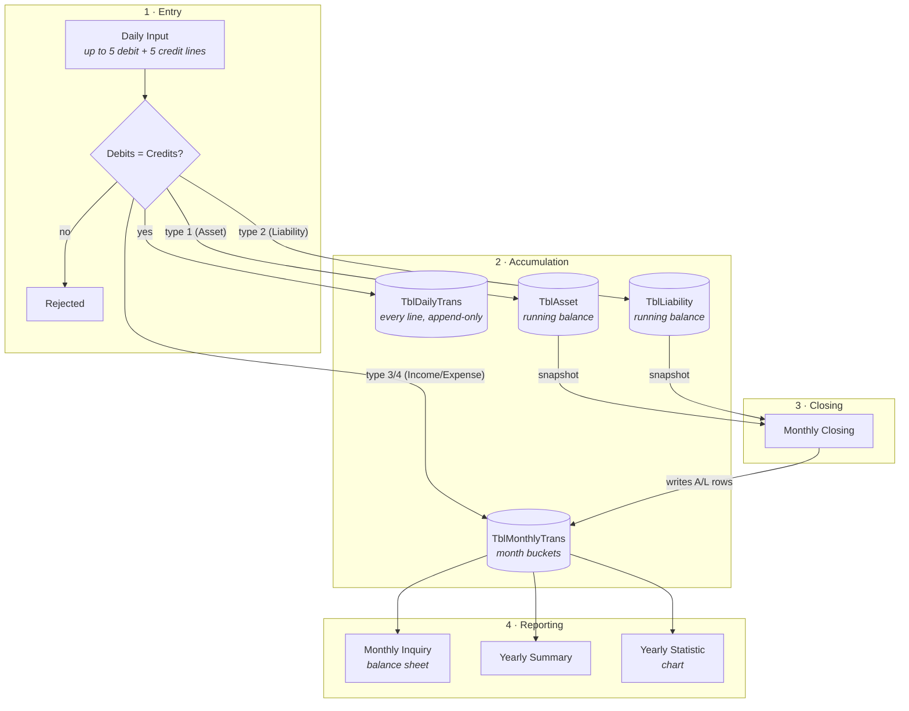
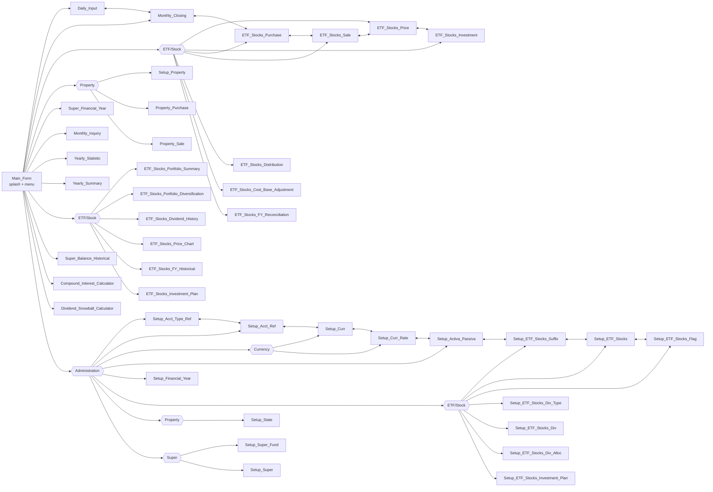

# Financial Balance

A Windows Forms double-entry bookkeeping application for tracking personal assets, liabilities,
income and expenses across multiple currencies. Transactions are entered daily as balanced
debit/credit vouchers, rolled into monthly buckets, and reported as a balance sheet, a yearly
summary, and a per-account trend chart.

Built with C# on .NET Framework 4.8 against a password-protected Microsoft Access (Jet) database.

---

## Table of contents

- [How it works](#how-it-works)
- [Screens](#screens)
- [Data model](#data-model)
- [Posting rules](#posting-rules)
- [Conventions](#conventions)
- [Multi-currency handling](#multi-currency-handling)
- [Project layout](#project-layout)
- [Building and running](#building-and-running)
- [Configuration](#configuration)
- [Implementation notes](#implementation-notes)

---

## How it works

Money moves through the system in three stages: **entry**, **accumulation**, and **closing**.



The key asymmetry: **income and expense accumulate into `TblMonthlyTrans` continuously** as you
enter transactions, whereas **asset and liability rows are written into `TblMonthlyTrans` only when
you run a monthly closing**. Assets and liabilities live as running balances (a *stock*) that the
closing snapshots; income and expense are *flows* bucketed by month as they happen.

Closing a month is idempotent — it deletes existing `A`/`L` rows for that month before re-inserting
them, so you can safely re-close.

---

## Screens

Every form is a full-screen window that hides its predecessor; there is no MDI container. The
`Administration` menu is reachable from `Main_Form`, and each setup form carries a menu strip
letting you hop directly between the other setup forms.

Related pages are collected into submenus rather than sitting flat:

| Menu | Submenu | Contains |
| --- | --- | --- |
| `Process` | **ETF/Stock** | ETF/Stock Price, ETF/Stock Investment, ETF/Stock Purchase, ETF/Stock Sale, ETF/Stock Distribution/Dividend, ETF/Stock Cost Base Adjustment, ETF/Stock Financial Year Reconciliation |
| `Inquiry` | **ETF/Stock** | ETF/Stock Portfolio Summary, ETF/Stock Portfolio Diversification, ETF/Stock Dividend History, ETF/Stock Price Chart, ETF/Stock Financial Year Historical, ETF/Stock Investment Plan |
| `Administration` | **Currency** | Currency Setup, Currency Rate Setup |
| `Administration` | **ETF/Stock** | ETF/Stock Suffix Setup, ETF/Stock Setup, ETF/Stock Portfolio Code Setup, ETF/Stock Diversification Type Setup, ETF/Stock Diversification Setup, ETF/Stock Diversification Allocation, ETF/Stock Investment Plan Setup |
| `Process` | **Property** | Property Setup, Property Purchase, Property Sale |
| `Administration` | **Property** | State Setup |
| `Administration` | **Super** | Super Fund Setup, Super Setup |

`Process` also carries **Super** as a single entry of its own, after the ETF/Stock submenu —
one page rather than a group. `Inquiry` likewise carries **Super Balance & Historical Data**
after its own ETF/Stock submenu. `Calculator` holds both its pages — **Compound Interest
Calculator** and **Dividend Snowball Calculator** — directly, with no submenu between.

The same grouping applies to each form's own menu strip, not just `Main_Form`. Because a form
never lists itself, a submenu can hold one fewer entry there — from `Setup_Curr` the **Currency**
submenu offers only Currency Rate Setup, and it disappears to a single child rather than being
flattened, so the layout stays the same everywhere.



| Form | Purpose |
| --- | --- |
| `Main_Form` | Splash screen with an animated marquee, clock, version label. Enables the transaction menus only once `TblAcctRef` has at least one row. |
| `Daily_Input` | Enter, amend or delete a dated voucher. Up to 5 debit and 5 credit lines; refuses to save unless the two sides balance. |
| `Monthly_Closing` | Snapshots `TblAsset` and `TblLiability` into `TblMonthlyTrans` for a chosen month. Defaults to the month after the last close. |
| `ETF_Stocks_Purchase` | Add / update / delete ETF and stock **buys** for one date. |
| `ETF_Stocks_Sale` | Add / update / delete ETF and stock **sells** for one date. A sale is built against the purchase lots it draws from, which it then settles. |
| `ETF_Stocks_Price` | Daily closing price per ticker. Entered by hand, or pulled from Yahoo Finance for tickers flagged `In_YahooFinance`. |
| `ETF_Stocks_Investment` | Cash paid into and taken out of each portfolio. Every movement is kept; the portfolio's running `Cash` moves with it. |
| `ETF_Stocks_Distribution` | Shown as **ETF/Stock Distribution/Dividend**. Distributions and dividends paid per ticker per portfolio, with the units they were paid on. |
| `ETF_Stocks_Cost_Base_Adjustment` | Shown as **ETF/Stock Cost Base Adjustment**. Records a per-year adjustment to a holding's cost base, and can spread it across the purchase lots that year rests on. |
| `ETF_Stocks_FY_Reconciliation` | Shown as **ETF/Stock Financial Year Reconciliation**. One financial year's result per portfolio, with an entry section that defaults every figure from the rest of the database. |
| `Super_Financial_Year` | Shown as **Super**. One financial year's result per super account — what went in, what the fund returned, what it cost, and what came out at the end. |
| `Super_Balance_Historical` | Shown as **Super Balance & Historical Data**. Read-only, in two parts: where every super account stands, then one account's full year-by-year history. |
| `Monthly_Inquiry` | Balance sheet for one month: assets (split current / non-current), liabilities, income, expense, and net worth, in IDR and AUD. |
| `Yearly_Summary` | Full-year income and expense breakdown with totals. |
| `Yearly_Statistic` | Ten-year trend for any Asset, Liability, Income or Expense account — or a whole category — drawn with `System.Windows.Forms.DataVisualization` charting. |
| `ETF_Stocks_Portfolio_Summary` | Unsold holdings for a chosen portfolio, optionally main portfolios only — summarised per ticker, or drilled into one ticker's individual purchases. |
| `ETF_Stocks_Portfolio_Diversification` | The same holdings re-cut as one pie chart per diversification type. |
| `ETF_Stocks_Dividend_History` | What the holdings have paid — summarised per ticker, or every payment for one ticker, optionally within one financial year. Exports to Excel. |
| `ETF_Stocks_Price_Chart` | One ticker's recorded price drawn as a line over time, at most eight points wide, optionally narrowed to one financial year. |
| `ETF_Stocks_FY_Historical` | Shown as **ETF/Stock Financial Year Historical**. Read-only view of one financial year's stored reconciliation rows, with twelve totals across the selection and an Excel export. |
| `ETF_Stocks_Investment_Plan` | Shown as **ETF/Stock Investment Plan**. Applies an investment plan to an amount of money: what each ticker's share comes to, the same three diversification pies, and an Excel export. |
| `Compound_Interest_Calculator` | Shown as **Compound Interest Calculator**. Works out what savings grow to, with a year-by-year chart and table. Reads and writes nothing. |
| `Dividend_Snowball_Calculator` | Shown as **Dividend Snowball Calculator**. Projects a dividend income stream year by year — contributions, a growing yield, reinvestment — and how long a target income takes to reach. Reads and writes nothing. |
| `Setup_Acct_Type_Ref` | Maintains the four account types. |
| `Setup_Acct_Ref` | Chart of accounts — code, name, type, currency, display order, current-asset flag. |
| `Setup_Curr` | Currency codes and names. |
| `Setup_Curr_Rate` | Dated exchange rates. |
| `Setup_Activa_Passiva` | Shown as **Asset Liability Setup**. Directly set the opening/running balance of an asset or liability account. |
| `Setup_Financial_Year` | Shown as **Financial Year Setup**. Names a financial year and the dates it runs between. |
| `Setup_ETF_Stocks_Suffix` | Maintains the list of ETF/stock exchange suffixes. |
| `Setup_ETF_Stocks` | Maintains ETF/stock tickers. `Full_Ticker` is derived, not typed. |
| `Setup_ETF_Stocks_Flag` | Shown as **ETF/Stock Portfolio Code Setup**. Maintains portfolio codes, descriptions and the `Is_Main` marker. |
| `Setup_ETF_Stocks_Div_Type` | Maintains the diversification types — the categories a holding can be classified along. |
| `Setup_ETF_Stocks_Div` | Maintains the values within each type. |
| `Setup_ETF_Stocks_Div_Alloc` | Splits a ticker across one diversification type's values. Refuses to save unless the type totals 100. |
| `Setup_ETF_Stocks_Investment_Plan` | Shown as **ETF/Stock Investment Plan Setup**. Named investment plans, the percentage of each that a ticker is meant to take, and the diversification splits that implies. |
| `Property_Sale` | Shown as **Property Sale**. What one property fetched when it was sold — price, and the costs of selling. One record per property. |
| `Property_Purchase` | Shown as **Property Purchase**. What one property cost to buy — price, stamp duty and the costs around it, the deposit and the loan it started with. One record per property. |
| `Setup_Property` | Shown as **Property Setup**. Maintains the properties — name and address. What happened to each one lives on its purchase and sale records. |
| `Setup_State` | Shown as **State Setup**. Maintains the Australian states and territories — a three-character code and its full name. |
| `Setup_Super_Fund` | Shown as **Super Fund Setup**. Maintains the list of super funds. |
| `Setup_Super` | Shown as **Super Setup**. Maintains super accounts — a code, a name and the fund each belongs to. |

---

## Data model

Thirty-two tables. **No foreign keys or relationships are defined in the database** — the links below are
conventions the application enforces in code, not constraints Access enforces for you.

```mermaid
erDiagram
    TblAcctTypeRef  ||--o{ TblAcctRef      : "classifies"
    TblCurrCode     ||--o{ TblAcctRef      : "denominates"
    TblCurrCode     ||--o{ TblCurrRate     : "priced by"
    TblAcctRef      ||--o{ TblDailyTrans   : "posted to"
    TblAcctRef      ||--o| TblAsset        : "balance of (type 1)"
    TblAcctRef      ||--o| TblLiability    : "balance of (type 2)"
    TblAcctRef      ||--o{ TblMonthlyTrans : "bucketed by"
    TblETFStocksExchangeSuffix ||--o{ TblETFStocks : "suffixes"
    TblETFStocks    ||--o{ TblETFStocksPurchase : "bought"
    TblETFStocks    ||--o{ TblETFStocksSale : "sold"
    TblCurrCode     ||--o{ TblETFStocksPurchase : "denominates"
    TblCurrCode     ||--o{ TblETFStocksSale : "denominates"
    TblETFStocks    ||--o{ TblETFStocksPrice : "priced by"
    TblETFStocksPortfolioCode ||--o{ TblETFStocksPurchase : "codes"
    TblETFStocksPortfolioCode ||--o{ TblETFStocksSale : "codes"
    TblETFStocksPortfolioCode ||--o{ TblETFStocksDistributionDividend : "codes"
    TblETFStocksPortfolioCode ||--o{ TblETFStocksFinancialYear : "codes"
    TblFinancialYear ||--o{ TblETFStocksFinancialYear : "covers"
    TblETFStocks    ||--o{ TblETFStocksDistributionDividend : "pays"
    TblCurrCode     ||--o{ TblETFStocksDistributionDividend : "denominates"
    TblETFStocksPortfolioCode ||--o| TblETFStocksPortfolio : "describes"
    TblETFStocksPortfolioCode ||--o{ TblETFStocksPortfolioInvestment : "codes"
    TblETFStocksPortfolio ||--o{ TblETFStocksPortfolioInvestment : "moved by"
    TblCurrCode     ||--o{ TblETFStocksPortfolio : "denominates"
    TblETFStocksDiversificationType ||--o{ TblETFStocksDiversification : "groups"
    TblETFStocksDiversification ||--o{ TblETFStocksDiversificationAllocation : "allocated by"
    TblETFStocksInvestmentPlan ||--o{ TblETFStocksInvestmentPlanAllocation : "allocates"
    TblETFStocks    ||--o{ TblETFStocksInvestmentPlanAllocation : "targeted by"
    TblSuperFund    ||--o{ TblSuper : "holds"
    TblSuper        ||--o{ TblSuperFinancialYear : "reported by"
    TblFinancialYear ||--o{ TblSuperFinancialYear : "covers"
    TblCurrCode     ||--o{ TblSuperFinancialYear : "denominates"
    TblETFStocks ||--o{ TblETFStocksDiversificationAllocation : "split across"
    TblState        ||--o{ TblProperty : "locates"
    TblProperty     ||--o| TblPropertyPurchase : "was bought for"
    TblProperty     ||--o| TblPropertySale : "was sold for"

    TblAcctTypeRef {
        text Acct_Type PK "1 char: 1-4"
        text Acct_Type_Name
    }
    TblAcctRef {
        text Acct_Code PK "5 chars"
        text Acct_Name
        text Acct_Type FK
        text Curr_Code FK
        int  Acct_Order "display order"
        bool Current_Asset "splits current vs non-current"
    }
    TblCurrCode {
        text Curr_Code PK "3 chars"
        text Curr_Name
    }
    TblCurrRate {
        text    Curr_Date PK "yyyyMMdd"
        text    Curr_Code PK
        decimal Curr_Rate "IDR per unit"
    }
    TblDailyTrans {
        text    Trans_Date PK "yyyyMMdd"
        text    Trans_Seq PK "3 chars"
        text    Trans_Type PK "D or C"
        text    Acct_Code PK
        decimal Balance_Curr "account currency"
        decimal Rate
        decimal Balance "Balance_Curr x Rate"
    }
    TblAsset {
        text    Acct_Code PK
        decimal Balance "running, account currency"
    }
    TblLiability {
        text    Acct_Code PK
        decimal Balance "running, account currency"
    }
    TblMonthlyTrans {
        text    Trans_Month PK "yyyyMM"
        text    Acct_Code PK
        decimal Balance "account currency"
    }
    TblETFStocksExchangeSuffix {
        text Suffix PK "10 chars"
    }
    TblETFStocks {
        text Ticker "20 chars"
        text Exchange_Suffix "from the suffix list"
        text Full_Ticker PK "derived, never typed"
        bool In_YahooFinance
    }
    TblETFStocksPurchase {
        text    Trans_Date "yyyyMMdd"
        text    Full_Ticker "joins TblETFStocks"
        text    Currency "3 chars"
        decimal Unit "4 dp"
        decimal Original_Cost_Base "2 dp, as first bought"
        decimal Cost_Base "2 dp"
        decimal Fee "2 dp"
        decimal Original_Total_Cost_Base "2 dp, as first bought"
        decimal Total_Cost_Base "2 dp"
        decimal Real_Total_Cost_Base "2 dp"
        bool    Is_Sold
        text    Portfolio_Code "from the portfolio code list"
        text    Sold_Date "yyyyMMdd, null unless sold"
        text    Sale_Id "50 chars, the sale that closed this lot"
    }
    TblETFStocksSale {
        text    Trans_Date "yyyyMMdd"
        text    Sale_Id "50 chars, stamped on the sale and its lots"
        text    Full_Ticker "joins TblETFStocks"
        text    Currency "3 chars"
        decimal Unit "4 dp"
        decimal Selling_Price_Per_Unit "2 dp"
        decimal Selling_Total_Amount "2 dp"
        decimal Profit_Or_Loss_On_Paper "2 dp"
        decimal Real_Profit_Or_Loss "2 dp"
        text    Portfolio_Code "5 chars"
    }
    TblETFStocksPrice {
        text    Price_Date PK "yyyyMMdd"
        text    Full_Ticker PK "joins TblETFStocks"
        decimal Price "2 dp"
        text    Currency "3 chars"
    }
    TblETFStocksPortfolioCode {
        text Portfolio_Code PK "5 chars"
        text Description "50 chars"
        bool Is_Main
    }
    TblETFStocksInvestmentPlan {
        text    Name "50 chars, the plan's name"
    }
    TblETFStocksInvestmentPlanAllocation {
        text    Investment_Plan_Name "50 chars, names TblETFStocksInvestmentPlan.Name"
        text    Full_Ticker "31 chars, joins TblETFStocks"
        decimal Allocation "2 dp, a percentage"
    }
    TblSuperFund {
        text    Name "100 chars, the fund's name"
    }
    TblSuper {
        text    Super_Code "5 chars"
        text    Name "100 chars"
        text    Super_Fund_Name "100 chars, names TblSuperFund.Name"
    }
    TblSuperFinancialYear {
        text    Financial_Year "9 chars, joins TblFinancialYear"
        text    Super_Code "5 chars, joins TblSuper"
        text    Currency "3 chars"
        decimal Opening_Balance "2 dp"
        decimal Contribution "2 dp"
        decimal Transfer_In "2 dp"
        decimal Investment_Returns "2 dp"
        decimal Percentage_Investment_Returns "2 dp"
        decimal Admin_Fee "2 dp"
        decimal Insurance_Premium "2 dp"
        decimal Goverment_Tax "2 dp, spelt as the app spells it"
        decimal Goverment_Tax_Benefit "2 dp"
        decimal Investment_Profit_Or_Loss "2 dp"
        decimal Percentage_Investment_Profit_Or_Loss "2 dp"
        decimal Total_Surplus_Or_Minus "2 dp"
        decimal Percentage_Total_Surplus_Or_Minus "2 dp"
        decimal Transfer_Out "2 dp"
        decimal Ending_Balance "2 dp"
    }
    TblETFStocksCostBaseAdjustment {
        text    Financial_Year "9 chars, joins TblFinancialYear"
        text    Portfolio_Code "5 chars"
        text    Full_Ticker "joins TblETFStocks"
        text    Currency "3 chars"
        text    Adjustment_Type "+ or -"
        decimal Adjustment "2 dp, always positive"
    }
    TblETFStocksFinancialYear {
        text    Financial_Year "joins TblFinancialYear"
        text    Portfolio_Code "5 chars"
        text    Currency "3 chars"
        decimal Previous_Investment "2 dp"
        decimal Investment "2 dp"
        decimal Sold_Amount "2 dp"
        decimal Ending_Investment "2 dp"
        decimal On_Paper_Ending_Value "2 dp"
        decimal On_Paper_Profit_Or_Loss "2 dp"
        decimal Percentage_On_Paper_Profit_Or_Loss "2 dp"
        decimal Total_DistributionDividend "2 dp"
        decimal Total_DistributionDividend_Yield "2 dp"
        decimal Total_DistributionDividend_Reinvested "2 dp"
        decimal Total_DistributionDividend_Not_Reinvested "2 dp"
        decimal Capital_Gains_On_Paper "2 dp"
        decimal Real_Capital_Gains "2 dp"
        decimal Investment_Loan_Interest "2 dp"
        decimal Tax "2 dp"
        decimal Real_Profit_Or_Loss "2 dp"
        decimal Percentage_Real_Profit_Or_Loss "2 dp"
    }
    TblFinancialYear {
        text Name PK "9 chars"
        text Start_Date "yyyyMMdd"
        text End_Date "yyyyMMdd"
    }
    TblState {
        text Name PK "3 chars, the state code"
        text Long_Name "50 chars"
    }
    TblPropertySale {
        long    Property_Id "joins TblProperty, one row per property"
        text    Sold_Date "yyyyMMdd"
        decimal Sold_Price "2 dp"
        decimal Conveyancing_Cost "2 dp"
        decimal Sale_Agent_Cost "2 dp"
        decimal Settlement_Cost "2 dp"
        decimal Other_Cost "2 dp"
    }
    TblPropertyPurchase {
        long    Property_Id "joins TblProperty, one row per property"
        text    Purchase_Date "yyyyMMdd"
        decimal Purchase_Price "2 dp"
        decimal Stamp_Duty "2 dp"
        decimal Conveyancing_Cost "2 dp"
        decimal Building_Pest_Inspection_Cost "2 dp"
        decimal Buyers_Agent_Cost "2 dp"
        decimal Settlement_Cost "2 dp"
        decimal Other_Cost "2 dp"
        decimal Down_Payment "2 dp"
        decimal Initial_Loan "2 dp"
        decimal Percentage_Ownership "2 dp, 0 to 100"
    }
    TblProperty {
        long Property_Id PK "handed out by the page, not an AutoNumber"
        text Name "50 chars"
        text Address "150 chars"
        text Suburb "50 chars"
        text State "3 chars, a code from TblState"
        text Post_Code "4 chars"
    }
    TblETFStocksDistributionDividend {
        text    Pay_Date "yyyyMMdd"
        text    Full_Ticker "joins TblETFStocks"
        text    Portfolio_Code "5 chars"
        text    Currency "3 chars"
        decimal Entitled_Unit "4 dp"
        decimal Amount_Per_Unit "4 dp"
        decimal Total_Amount "2 dp"
        bool    Is_Reinvested
    }
    TblETFStocksPortfolio {
        text    Portfolio_Code PK "5 chars"
        text    Currency "3 chars"
        decimal Cash "2 dp, running balance"
        decimal Investment_Amount "2 dp"
    }
    TblETFStocksPortfolioInvestment {
        text    Investment_Date "yyyyMMdd"
        text    Portfolio_Code "joins TblETFStocksPortfolioCode"
        text    Investment_Type "1 char: + or -"
        text    Currency "3 chars"
        decimal Amount "2 dp, always positive"
    }
    TblETFStocksDiversificationType {
        text Name PK "50 chars"
    }
    TblETFStocksDiversification {
        text Type PK "matches a Type Name"
        text Name PK "50 chars"
    }
    TblETFStocksDiversificationAllocation {
        text Full_Ticker PK "joins TblETFStocks"
        text Diversification_Type PK "50 chars"
        text Diversification_Name PK "50 chars"
        int  Percentage "whole number"
    }
```



### Reference data

`TblAcctTypeRef` is fixed at four rows:

| `Acct_Type` | Name | Code prefix |
| --- | --- | --- |
| `1` | Asset | `A` |
| `2` | Liability | `L` |
| `3` | Income | `I` |
| `4` | Expense | `E` |

`TblETFStocks.Full_Ticker` is **derived, never entered by hand**. `Setup_ETF_Stocks`
recomputes it whenever the ticker or the suffix changes:

```
Exchange_Suffix == "None"  ->  Full_Ticker = Ticker
otherwise                  ->  Full_Ticker = Ticker + "." + Exchange_Suffix
```

So suffixes are stored **without** a leading dot — `AX`, not `.AX` — since the dot is added
by the rule. `Full_Ticker` is the table's primary key.

#### Financial years

`Setup_Financial_Year` maintains `TblFinancialYear`: a `Name` of up to 9 characters (`FY2025-26`
fits exactly) and the two dates the year runs between, both stored `yyyyMMdd` like every other date
in the database and shown as `dd-MMM-yyyy`. The list reads chronologically, by `Start_Date`.

`Name` is treated as the key, the same way `Full_Ticker` is on ETF/Stock Setup: **Add / Update** is
an upsert on it and **Delete** matches on it. Editing a row remembers the name it was loaded under,
so changing the name *renames that year* rather than leaving the old row behind — and renaming onto
a name that already exists is refused rather than merging two years into one. **Clear** abandons the
edit and returns to entering a new year.

A year whose `End_Date` falls before its `Start_Date` is rejected.

`TblETFStocksFinancialYear` holds one row per financial year per portfolio code, carrying that
year's opening and closing investment, what was sold, the on-paper and realised results,
distribution totals, capital gains, loan interest and tax. **No screen reads or writes either table
yet** beyond Financial Year Setup maintaining the years themselves — both stand ready for whatever
is built on them.

### ETF/stock purchase and sale rules

Buying and selling are **two pages**, each owning one table: **ETF/Stock Purchase** writes
`TblETFStocksPurchase`, **ETF/Stock Sale** writes `TblETFStocksSale`. There is no stored
transaction type — the table a row lives in *is* its type. Each page shows its own rows for a
chosen date and nothing else, so neither grid carries a column that is always blank.

> These were one page, `ETF_Stocks_Transaction`, with a Buy/Sell dropdown that swapped the entry
> area. Splitting it removed one capability: **a saved row can no longer change type.** On the
> combined page, updating a row with the dropdown flipped deleted it from one table and inserted
> it into the other. To do that now, delete it on the page that owns it and add it on the other.
>
> The rules below apply to whichever page owns the field, and the two pages cross-link through
> the `Process` ▸ ETF/Stock menu.

| Field | Rule |
| --- | --- |
| `Trans_Date` | From the date picker, stored `yyyyMMdd`. |
| `Unit` | Buy: typed, numeric, not negative, at most 4 decimal places. **Sell: derived** — see below. |
| `Cost_Base`, `Fee` | Buy only. Numeric, not negative, at most 2 decimal places. |
| `Total_Cost_Base` | Buy only, derived: `round(Unit x Cost_Base, 2) + Fee`. Not editable. |
| `Real_Total_Cost_Base` | Buy only. `0` when the **Reinvestment** box is ticked, otherwise `Total_Cost_Base`. **Add, Update and Delete all move the portfolio's running balance** by it — see below. |
| `Original_Cost_Base` | Buy only. Typed, with the same guard as `Cost_Base` — digits and a decimal point, no minus. Holds what the lot originally cost, alongside the `Cost_Base` that later processing may change. |
| `Original_Total_Cost_Base` | Buy only, derived: `round(Unit x Original_Cost_Base, 2) + Fee`. Not editable. The same shape as `Total_Cost_Base`, the Fee included — the only difference between the two is which cost base they are worked out from. |
| `Is_Sold` | Buy only. The Sold checkbox. |
| `Sold_Date` | Buy only. Shown only while Sold is ticked; stored `yyyyMMdd`, otherwise `Null`. |
| `Sale_Id` | **Not typed anywhere.** Generated by **ETF/Stock Sale** when a sale is added, and written to the sale row *and* to every purchase lot that sale closes. A purchase that has never been sold has none. |
| `Portfolio_Code` | **Both pages**, from a dropdown labelled **Portfolio** filled from `TblETFStocksPortfolioCode` and defaulting to `OB`, with the chosen code's `Description` shown beside it (`-` when blank). On **ETF/Stock Sale** it also **filters the lots on offer** — see below. It is the first column of the purchase grid and the last of the sale grid. |
| `Selling_Price_Per_Unit` | Sell only. Numeric, not negative, at most 2 decimal places. |
| `Selling_Total_Amount` | Sell only, derived: `round(Unit x Selling_Price_Per_Unit, 2)`. Not editable. |
| `Profit_Or_Loss_On_Paper` | Sale only, derived on **Add** from the lots being sold and restated on **Update** — see below. Shown in the sale grid, red below zero and green above. |
| `Real_Profit_Or_Loss` | Sale only, the same but ignoring what the reinvested lots cost — see below. Shown in the sale grid, coloured the same way. |

> **The two totals differ only by their cost bases.** Both are
> `round(Unit x <cost base>, 2) + Fee`, so the Fee lands in each of them once. With 4 units, an
> original cost of `11.11`, a cost base of `13.50` and a `2.00` fee they read `46.44` and
> `56.00` — `9.56` apart, which is exactly `round(4 x 13.50, 2) - round(4 x 11.11, 2)`.
>
> The one place the Fee is absent from both is the remainder row left by a part sale: that row
> is written with `Fee = 0.00`, because the fee belonged to the original purchase and has
> already been accounted for.

**ETF/Stock Purchase** shows Full Ticker, Currency, Unit, Original Cost Base, Cost Base, Fee, the
three totals, Reinvestment, Sold with its date, and Portfolio. **ETF/Stock Sale** shows Full
Ticker, Currency, a read-only Unit, Selling Price/Unit, Selling Total Amount, its own Portfolio,
and the lot grid beneath. Each page validates only its own fields, and each Portfolio dropdown
carries a description label beside it.

#### Both pages move the portfolio's balance

`TblETFStocksPortfolio` holds one running row per portfolio code — its `Cash` and the
`Investment_Amount` bought out of that cash. **Buying and selling both move it**, and between them
they keep `Investment_Amount` meaning one thing throughout: **the real money currently invested**.

**ETF/Stock Purchase.** `Real_Total_Cost_Base` is what a purchase actually cost, so it shifts that
figure out of the cash and into the invested amount:

```
Cash              = Cash - <shift>
Investment_Amount = Investment_Amount + <shift>
```

| Button | `<shift>` |
| --- | --- |
| **Add** | `+ Real_Total_Cost_Base` |
| **Update** | `new Real_Total_Cost_Base - stored Real_Total_Cost_Base` — the difference, so only what changed moves |
| **Delete** | `- stored Real_Total_Cost_Base`, giving the whole cost back |

**ETF/Stock Sale.** The proceeds come into the cash, and the real cost of the lots the sale closed
leaves the invested amount — releasing exactly what the purchase put there:

```
Cash              = Cash + Selling_Total_Amount
Investment_Amount = Investment_Amount - <real cost of the lots closed>
```

| Button | Movement |
| --- | --- |
| **Add** | cash `+ Selling_Total_Amount`, invested `-` the closed lots' `Real_Total_Cost_Base` |
| **Update** | cash by the **difference in proceeds** only. Which lots a sale closed is fixed by its `Sale_Id` and an update does not re-settle them, so the released cost is the same before and after |
| **Delete** | the whole sale undone: cash `- stored Selling_Total_Amount`, invested `+` the closed lots' cost, which are held again |

The gap between the two sale figures is the sale's **real profit**, so net worth moves by exactly
that. Sell 4 units for `36.00` out of lots that cost `25.00` real and the cash rises `36.00` while
the invested amount falls `25.00` — `11.00` better off, which is what `Real_Profit_Or_Loss` records.

A **reinvested** lot has a `Real_Total_Cost_Base` of `0`, so it moves nothing on either page: buying
one costs no cash, and selling one releases nothing. The row is still recorded either way. An
**Update** that changes neither the cost nor the proceeds likewise moves nothing.

**The two pages round-trip.** Buy a lot for `800.00` and the invested amount rises by `800.00`;
sell it and the same `800.00` comes back out, whatever it sold for. Delete the sale and it goes
back in, with the lot held again.

##### The details that are easy to get wrong

- **Update and Delete use the *stored* figures, not what the boxes are showing.** Both act on the
  row as it stands in the database, and the entry fields — including the derived
  `Real Total Cost Base` and `Selling Total Amount` — may have been edited since the row was
  selected. Reading the box would give back the wrong amount: select a `1,205.00` purchase, change
  the Unit on screen, press Delete, and the box may read `11,993.00` while what actually left the
  portfolio was `1,205.00`. A sale's released cost is likewise read from **the lots stamped with
  its `Sale_Id`**, before Delete releases them.
- **Changing the Portfolio as part of an Update moves the whole thing between balances.** On a
  purchase the stored cost goes back to the old portfolio in full and the new cost is taken from
  the new one in full; on a sale the proceeds and the released cost move together the same way —
  not the difference, which would leave the old portfolio still carrying figures that are no
  longer its own. Both portfolios are named in the success message.
- **The movement happens once per row touched.** Identical rows are indistinguishable without a
  key, so one Update or Delete can affect several — the page already warns how many. The balance
  moves by that many multiples, or it would drift by every row but the first.
- **A portfolio code with no running row yet gets one written.** The codes live in
  `TblETFStocksPortfolioCode` and the balances in `TblETFStocksPortfolio`, so a purchase can name a
  code that has never had a balance. Updating nothing would lose the movement silently; this is
  what `ETF_Stocks_Investment` does with a movement against a new portfolio.
- **A purchase or sale in a currency the portfolio is not held in is refused**, on both Add and
  Update, before anything is written. `Cash` and `Investment_Amount` are single figures and amounts
  in different currencies cannot be added together — the same rule `ETF_Stocks_Investment`
  applies. Change the currency, or edit the portfolio first.
- **The success message says where the portfolio now stands**, so the movement is visible without
  going to another page.

> **A sale with no `Sale_Id`** — only rows predating that field — cannot say which lots it
> closed, so it releases nothing from the invested amount. Its proceeds still move the cash.

#### The Sale Id

Every sale is stamped with an identifier built when the sale is added:

```
<Trans_Date> _ <Full_Ticker> _ <Portfolio_Code> _ <HHmmss>
```

for example `20260906_ZZSID.AX_OB_154511`. The same value goes onto the sale row and onto every
purchase lot the sale closes, so the two sides can be tied back together — one sale that settles
three lots leaves the same id on all four rows. **ETF/Stock Purchase** shows it in a `Sale Id`
column, beside a `Sold Date` column showing `Sold_Date` as `dd-MMM-yyyy`; **ETF/Stock Sale** shows
it as the first column of its own table.

The **remainder row left by a part sale is deliberately not stamped** — those units were not sold,
so they carry no sale id and no sold date, and they stay available to a later sale.

> **The id can be too long for its column, and the page checks before writing.** `Sale_Id` holds
> 50 characters. The parts add up to 8 + 1 + `Full_Ticker` + 1 + `Portfolio_Code` + 1 + 6, and
> `Full_Ticker` alone can be 31 with `Portfolio_Code` 5 — **53 at worst**. Real tickers are far
> shorter (`ZZSID.AX_OB` gives 27), but rather than let Access reject the insert with an opaque
> error, **ETF/Stock Sale** measures the id first and refuses with a message naming the length.
> Nothing is written when that happens. Widening the column to 60 would remove the limit
> entirely.

#### The purchase table

**ETF/Stock Purchase** lists its own rows for the chosen date, portfolio first:

```
Portfolio Code | Full Ticker | Currency | Unit |
Original Cost Base | Cost Base | Fee |
Original Total Cost Base | Total Cost Base | Real Total Cost Base |
Reinvestment | Sold | Sold Date | Sale Id
```

`Reinvestment` and `Sold` read `Y` or `N` — the first derived from `Real_Total_Cost_Base == 0`
rather than stored, the second from `Is_Sold`. `Sold Date` shows `Sold_Date` as `dd-MMM-yyyy` and
`Sale Id` the sale that closed the lot; both are blank while the lot is still held.

#### The sale table

**ETF/Stock Sale** lists its own rows for the chosen date:

| Column | Source |
| --- | --- |
| `Sale Id` | `Sale_Id` — blank on a sale recorded before the column existed |
| `Full Ticker`, `Currency`, `Unit` | as stored |
| `Selling Price/Unit`, `Selling Total Amount` | as stored |
| `Portfolio Code` | `Portfolio_Code`, `-` when none |
| `Profit/Loss On Paper` | `Profit_Or_Loss_On_Paper`, with a dollar sign |
| `Real Profit/Loss` | `Real_Profit_Or_Loss`, with a dollar sign |

The two profit columns are **coloured by sign** — red below zero, green above it, and left alone
at exactly zero, the same rule the reconciliation pages use. A loss reads `-$56.78`, with the
minus outside the dollar sign rather than Excel's bracketed form.

#### Reading a stored sale back

Picking a row in the sale table turns the page from *entering* a sale into *reading one back*:

- A **Sale Id** line appears under Unit, showing that sale's `Sale_Id`.
- **Unit** and **Selling Total Amount** are filled from the stored row rather than recomputed.
- **Add is hidden** — there is nothing to add while a stored sale is on screen.
- The unsold-lot list is replaced by **Purchases closed by this sale**, every
  `TblETFStocksPurchase` row carrying that `Sale_Id`:

| Column | Source |
| --- | --- |
| `Purchase Date` | `Trans_Date`, shown `dd-MMM-yyyy` |
| `Unit` | `Unit` |
| `Purchase Price / Unit` | `Cost_Base`, with a dollar sign |
| `Purchase Amount` | `Total_Cost_Base`, with a dollar sign |
| `Real Purchase Amount` | `Real_Total_Cost_Base`, with a dollar sign — `0` for a reinvested lot |

Two totals sit under that table, adding up the two money columns above them:

| Label | Adds up |
| --- | --- |
| `Total Purchase Amount` | every `Purchase Amount` |
| `Total Real Purchase Amount` | every `Real Purchase Amount` |

Both carry a dollar sign under the usual rule — only when every lot that fed the total shares one
dollar currency, since adding AUD to USD gives an amount in neither. They are the very figures
Update subtracts from the proceeds, so what the profit is worked out from is on screen rather than
implied.

Clearing the entry area, or finishing an Add, Update or Delete, puts the page back into entry
mode: Add returns and the unsold lots come back.

**Update** restates both profit figures from that table rather than trusting what was stored:

```
Profit_Or_Loss_On_Paper = Selling_Total_Amount - SUM(Purchase Amount)
Real_Profit_Or_Loss     = Selling_Total_Amount - SUM(Real Purchase Amount)
```

so a reinvested lot, whose real amount is `0`, leaves all of its proceeds as real profit.

> A sale with **no `Sale_Id`** cannot say which lots it closed, so that table is empty and the
> sums would be zero. Restating from that would silently rewrite the profits as the whole
> proceeds, so Update **leaves those two columns alone** for such a sale and changes only the
> fields on screen.

**Delete** releases the holding before removing the sale: every purchase row carrying that
`Sale_Id` has `Is_Sold` set back to false and its `Sold_Date` and `Sale_Id` cleared, so the units
are available to sell again.

> Releasing does not re-merge a lot that the sale split. A part sale leaves a closed row and a
> remainder row; deleting the sale makes both available again, but as **two lots rather than the
> one** they were before. The units and the money are unchanged — only the grouping differs.

#### Selling against lots

A sale is not entered as a bare quantity. **ETF/Stock Sale** always lists the ticker's unsold
purchases **held in the chosen Portfolio** — the grid is part of the page rather than something
a type dropdown reveals — and the units come from the lots they are actually being taken out of.
Changing either the ticker or the Portfolio redraws the list, because units can only be sold out
of the portfolio holding them — selling from one portfolio leaves another's lots alone. The code
chosen here is stored on the sale as its `Portfolio_Code`:

| Column | Source |
| --- | --- |
| `Purchase Date` | `Trans_Date`, shown `dd-MMM-yyyy`. |
| `Unit` | `Unit` — how many are held in that lot. |
| `Purchase Price / Unit` | `Cost_Base` |
| `Real Purchase Amount` | `Real_Total_Cost_Base` — `0` for a reinvested lot, so it is visible as costing nothing. |
| `Sold Unit` | **Editable.** Numeric-only keystrokes, not negative, at most 4 decimal places, and never more than that lot's `Unit`. |

The **Unit** box is read-only and holds the sum of every `Sold Unit`, so `Selling_Total_Amount`
follows the lots automatically. Adding a sale with nothing allocated is refused.

**Add** generates the sale's [`Sale_Id`](#the-sale-id), writes the `TblETFStocksSale` row, then
settles each lot it drew from — stamping that same id on every one, so the sale can find them
again afterwards:

When a **part sale splits a lot**, the remainder row keeps the original figures rather than
starting blank: `Original_Cost_Base` is carried across unchanged (it is a per-unit figure) and
`Original_Total_Cost_Base` is restated for the units that remain. Without that, selling part of
a holding would silently leave rows with no original cost recorded.

| Case | Effect on `TblETFStocksPurchase` |
| --- | --- |
| Whole lot sold | The row is closed as it stands — `Is_Sold = True`, `Sold_Date` set, `Sale_Id` stamped with the sale's id. |
| Part of a lot sold | The row is cut down to the units **sold**, closed and stamped the same way, keeping the original `Fee`; a **new open row** carries the remainder with `Fee = 0` and **no** `Sold_Date` or `Sale_Id`, since those units were not sold. |

So a 10-unit lot at 50.00 with a 9.95 fee, selling 3, leaves a closed `3 @ 50.00` row totalling
`159.95` and an open `7 @ 50.00` row totalling `350.00`. The portfolio still shows 7 units held —
the closed side is the part that left.

#### Profit recorded against a sale

Add also works out what the units being sold originally cost, and stores two figures on the sale
row. Both start from `Selling_Total_Amount` and subtract a cost totalled over the lots the sale
draws from, where each lot contributes:

```
lot cost = round(round(Sold Unit x Purchase Price / Unit, 2) + Fee, 2)
```

The `Fee` there is **that purchase lot's own fee**, not a fee on the sale, and the closed part of a
lot carries the whole of it — the same rule the split below uses.

| Field | Cost subtracted |
| --- | --- |
| `Profit_Or_Loss_On_Paper` | Every lot contributes its `lot cost`. |
| `Real_Profit_Or_Loss` | A lot whose `Real_Total_Cost_Base` is `0` contributes **nothing**; every other lot contributes its `lot cost`. |

So a DRIP lot costs nothing real, and all of its proceeds land in `Real_Profit_Or_Loss` — which is why
`Real_Profit_Or_Loss` is the larger of the two whenever a reinvested lot is sold. Selling 10 units bought
at 100.00 with a 9.95 fee, 5 DRIP units, and 3 of a lot bought at 120.00 with a 5.00 fee, at
150.00 each, gives proceeds of `2,700.00` against `1,924.95` on paper and `1,374.95` real —
`775.05` and `1,325.05`.

This arithmetic deliberately mirrors the settlement below, so the profit on a sale always agrees
with the cost left behind on the closed purchase rows.

> Both figures are written on **Add**, and **restated on Update** — a sale now records which lots
> it closed, through the `Sale_Id` it stamps on them, so its cost basis can be found again. Update
> re-reads those lots and recomputes both profits from the two totals shown under the table. A sale
> carrying no `Sale_Id` cannot name its lots, so Update leaves its profits untouched rather than
> rewriting them from an empty table.
>
> Update still does **not** re-settle the lots themselves: changing the units on a stored sale
> changes the sale row, not which purchases are closed. To change what was sold, delete the sale —
> which releases its lots — and enter it again.

`Total_Cost_Base` is recomputed on both rows, and `Real_Total_Cost_Base` follows the DRIP rule:
**zero stays zero**, so splitting a reinvested lot leaves both halves at `0` rather than
inventing a cost. Because the purchase table has no key, each lot row remembers the values it was
read with and the update matches on all of them.

**Sold Date** is nested one level deeper: it appears only when the Sold box is ticked on a Buy,
and unticking clears the value as well as hiding it, so a stale date cannot survive out of sight.
Both date pickers share the single `MonthCalendar` on the form, routed by a `CalTarget` flag —
picking a transaction date reloads the day's grid, picking a sold date deliberately does not.

The **Reinvestment** checkbox is **not stored**. The form re-derives it on selection as
`Real_Total_Cost_Base == 0` — a lot bought with no real money is one that was reinvested. It was
labelled *DRIP* until it was renamed, and the grid column now reads **Reinvestment** too; only the
identifier `chkDRIP` still carries the older word, so searching the code for the on-screen label
will not find it.

> **Access stores Yes/No `True` as `-1`.** A `WHERE Is_Sold = 1` matches nothing and fails
> silently. Compare against `True`/`False` instead — the same applies to `In_YahooFinance` and
> `Is_Main`, which are written as literals rather than `1`/`0`. Likewise, `Currency` is a reserved
> word: it needs brackets in DDL (`[Currency]`), though plain DML tolerates it.
>
> A Yes/No column **added to an existing table lands as `False` on every row**, so a migration that
> wants `Yes` has to follow the `ALTER` with an `UPDATE`.

Neither table has a primary key — the same ticker can be bought twice on one day, so no
combination of columns is reliably unique. Update and delete therefore match on **all of the
row's original column values**, and each grid row remembers which table it came from. If two
identical transactions exist on one date, the form says so and asks before touching both.
Changing an existing row's type moves it between the tables (delete then insert), since an
in-place update cannot cross tables.

### Diversification

Holdings can be classified along several axes at once. `TblETFStocksDiversificationType` names the
axes, and `TblETFStocksDiversification` holds the values available within each one — its `Type`
column carries the `Name` of a row in the type table.

| Type | Values |
| --- | --- |
| `Asset Class` | Stock, Commodity, Defensive Asset |
| `Investment Style` | High Growth, High Yield, Market Capitalization Driven, Other |
| `Geographic` | Australia, US, Ex Australia and Ex US, Other |

The diversification table is keyed on **`(Type, Name)`**, so the same name can appear under two
different types — `Other` exists under both Investment Style and Geographic — while a duplicate
within one type is rejected.

Deleting a type that still has values is refused with a count of what depends on it. Nothing in
the database enforces that link, so the check lives in `Setup_ETF_Stocks_Div_Type`.

#### Allocation

`Setup_ETF_Stocks_Div_Alloc` splits one ticker across the values of **one type at a time**. It
lists every value of the chosen type with an editable percentage, shows a running total that is
green at 100 and red otherwise, and **refuses to save at any other total**.

Saving rewrites that ticker-and-type in one pass — delete, then re-insert — so the stored data can
never be left part-way at a total other than 100. Only non-zero rows are written, so an unused
value simply has no row. `Clear All` drops the whole type for that ticker after a confirmation.

`TblETFStocksDiversificationAllocation` is keyed on **`(Full_Ticker, Diversification_Type,
Diversification_Name)`**. The type is stored rather than looked up by name, because names repeat
across types: without it a ticker could not hold both an Investment Style `Other` and a Geographic
`Other`, and the per-type totals could not be grouped correctly.

### Portfolio diversification

`ETF_Stocks_Portfolio_Diversification` takes the same **Portfolio** dropdown and **Main Only**
checkbox as the summary page — same filters, same defaults — and re-cuts the holdings as **one pie
chart per diversification type**. The charts are built at run time from
`TblETFStocksDiversificationType`, so adding a type adds a chart with no code change.

A slice is a ticker's weight in the portfolio, split by how that ticker is allocated:

```
slice(type, name) = SUM over tickers of  portfolio share of ticker  x  allocation %  / 100
```

where the portfolio share is the same `Total Current Amount / Total Portfolio Current Amount`
the summary page shows in its **Percentage from whole portfolio** column. An unpriced holding has
no current amount, so it carries no weight into any pie.

Because each ticker's allocation totals 100 within a type, and the shares themselves total 100,
a fully allocated portfolio produces pies that total 100 %. **Any shortfall is drawn as a grey
`(unallocated)` slice** rather than left out — a pie normalises to the sum of its slices, so
omitting the gap would silently inflate every other wedge.

### ETF/stock price rules

`ETF_Stocks_Price` maintains `TblETFStocksPrice`, which is keyed on `(Price_Date, Full_Ticker)` —
**one price per ticker per day**. That key makes Add an upsert: it updates the row when the
ticker and date already exist, and inserts otherwise. The page opens with a blank ticker and
loads nothing until one is picked, then shows that ticker's most recent 5 prices.

Prices arrive two ways:

| Route | Behaviour |
| --- | --- |
| **Manual** | Pick a date, a currency and type a price — numeric, not negative, at most 2 decimal places. |
| **Sync with Yahoo Finance** | One ticker. Enabled only when its `In_YahooFinance` is `True`, otherwise greyed with a note. |
| **Sync all with Yahoo Finance** | Every ticker flagged `In_YahooFinance`, in one pass. |

A grid at the top of the page lists **every** ticker in `TblETFStocks` with the currency and
latest stored price, whether that price came from Yahoo or was typed in; a ticker with no price
shows `-`. It refreshes after any add, update, delete or sync, so it never goes stale. Its
columns are `Full Ticker`, `Currency`, `Current Price`; the per-ticker grid below shows
`Price Date`, `Currency`, `Price`.

The bulk sync attempts each ticker independently — one failure does not abort the run. Results
are reported once at the end as *"n of m ticker(s) updated"*, with any failures listed, rather
than a dialog per ticker. Both sync buttons disable while it runs.

The sync calls Yahoo's chart endpoint and reads three values out of the response:

```
https://query1.finance.yahoo.com/v8/finance/chart/{Full_Ticker}?interval=1d&range=1d
  regularMarketPrice  ->  Price      (rounded to 2 dp)
  regularMarketTime   ->  Price_Date (epoch, converted to LOCAL date)
  currency            ->  Currency   (as quoted by the exchange)
```

There is no JSON library in the project, so those three fields are pulled out with regular
expressions rather than adding a dependency. An unknown ticker returns HTTP 404 and is reported
as such; network failures report the underlying error.

> The synced date is the market timestamp **converted to local time**, not the exchange's own
> date. A US close therefore lands under the following Australian date, so US and ASX tickers
> can sit on different `Price_Date` values for the same trading session.

#### Currency on a price

Every price records the currency it is quoted in. A sync takes that straight from the exchange,
so an ASX ticker stores `AUD` and a US ticker stores `USD` without anyone choosing it. Manual
entry uses the **Currency** dropdown, which is filled from `TblCurrCode` and defaults to `AUD`
(`Fill_Curr` defaults to `IDR` for the accounting pages, so this page overrides it).

Two cases are worth knowing:

- **Yahoo returns a currency the database has never seen.** It is still what the price is quoted
  in, so it is stored as-is and *added to the dropdown* rather than dropped. Silently discarding
  it would leave the dropdown disagreeing with the stored row.
- **Yahoo returns no currency at all.** Rather than guess, the sync falls back to whatever that
  ticker was last priced in, and only then to `AUD`.

> Rows that predate the column were backfilled to `AUD`, then `GOOGL` — the one holding not
> quoted in Australian dollars — was corrected to `USD`, so the stored currencies now match the
> exchanges. Worth remembering when **adding a ticker quoted somewhere new**: a manually entered
> price takes whatever the dropdown is showing, and that defaults to `AUD`. A sync sets it from
> the exchange instead. Prices written before the column existed read back as null and display
> as `-`.

### ETF/stock investment rules

`ETF_Stocks_Investment` keeps track of the **cash sitting in each portfolio** — money paid in and
taken out, separate from what has been spent on securities. It writes two tables:

| Table | Holds |
| --- | --- |
| `TblETFStocksPortfolioInvestment` | Every movement, one row each, never amended. |
| `TblETFStocksPortfolio` | One running row per portfolio code: its currency, `Cash` and `Investment_Amount`. |

The grid shows the running rows, with `Portfolio` resolved from `TblETFStocksPortfolioCode` by
matching `Portfolio_Code`. `Cash` and `Investment_Amount` follow the same rule as everywhere else —
a `$` for AUD and USD, bare otherwise, and a negative reads `-$1,234.56`. A code with no matching
description shows `-` rather than a blank.

Adding a movement takes a date, a portfolio code, a type, a currency and an amount. The chosen
code's `Description` is shown beside the dropdown, since a five-character code on its own is easy
to pick wrongly; a code with a blank description shows `-`. **The amount is
always positive; the sign lives in Investment Type** (`+` pays in, `-` takes out), which is why that
box uses the same digits-only keypress guard as every other amount field in the app. The entry is
appended to `TblETFStocksPortfolioInvestment`, and then:

- **The portfolio already exists** — `Cash` moves by the signed amount.
- **It does not** — a row is created with the chosen currency, `Cash` set to the signed amount and
  `Investment_Amount` set to `0`.

> `Investment_Amount` is **not** touched by adding a movement. It only changes through the edit
> panel. Paying cash in does not by itself mean it has been invested.

Selecting a row in the grid reveals an edit panel for that portfolio's `Currency`, `Cash` and
`Investment_Amount`. Those two amounts are running balances that can legitimately go negative, so
they accept a leading minus that the shared numeric guard would otherwise reject.

Two things are worth knowing:

- **A movement whose currency disagrees with the portfolio is refused.** Adding a USD amount to an
  AUD balance would quietly corrupt the running total, so the entry is blocked with both currencies
  named rather than silently added.
- **A `-` on a portfolio that does not exist yet creates it with negative cash.** That is taken as a
  real state — money owed — rather than an error to reject.

There is no delete on this page. A movement, once recorded, stays; a balance is corrected through the
edit panel, which leaves the movement history intact.

### ETF/stock distribution and dividend rules

`ETF_Stocks_Distribution` records what a holding actually **paid** — distributions and dividends —
in `TblETFStocksDistributionDividend`, one row per payment.

The page is filtered rather than dated. Two dropdowns at the top choose a **Full Ticker** and a
**Portfolio**, and the table below shows that combination's payments **newest first** by `Pay_Date`.
The portfolio dropdown carries a description label, as everywhere else. There is no `All` option on
either filter, so the table always shows one ticker in one portfolio.

A second, independent set of inputs below the table is what actually writes:

| Field | Rule |
| --- | --- |
| `Pay_Date` | From the date picker, stored `yyyyMMdd`. |
| `Full_Ticker` | Dropdown from `TblETFStocks`. |
| `Portfolio_Code` | Dropdown from `TblETFStocksPortfolioCode`, with its `Description` beside it. |
| `Currency` | Dropdown from `TblCurrCode`, defaulting to `AUD`. |
| `Entitled_Unit` | Numeric, not negative, at most 4 decimal places. |
| `Amount_Per_Unit` | Numeric, not negative, at most 4 decimal places. |
| `Total_Amount` | Derived as `round(Entitled_Unit x Amount_Per_Unit, 2)` — **but editable**. |
| `Is_Reinvested` | The **Reinvested** checkbox, for a payment taken as units rather than cash. Shown as **Reinvested** in the table too. |

**Total Amount is derived but not locked.** It is recomputed whenever Entitled Unit or Amount Per
Unit changes, and a figure typed over it stands until one of those two changes again. That matters
because a registry's rounding or a withholding deduction can leave the paid total slightly off the
product of the two.

> The rounding is `Math.Round`, which is **banker's rounding** — `round(12.345, 2)` gives `12.34`,
> not `12.35`. This is the same helper every other derived total in the app uses, so the behaviour
> is consistent across pages rather than correct in isolation.

Add, Update and Delete all work. The entry area defaults its ticker and portfolio to whatever the
filter is showing, and after a save the filter moves to the row just written — otherwise a payment
saved outside the current filter would vanish with no explanation. Clicking a row loads it for
editing; **Clear** abandons the edit and returns to entering a new payment.

Like the transaction tables, this one has **no primary key** — the same ticker can pay twice on one
date — so update and delete match on **all eight of the row's original column values**, re-read from
the table rather than taken from the display, and the form warns before touching more than one
identical row.

### Cost base adjustment

`ETF_Stocks_Cost_Base_Adjustment`, shown as **ETF/Stock Cost Base Adjustment** under `Process` ▸
ETF/Stock, records an adjustment to what a holding is treated as having cost in a given financial
year — the kind of thing a fund's annual tax statement hands you — and can then spread that
amount across the purchase lots the year rests on.

The page has two halves. The top one keeps records in `TblETFStocksCostBaseAdjustment`; the
bottom one applies an adjustment to `TblETFStocksPurchase`.

#### The stored adjustments

Three filters — Financial Year, Portfolio and Full Ticker, each with an `All` entry — narrow the
table above the entry area. The Portfolio filter lists **descriptions** but matches on the code
behind them. Below it, six inputs add, update and delete a record: Financial Year, Portfolio Code
(with its description beside it), Full Ticker, Currency, Adjustment Type (`+` or `-`) and
Adjustment.

`Adjustment` is stored **positive**; the direction lives in `Adjustment_Type`, so a negative
figure is refused with a message pointing at the type instead. The table has no key, so update
and delete match on all six columns — identical rows are indistinguishable and would be changed
together.

#### The lots an adjustment applies to

Choosing a **Financial Year**, **Portfolio Code** or **Full Ticker** in the entry area redraws a
second table listing the purchase lots that year's cost base rests on:

```
Trans_Date  <= the year's End_Date
Full_Ticker  = the chosen ticker
Portfolio_Code = the chosen portfolio
AND ( Is_Sold = False
      OR (Is_Sold = True AND Sold_Date BETWEEN the year's Start_Date AND End_Date) )
```

so it holds everything still held at the year's end plus anything sold **during** that year, and
excludes a lot bought after the year closed, one sold after it closed, and anything in another
portfolio.

> **The portfolio condition was not in the original specification.** Without it an adjustment
> entered against one portfolio would rewrite the cost base of the same ticker's lots in every
> other portfolio. Since the Portfolio Code dropdown is one of the three that redraw this table,
> scoping to it is what makes that dropdown mean anything.

| Column | Source |
| --- | --- |
| `Purchase Date` | `Trans_Date`, shown `dd-MMM-yyyy` |
| `Unit` | `Unit` |
| `Cost Base/Unit` | `Cost_Base`, with a dollar sign |
| `Total Cost Base` | `Total_Cost_Base`, with a dollar sign |
| `Real Total Cost Base` | `Real_Total_Cost_Base`, with a dollar sign |
| `Sold Date` | `Sold_Date`, `dd-MMM-yyyy`, blank while held |
| `Sale Id` | `Sale_Id`, blank while held |

**Total Unit** under the table adds up the `Unit` column, and **Calculated Cost Base/Unit** is
`Adjustment / Total Unit` to two decimal places. It is editable, so an awkward division can be
overridden. With no lots in range it reads `0` rather than dividing by zero.

#### Recalculate Cost Base

The button walks the listed lots and rewrites each one:

```
Cost_Base            = Cost_Base +/- Calculated Cost Base/Unit    (per Adjustment Type)
Total_Cost_Base      = round(Unit x new Cost_Base, 2) + Fee
Real_Total_Cost_Base = new Total_Cost_Base, unless it was already 0
```

The lot keeps its own `Fee` in the restated total, which is the same shape the total is given
everywhere else it is worked out — on entry, and when a part sale splits a lot. Ten units at
`5.00` with a `2.50` fee total `52.50`; add `2.50` a unit and they total `77.50`, not `75.00`.

A reinvested lot has a real cost of `0`, and **zero stays zero** — spreading an adjustment over it
would invent money that was never paid.

**The table above the button is deliberately left as it was.** Only the third table is re-read, so
the figures the adjustment started from stay on screen next to the figures it produced, and the two
can be compared line by line. Re-choosing the Financial Year, Portfolio Code or Full Ticker reloads
the middle table from the database and clears the result.

> **This rewrites stored purchases and cannot be undone.** The button says what it is about to do
> — the amount per unit, the direction, how many rows and which ticker and portfolio — and asks
> before doing it.
>
> **Pressing it a second time is refused.** Once an adjustment has been spread, the rows listed
> above are the before picture and no longer match what is stored, so applying them again would
> match nothing and quietly report no work done. The page says so instead, and points at the three
> dropdowns as the way to read the current figures. That guard is per-selection, not per-record:
> nothing marks a stored adjustment as having been applied, so re-selecting and pressing again
> **will** apply it a second time.

---

### Financial year reconciliation

`ETF_Stocks_FY_Reconciliation` reads `TblETFStocksFinancialYear` back out: a **Financial Year**
dropdown listing `TblFinancialYear.Name` newest-closing first, plus the **Portfolio** dropdown and
**Main Only** checkbox the other ETF pages use, and a table of the matching rows.

The year dropdown has **no `All` option** — a reconciliation is read one year at a time — and it
selects the most recently closing year when the page opens. Sixteen of the table's twenty columns
are shown; `Investment`, `Sold_Amount`, `Investment_Loan_Interest` and `Tax` are stored but not
displayed.

Six columns are coloured **red below zero and green above it**, zero left alone: both profit/loss
figures, both percentages, and both capital gains. The plain money columns are never coloured.

Each row carries its own `Currency`, shown as the third column and driving the `$` on every money
column beside it — a row left without one displays `-` and its amounts stay bare, the same rule the
other ETF pages follow.

#### Entering a reconciliation

Below the table an entry section adds, updates and deletes rows. **`Financial_Year` and
`Portfolio_Code` together identify a reconciliation** — one per portfolio per year — so Add refuses
a pair that already exists, and Update and Delete match on that pair. Clicking a row in the table
loads it back exactly as stored, without re-deriving anything.

Choosing a year or a portfolio pulls a default for almost every figure out of the rest of the
database, all of them still editable afterwards:

| Field | Default |
| --- | --- |
| `Previous_Investment` | The preceding year's `Ending_Investment` for the same code — the year whose `End_Date` falls latest before this one starts. `0` when there is none. |
| `Investment` | Money **in less money out less what is still cash**: `SUM(Amount)` from `TblETFStocksPortfolioInvestment` inside the year where `Investment_Type` is `+`, less `SUM(Amount)` where it is `-`, less the portfolio's `Cash` — see below. |
| `Sold_Amount` | `SUM(Real_Total_Cost_Base)` from sold purchases inside the year. |
| `Ending_Investment` | `Previous_Investment + Investment - Sold_Amount`. |
| `On_Paper_Ending_Value` | Each still-open ticker's units, **bought on or before the year closed**, times the price below. |
| `Total_DistributionDividend` and its reinvested / not-reinvested split | `SUM(Total_Amount)` from distributions inside the year. |
| `Capital_Gains_On_Paper`, `Real_Capital_Gains` | `SUM` of the two profit columns on sales inside the year. |
| `Investment_Loan_Interest`, `Tax` | `0` — nothing in the database records them. |

**The portfolio's `Cash` is subtracted.** Money paid in is not all of it invested: whatever is
still sitting as cash has not bought anything, and this figure is meant to be what actually went
into holdings.

```
Investment = money in - money out - Cash
```

Two things follow from where `Cash` lives:

- **It is a running figure, not a per-year one.** `TblETFStocksPortfolio` keeps one row per
  portfolio code with no date on it, so what is subtracted is the cash **as things stand**,
  whichever financial year is selected. Reconciling a closed year today uses today's cash balance,
  not the cash as it was when that year ended.
- **A portfolio with no row there loses nothing**, since there is no cash figure to take off.

The result is **not clamped at zero**: more cash than was paid in during the year gives a negative
default, the same way a year of withdrawals alone does. Like every figure in this section it stays
editable, so it can be typed over.

> The page used to carry a note beside the box reading *"Please minus any amount in cash"*. The
> subtraction is done for you now, so that note is gone — leaving it would have asked for the
> deduction to be made twice.

> `Amount` on a portfolio movement is **always stored positive**, with the direction held in
> `Investment_Type`, so the two signs must be summed apart and subtracted. Adding the column
> outright would count a withdrawal as money going in. A year of withdrawals alone gives a
> negative `Investment`, which then carries into `Ending_Investment`.

`On_Paper_Ending_Value` looks for a price in three places, in order, and stops at the first that
has one:

1. the **latest price inside the financial year**;
2. failing that, the **last price before** the year started;
3. failing that, the **first price after** the year ended.

A ticker never priced at all contributes nothing rather than being guessed at. The fallback matters
because a holding bought late, or one whose prices were only recorded later, would otherwise be
valued at zero and drag the whole figure down.

The rest are derived and re-derive as their inputs change: `On_Paper_Profit_Or_Loss` is
`On_Paper_Ending_Value - Ending_Investment`, `Real_Profit_Or_Loss` is
`Distribution + Real_Capital_Gains - Loan_Interest - Tax`, and the three percentages divide by
`Ending_Investment`.

> Every derived box stays editable, and a typed figure stands **until something it depends on
> changes again** — editing Ending Investment then changing Investment replaces it, the same rule
> the Distribution page uses for its total. The chain only ever runs one way, so nothing loops.
>
> A percentage whose `Ending_Investment` is not above zero reports `0` rather than being left
> undefined, and the minus key is accepted here because a loss, a capital loss or a negative
> percentage is a legitimate result.

### Financial year historical

`ETF_Stocks_FY_Historical`, shown as **ETF/Stock Financial Year Historical** under `Inquiry` ▸
ETF/Stock, is the read-only companion to
[ETF/Stock Financial Year Reconciliation](#financial-year-reconciliation). It shows what is
already stored in `TblETFStocksFinancialYear` and never writes: no entry section, no defaults,
no recalculation chain.

| Filter | Comes from | Default |
| --- | --- | --- |
| Financial Year | `TblFinancialYear.Name`, newest closing year first | the most recently closed year |
| Portfolio | `All`, then `TblETFStocksPortfolioCode.Description` | `All` |
| Main Only | tick box | **ticked** |

There is deliberately **no "All" on Financial Year**. A row is one portfolio's result for one
year, so stacking several years into one table would list the same portfolio more than once and
the totals underneath would double-count it.

The page **opens with Main Only ticked**, as does every other page carrying that box — Portfolio
Summary, Portfolio Diversification, Dividend History and Financial Year Reconciliation. So the
first table drawn already covers main portfolios only, and the Portfolio dropdown already omits
the non-main ones.

`Main Only` narrows the Portfolio list itself, so a non-main portfolio cannot be left selected
while it is ticked — otherwise the page would show an empty table with nothing to explain it.
On `All`, `Main Only` still applies, and a row carrying no portfolio code belongs to no main
portfolio, so it drops out with the rest.

#### The table

The same sixteen columns as the reconciliation page, in the same order, with the same
formatting and the same red/green rules — negative red, positive green, zero left alone on
On Paper Profit/Loss, Percentage On Paper Profit/Loss, Capital Gains On Paper, Real Capital
Gains, Real Profit/Loss and Percentage Real Profit/Loss. Rows are ordered by portfolio code.

#### The totals

Twelve figures sit under the table, in two columns of six. **They appear only while Portfolio is
`All`** — choosing one portfolio puts them away rather than repeating that portfolio's own row
back at the reader.

| Label | How it is worked out | Coloured |
| --- | --- | --- |
| Total Ending Investment | sum of `Ending Investment` | no |
| Total On Paper Ending Value | sum of `On Paper Ending Value` | no |
| Total On Paper Profit/Loss | sum of `On Paper Profit/Loss` | yes |
| Percentage Total On Paper Profit/Loss | `Total On Paper Profit/Loss` ÷ `Total Ending Investment` × 100, or 0 when the investment is not above zero | yes |
| Total Distribution/Dividend | sum of `Distribution/Dividend` | no |
| Total Distribution/Dividend Yield | `Total Distribution/Dividend` ÷ `Total Ending Investment` × 100, or 0 | no |
| Total Distribution/Dividend Reinvested | sum of `Distribution/Dividend Reinvested` | no |
| Total Distribution/Dividend Not Reinvested | sum of `Distribution/Dividend Not Reinvested` | no |
| Total Capital Gains On Paper | sum of `Capital Gains On Paper` | no |
| Total Real Capital Gains | sum of `Real Capital Gains` | no |
| Total Real Profit/Loss | sum of `Real Profit/Loss` | yes |
| Percentage Real Profit/Loss | `Total Real Profit/Loss` ÷ `Total Ending Investment` × 100, or 0 | yes |

Every percentage divides by **Total Ending Investment**, including the two that measure real
rather than on-paper results, and each guards its own divide-by-zero.

Amounts carry a dollar sign under the same rule as the rest of the app: only when the rows that
fed the total all share one dollar currency (AUD or USD). A selection spanning AUD and USD
totals to a number that is in neither, so it is shown bare rather than labelled with a currency
it is not in — and a selection with no rows at all has no currency to name, so its zeros are
bare too, matching [Dividend history](#dividend-history).

#### Generate Excel

Writes what is on screen to a `.xlsx` — the filters, the note, the twelve totals (only when they
are showing), then the table. The file is named:

```
ETF_Stocks_FY_Historical _ yyyyMMddHHmmss _ <Financial Year> _ <Portfolio> _ <Yes|No for Main Only> .xlsx
```

for example `ETF_Stocks_FY_Historical_20260905143012_2025-2026_All_No.xlsx`. Every cell is written as text for the reason
given under [Portfolio summary](#portfolio-summary): left to itself Excel re-reads the values and
throws away the formatting on screen, so `-$489.75` comes back as a red `($489.75)` and
`4.10 %` turns into a fraction.

---

### Dividend history

`ETF_Stocks_Dividend_History` reads `TblETFStocksDistributionDividend` back out. It shares the
**Portfolio** dropdown and **Main Only** checkbox with the portfolio summary — descriptions shown,
codes filtered on, Main Only ticked when the page opens and narrowing the dropdown as well as the
data — and adds a **Financial Year** dropdown listing `TblFinancialYear.Name` newest-closing first,
plus `All`.

Picking a financial year brackets `Pay_Date` between that year's `Start_Date` and `End_Date`. All
three are stored `yyyyMMdd`, so a plain string comparison *is* a date comparison. `All` applies no
date filter.

The **Full Ticker** dropdown chooses between two tables, the same way the portfolio summary does:

| Full Ticker | Table |
| --- | --- |
| `All` | One row per ticker: `Investment`, `Total`, `Yield`, `Total Reinvested`, `Total Not Reinvested`. |
| a ticker | Every payment for it, newest first, with `Amount`, `Amount Reinvested` and `Amount Not Reinvested`. |

`Investment` is the **money actually put in and not yet taken back out**, as at a cut-off date —
today when the Financial Year is `All`, otherwise the day the chosen year closes:

```
Investment = SUM(Real_Total_Cost_Base) from TblETFStocksPurchase  up to the cut-off
           - SUM(Selling_Total_Amount) from TblETFStocksSale      up to the cut-off
```

Both sums are filtered to the row's own `Full_Ticker` and `Portfolio_Code`. It is a **cost** figure,
not a market valuation — no price is consulted, and the page never reads `TblETFStocksPrice`.
`Real_Total_Cost_Base` is `0` on a reinvested purchase, so units that arrived as a DRIP add no cost,
which is the point of using that field rather than `Total_Cost_Base`.

> Proceeds can exceed cost, so `Investment` can legitimately go **negative** — a holding bought for
> `100.00` and sold for `150.00` reads `-$50.00`. Since the yield rule only divides when
> `Investment` is above zero, such a row shows `0.00 %` rather than a negative yield.

> The column only appears on rows the table already has, and the table is driven by dividends. A
> ticker that paid nothing in the chosen financial year is absent entirely, so its holding is not
> shown for that year even if it was held throughout.

`Yield` sits directly after `Total` and measures the payments against that holding —
`Total / Investment x 100`, or `0` when `Investment` is not above zero. A holding that has never
been priced therefore reads `-` for `Investment` and `0.00 %` for `Yield`, rather than dividing by
nothing. The columns run in the same order as the totals underneath, so a row reads the same way
as the summary beneath it.

The reinvested split is a single `Sum(IIf(...))` pass rather than three queries. In the per-payment
table a payment is either reinvested or it is not, so its amount lands in one of those two columns
and the other reads zero. Amounts carry a `$` for AUD and USD and stay bare otherwise, as elsewhere.

Totals sit under whichever table is showing, in five fixed slots filled from the top so neither
view leaves a gap and the two sets can never appear at once:

| Slot | Summary view | Payment view |
| --- | --- | --- |
| 1 | `Grand Total Investment` | `Total Investment` |
| 2 | `Grand Total` | `Total Amount` |
| 3 | `Yield` | `Yield` |
| 4 | `Grand Total Reinvested` | `Total Amount Reinvested` |
| 5 | `Grand Total Not Reinvested` | `Total Amount Not Reinvested` |

`Grand Total Investment` is the **same two sums without the ticker filter** — every holding the
current Portfolio and Main Only selection covers, not just the ones that paid a dividend. So it is
**not the Investment column added up**: on real data the column summed to `$2,800.86` across the
dividend-paying rows while the grand total came to `$3,315.61`, the difference being holdings that
paid nothing and are absent from the table.

Because it drops the ticker filter rather than walking every ticker in turn, it costs two queries
regardless of how many holdings there are. `Yield` then measures the payments against it —
`Grand Total / Grand Total Investment x 100`, or `0` when that is not above zero.

The payment view carries the same two figures for the one ticker on screen. `Total Investment` runs
the identical sums narrowed to that ticker, and `Yield` is `Total Amount / Total Investment x 100`.

> Both are still filtered by the **Portfolio dropdown and Main Only**, not by any one row's code.
> So a ticker held in two portfolios reports different figures as that filter changes: seeded with
> `100.00` and `40.00` in a main portfolio and `25.00` in a non-main one, `Total Investment` reads
> `140.00` with Main Only ticked, `165.00` unticked, and `25.00` with the non-main portfolio
> selected on its own.

> A total carries a `$` **only when every row feeding it shares one dollar currency**. Adding AUD to
> USD does not produce an amount in either, so a mixed selection is left bare rather than labelled
> with a currency it is not in. An empty table shows `0.00`, since with no rows there is no currency
> to claim.

> **The summary groups by ticker, portfolio code *and currency*.** Currency is not part of the
> grouping the page was specified with, but without it a ticker paying in two currencies would have
> its amounts added together into one meaningless `Total`, and the `Currency` column would show
> whichever row happened to come last. The extra key only ever splits a row where summing would
> have been wrong.

A note line under the filters says how many rows are showing and which filters are narrowing them,
so an empty table is explainable rather than mysterious.

#### Generate Excel

Writes what is on screen to a `.xlsx` — the four filters, the note, the aggregate labels, then the
table. **Whichever of the two tables is showing is the one exported**, with its own headings: the
eight-column summary on `All`, the six-column payment list for a single ticker. The aggregate rows
follow the same view, so the sheet always matches the screen it was taken from.

The file is named:

```
ETF_Stocks_Dividend_History _ yyyyMMddHHmmss _ <Portfolio> _ <Yes|No for Main Only> _ <Full Ticker> _ <Financial Year> .xlsx
```

for example `ETF_Stocks_Dividend_History_20260905175507_All_No_All_All.xlsx`. Because the Portfolio dropdown shows
*descriptions*, a name like `Oz Betashares Direct` puts spaces in the filename — legal, and the same
as [Portfolio summary](#portfolio-summary) already does.

Every cell is written as text, for the reason given under Portfolio summary: left to itself Excel
re-reads the values and throws away the formatting on screen, so `-$76.05` comes back as a red
`($76.05)` and `4.10 %` turns into a fraction. Excel is driven with a single bulk write, every COM
object is released explicitly, and the Excel process is killed as a backstop so exports cannot pile
up invisible copies.

The button refuses an empty table rather than producing a sheet with nothing under the headings.

### Price chart

`ETF_Stocks_Price_Chart`, shown as **ETF/Stock Price Chart** under `Inquiry` ▸ ETF/Stock, plots
what `TblETFStocksPrice` holds for a single ticker. It reads and never writes.

Two filters drive it, and changing either redraws immediately:

| Filter | Comes from | Default |
| --- | --- | --- |
| Full Ticker | `TblETFStocks.Full_Ticker`, alphabetical | the first ticker |
| Financial Year | `All`, then `TblFinancialYear.Name` newest closing year first | `All` |

`All` charts every price on record for the ticker. Naming a year restricts the prices to
`Price_Date` between that year's `Start_Date` and `End_Date` inclusive — so the earliest and
latest points become the first and last prices *within the year*, not overall.

#### Choosing which prices to plot

At most **eight** points are drawn, which is as many as the axis can label before the dates run
together. When the ticker has eight prices or fewer in range, all of them are plotted. Above
that, the points are chosen by walking evenly across the ordered list:

```
index = round( i × (count - 1) / 7 )   for i = 0 .. 7
```

Because `i / 7` runs exactly 0 to 1, the first and last prices are always kept — they are the
ends of the range being shown — and the six in between land at even intervals. Twenty prices,
for instance, plot as positions 0, 3, 5, 8, 11, 14, 16, 19.

Spreading them this way rather than taking any eight matters for real data: a ticker priced
daily for one week and then not again for a year would otherwise chart as a single flat week.

> **The points are chosen evenly, not at random.** The request asked for "random price in
> between ... with as big as spread as possible". Even spacing is what produces the largest
> possible spread, and it also means the same ticker draws the same chart every time it is
> opened — a genuinely random pick would move the line about on each viewing and make two
> readings of the same data disagree. If randomness is actually wanted, `Spread` in
> `ETF_Stocks_Price_Chart.cs` is the single method to change.

#### What is displayed

- The **currency label** shows the `Currency` of the *first* price in range — the earliest one —
  and the Y axis title repeats it. A ticker whose prices are not all in one currency is not
  detected here; see [Multi-currency handling](#multi-currency-handling).
- The **X axis** carries the full date, formatted `dd-MMM-yyyy` in `en-AU` — the same format the
  rest of the app uses for a date. Labels are the plotted dates themselves, so every point is
  distinct even when several prices fall in one month. The axis is a series of points in date
  order, not a calendar: the gap between two labels is one price to the next, not elapsed time,
  so an eight-point line spanning two years and one spanning a week look alike. The note line
  under the filters gives the real range.
- The **Y axis** is the price, with each point labelled `#,##0.00` and carrying a tooltip of its
  date and amount. It is **not anchored at zero** (`IsStartedFromZero = false`): a share
  moving $24 to $38 is the whole point of the chart, and a zero baseline squeezes that into
  the top third. This is the usual way a price series is drawn, but it does mean the
  vertical scale exaggerates movement compared with a zero-based chart — read the axis, not
  the slope.
- A **note line** under the filters reports how many of how many prices were plotted and the
  range they span, e.g. `8 of 20 price(s) plotted, 15-Jan-2025 to 15-Aug-2026 - spread evenly across
  the range`.
- A ticker with no price in range draws nothing and says so in the note rather than showing an
  empty grid.

---

### Portfolio summary

`ETF_Stocks_Portfolio_Summary` aggregates `TblETFStocksPurchase` into one row per `Full_Ticker`.
It only ever counts **unsold** lots (`Is_Sold = False`) — a sold lot leaves the portfolio.

The **Portfolio** dropdown offers `All` plus one entry per row in `TblETFStocksPortfolioCode`,
showing the `Description`. Picking one filters on that row's `Portfolio_Code`; `All` applies no
code filter. The dropdown holds descriptions but the codes are kept in an index-aligned list, so
two portfolio codes sharing a description still filter correctly.

A **Main Only** checkbox narrows everything to portfolio codes marked `Is_Main`, and is **ticked when the
page opens**, so the default view is main portfolios only. It filters the Portfolio dropdown as
well as the data, so a non-main portfolio cannot be selected while it is ticked —
otherwise the page would show an empty table with no explanation. A purchase carrying **no
portfolio code at all** is excluded too, since it belongs to no main portfolio. The note line says when the
filter is on.

A second **Full Ticker** dropdown chooses between two views. It is filled from the tickers the
selected portfolio actually holds — taken from the summary result rather than a separate query,
so the two views cannot disagree — and resets to `All` whenever the portfolio changes.

| Full Ticker | View |
| --- | --- |
| `All` | The per-ticker summary below, with its four totals. |
| a ticker | That ticker's individual unsold purchases, with its own five totals. Summary and its totals are hidden. |

| Column | Derivation |
| --- | --- |
| `Full Ticker` | Grouping key. |
| `Total Unit` | `SUM(Unit)` |
| `Total Investment` | `SUM(Real_Total_Cost_Base)` — so DRIP lots add units but no cost. |
| `Current Price` | Latest `TblETFStocksPrice` row for the ticker, by `Price_Date`. |
| `Total Current Amount` | `round(Total Unit x Current Price, 2)` |
| `Current Real Profit/Loss` | `Total Current Amount - Total Investment`. **Green** above zero, **red** below. |
| `Percentage Current Real Profit/Loss` | `Profit / Total Investment x 100` when investment is above zero, otherwise `0`. Same colouring. |
| `Percentage from whole portfolio` | `Total Current Amount / Total Portfolio Current Amount x 100` when that total is above zero, otherwise `0`. Not coloured. |

> **A ticker with no price row shows `-`** in the five price-derived columns rather than
> computing against a price of zero, which would misreport the holding as a total loss. It is
> left out of the portfolio total as well, so the remaining shares still add up to 100 %.

`Percentage from whole portfolio` divides by a figure that is only known once every row has been
priced, so the grid is built in **two passes** — the first works out each row and the running
totals, the second renders. Prices are still fetched once per ticker.

Four totals sit below the grid, each the sum of its own column:

| Total | Derivation |
| --- | --- |
| `Total Portfolio Investment` | Sum of `Total Investment` across every row. |
| `Total Portfolio Current Amount` | Sum of `Total Current Amount`. |
| `Total Portfolio Current Real Profit/Loss` | Sum of `Current Real Profit/Loss`. **Green** above zero, **red** below. |
| `Percentage Portfolio Current Real Profit/Loss` | `Profit / Investment x 100` when investment is above zero, otherwise `0`. Same colouring. |

> An **unpriced holding has a known investment but no current value**, so it lifts the investment
> total while contributing nothing to the other two. The three money figures then stop
> reconciling, and the note line says how many holdings were left out. With every holding priced,
> `Current - Investment == Profit` holds exactly.

#### Single-ticker view

Picking a ticker lists every unsold purchase behind it, under the same portfolio filter:

| Column | Source |
| --- | --- |
| `Date` | `Trans_Date`, shown `dd-MMM-yyyy`. |
| `Unit` | `Unit` |
| `Cost Base Per Unit` | `Cost_Base` |
| `Fee` | `Fee` |
| `Total Cost Base` | `Total_Cost_Base` |
| `Real Total Cost Base` | `Real_Total_Cost_Base` |
| `Real Current Profit/Loss` | `Unit x latest price - Real_Total_Cost_Base`. **Green** above zero, **red** below. |
| `Portfolio Code` | `Portfolio_Code` |

Its five totals: `Total Unit`, `Grand Total Cost Base`, `Grand Total Real Cost Base`,
`Total Real Current Profit/Loss` (coloured), and `Percentage Total Real Current Profit/Loss` —
the profit over the **real** cost base when that is above zero, otherwise `0`.

A DRIP purchase is where the two cost-base totals separate: it has a `Total_Cost_Base` but a
`Real_Total_Cost_Base` of `0`, so its whole current value counts as profit, and the percentage
divides by the smaller real figure. If the ticker has no price at all, the profit column and
both profit totals read `-`, while the unit and cost-base totals still compute.

#### Generate Excel

Writes what is on screen to a `.xlsx` — the filters, the aggregates, then the table, with the
single-ticker view exporting its own columns rather than the summary's. The file is named:

```
ETF_Stocks_Portfolio_Summary _ yyyyMMddHHmmss _ <Portfolio> _ <Full Ticker> .xlsx
```

for example `ETF_Stocks_Portfolio_Summary_20260905182154_All_All.xlsx`.

**Every cell is written as text**, and this is deliberate. Left to itself Excel re-reads every
value and throws away the formatting on screen: units lose their four decimals, `-$76.05` comes
back as a red `($76.05)`, `4.10 %` turns into a fraction, and what counts as a number at all
depends on the machine's locale. The export is meant to be what the reader is looking at, so the
cells are kept exactly as displayed. The trade-off is that the figures arrive as text, so a
spreadsheet formula over them needs converting first.

Excel is driven with one bulk write rather than cell by cell, every COM object is released
explicitly, and the Excel process is killed as a backstop — `Quit` does not always end it, and
without that an export could leave an invisible copy running.

#### Money formatting

`Total_Cost_Base` and friends are stored as bare numbers, and the currency lives on the purchase.
Where a figure is denominated in **AUD or USD** it is shown with a `$`; any other currency prints
the bare amount. A negative reads `-$75.30`, not `$-75.30`.

Unit counts and percentages never take a sign. A **total** only takes one when *every* row
feeding it is AUD or USD — mixing currencies into one sum is already approximate, so stamping a
dollar sign on the result would overstate it. The summary reads each ticker's currency with
`Max([Currency])` rather than grouping by it, which would otherwise split one ticker across
several rows.

The aggregate is read fully before any price lookup, so no second reader is opened on the shared
connection while the first is still live.

The sample database ships with six currencies — AUD, BHT, IDR, SGD, USD, YEN — 8 accounts,
11 tickers with their latest prices, and a single portfolio code `OB` ("Oz Betashares Direct")
which is the default the transaction page selects.

---

### Excel exports

Three pages export: [Portfolio summary](#portfolio-summary),
[Dividend history](#dividend-history) and
[Financial year historical](#financial-year-historical). They share these rules.

- **The form's name leads the file name**, so an export says which page produced it before
  anything else — `ETF_Stocks_Portfolio_Summary_...`, `ETF_Stocks_Dividend_History_...`,
  `ETF_Stocks_FY_Historical_...`. It is taken from the form's own `Name` property rather than
  typed out, so it cannot drift from the form it belongs to. The timestamp follows the prefix,
  then that page's own filters.
- **Every cell is written as text**, for the reason set out under Portfolio summary.
- **An empty table is refused** rather than exported as headings with nothing under them.
- The name is only what the Save dialog is *pre-filled* with; the reader can change it, and the
  dialog opens in Documents but remembers wherever it was last pointed.

[Portfolio summary](#portfolio-summary) also exports
[to Google Drive](#generate-to-google-drive), which builds the same workbook and uploads it as a
Google Sheet instead of saving it locally.

---

### Generate to Google Drive

[Portfolio summary](#portfolio-summary) has a third button beside **Generate Excel**. It builds
**the same workbook**, uploads it to the signed-in user's Google Drive, and asks Drive to convert
it into a Google Sheet on the way in. The workbook itself is written to the temporary directory
and deleted afterwards — it is only a carrier. Nothing is saved locally; that is what the Excel
button is for.

Both buttons go through one `Build_Sheet`, so the workbook and the Sheet are the same sheet by
construction rather than by two lots of layout code happening to agree. `Write_Workbook` takes
the tabs and where to write them; only the caller differs.

#### One file, reused

Unlike the Excel export, this does **not** make a new file each time. It writes to **one Sheet,
by name**, creating it the first time and replacing its contents after that — so the link keeps
working and anyone it has been shared with sees the current figures rather than collecting a
fresh file per export. The success dialog says whether it created or updated.

The name comes from `PortfolioGoogleSheetName` in `app.config`; empty or missing falls back to
**Financial Balance ETFs or Stocks Portfolio Investments**. The setting is named for the page
rather than for Drive, so a second page exporting this way later gets its own rather than quietly
sharing this one. The name carries no timestamp, deliberately — a timestamp would make every run
a different file, which is the behaviour this replaces.

**Changing the name starts a new Sheet.** Both the search and the remembered id are keyed by
name, so after a rename the next run finds nothing under the new name and creates a file, leaving
the old Sheet in Drive untouched and no longer updated. To carry on with an existing Sheet,
either rename it in Drive to match or set `PortfolioGoogleSheetName` to what it is already
called.

Every run **looks first**, and writes to the file it finds. Replacing the contents is a `PATCH`
to the same file id rather than a delete and re-create, so the id, the link and any sharing all
survive.

It looks in two places, in order of how far they can be trusted:

1. **The id it wrote down last time**, if that file is still in Drive and still carries that name.
2. Failing that, **a search by name** for an untrashed Google Sheet.
3. Failing both, it creates one — and writes the new id down.

**Why the id is written down at all.** This button signs in from scratch on every click: no stored
token, a fresh consent every time. That does not sit well with `drive.file`, which grants access
*per file*. A brand-new authorisation is not a reliable way to inherit per-file access to
something an earlier one created, and when it does not carry over, the search finds nothing and a
second Sheet of the same name gets made. **That is the duplicate.** Writing the id down makes
"the same file every time" hold either way. A Drive file id is not a secret — it is in the URL of
the Sheet — so keeping it costs nothing that the design was trying to avoid by storing no token.

It is kept in `%APPDATA%\FinancialBalance\google_drive.txt`, one line per Sheet name, rather
than in the `.mdb`: the databases get copied between Sample, Current, Debug and Release, and a
file id has no business travelling with them. Delete the file and the next run falls back to
searching. A remembered id is **checked before it is used** — still present, still that name,
not in the bin — so a Sheet the user has deleted or renamed is never silently written over.

**A search that cannot be carried out is not the same as finding nothing.** If Drive refuses or
cannot be reached, the upload stops and says so rather than treating the unanswered question as
"nothing there" and making a second file — which is exactly how duplicates used to appear.

The `drive.file` scope is what makes searching by name safe: the query can only ever see files
**this application created**, so it cannot pick up something of the user's that happens to share
the name, and it cannot overwrite a file the app has no business touching.

**The same scope is the one remaining limit.** A Sheet of that name that this application did
not create — one made by hand, or under a different OAuth client — is invisible both to the
search and to the remembered id, so a file of its own is created rather than the existing one
being overwritten. From then on that new file is the one kept up to date. Overwriting a Sheet
the app did not create would mean asking for the full `drive` scope, which Google classes as
**restricted**: full verification and a security assessment, and read access to everything in the
Drive. That is a poor trade for a personal export, so it is deliberately not done.

If more than one Sheet already carries the name, the **most recently changed** one is written to
— the search asks for `orderBy=modifiedTime desc`, so which one gets overwritten is decided
rather than left to whatever order Drive answers in. The others are left alone; deleting a file
of the user's on a guess is not this button's business. The success dialog says how many were
found, since only one of them is being kept current and the rest will go stale.

#### A tab per holding

When **Full Ticker** is `All`, the Sheet gets the summary as its first tab and then **one tab per
holding**, each carrying what the page would show had that ticker been chosen. With a single
ticker chosen it is that ticker alone, one tab. The Excel button is unchanged — it exports what
is on screen and nothing more, since that file is a snapshot rather than something shared.

Each per-ticker tab is produced by putting the page into that ticker's view and reading it back,
not by a second query written for the purpose — so a tab shows exactly what the user would see,
and there is no second copy of the logic to drift. The page is put back as it was found.

The detail view is driven by setting which grid is visible and calling `Get_Detail` directly,
**not** by assigning to the dropdown's `Text`. `CmbTicker` is a `DropDownList`, and assigning a
value that is not among its items does nothing at all — silently — which would leave a tab
headed with one ticker sitting over another ticker's rows. `Build_Sheet` is told which ticker the
sheet is for rather than reading the dropdown, for the same reason.

Tab names are the ticker, put through Excel's rules: 31 characters at most, `: \ / ? * [ ]`
replaced, and made unique with a `(2)` suffix if two would collide — Excel refuses a workbook
with two tabs alike. `Full_Ticker` is 31 characters in the database, so it only just fits.

#### No new dependencies

This is written against the framework alone — `HttpWebRequest`, `TcpListener`,
`RNGCryptoServiceProvider`, and `JavaScriptSerializer` from `System.Web.Extensions`. The
alternative, Google's own `Google.Apis.*` packages, would have been less code but would have
brought a dozen or so DLLs to a program that **ships as one exe, one config and one mdb**. Two
framework references were added (`System.Web.Extensions`, `System.Configuration`); neither adds
anything to deploy.

#### Signing in

The sign-in happens in the user's **default browser**, not in a window of ours. That is not a
style choice: Google rejects OAuth requests made from embedded browser controls, so an in-app
dialog is not available however well it would match the rest of the application.

It is the OAuth 2.0 authorization code flow for installed applications, with PKCE:

1. a random `code_verifier`, and its SHA-256 as the `code_challenge`
2. a `TcpListener` on `127.0.0.1` on a port **the OS picks** — nothing to configure, and two
   copies of the program cannot collide
3. the browser is opened on Google's consent page
4. Google redirects back to that port with a one-time code, which is read straight off the socket
5. the code and the verifier are swapped for an access token

**Every click signs in again.** No refresh token is requested (`access_type=online`) and nothing
is written to disk, so there is no stored credential to leak and no session to go stale. The
request also carries `prompt=select_account consent`, which makes Google ask rather than wave
through an account it already knows. What it cannot do is force a password prompt — if the
browser is still signed in to Google the user picks an account instead, and that is the browser's
session, not something this program can clear.

`state` is generated per request and checked on the way back; a reply that does not match it is
refused. If nobody finishes in the browser within three minutes the listener gives up and says
so.

**Why `TcpListener` and not `HttpListener`:** `HttpListener` goes through HTTP.SYS, which wants
the URL prefix reserved with `netsh` or the process running as administrator. This application
has never needed either. A raw socket needs neither, and the redirect is a single GET that is
simple enough to read by hand. One detail found the hard way: the socket has to be **half-closed**
(`Shutdown(SocketShutdown.Send)`) before it is disposed, or the browser shows a connection reset
instead of the "you can close this tab" page.

#### The scope

`drive.file` — only the files this application creates. It cannot see anything else in the
Drive, which is the right level of access for something that only ever writes exports, and it
stays clear of the scopes Google treats as restricted.

#### The upload

One `multipart/related` POST to the Drive upload endpoint: the metadata, then the workbook.
Naming `application/vnd.google-apps.spreadsheet` as the target mime type is what makes Drive
**convert** the upload into a real spreadsheet rather than storing the xlsx as a file. The reply
is asked for `id,webViewLink`, and the link is offered in the success dialog with the option to
open it.

Google puts the reason for a refusal in the body of the failing response, which is far more use
than *"The remote server returned an error: (400) Bad Request"* — so the body is read and its
message shown instead.

#### Setting it up

The button does nothing until an OAuth client exists. It says so, and names what it needs, rather
than failing at the browser. What has to be created on the Google side — the Cloud project, the
Drive API, the consent screen, and a **Desktop app** client — is written up in
`GOOGLE_DRIVE_EXPORT_PLAN.md`. The resulting client id and secret go in `app.config`; see
[Configuration](#configuration).

---

## Posting rules

When a voucher is saved, `Mdl1.CreUpdActivaPassivaMonthlyTrans` applies a sign to the line amount
based on the account's type and whether the line is a debit or a credit, then routes it to the
right table:

| Account type | Debit (`D`) | Credit (`C`) | Accumulates into |
| --- | --- | --- | --- |
| `1` Asset | `+` amount | `−` amount | `TblAsset.Balance` |
| `2` Liability | `−` amount | `+` amount | `TblLiability.Balance` |
| `3` Income | `−` amount | `+` amount | `TblMonthlyTrans.Balance` |
| `4` Expense | `+` amount | `−` amount | `TblMonthlyTrans.Balance` |

Every line, regardless of type, is also appended verbatim to `TblDailyTrans` — that table is the
audit trail and the source `Daily_Input` reads back when you reopen a voucher.

Amending a voucher is implemented as delete-then-reinsert:
`Mdl1.DelActivaPassivaMonthlyTrans` reverses each stored line's effect on the balance tables before
the new lines are posted.

### Yearly statistic categories

`Yearly_Statistic` charts ten years for one account, or for a whole category. The **Category**
dropdown offers all four account types, and each is read the way its `Acct_Type` is maintained:

| Category | `Acct_Type` | Code prefix | Read as | Current year comes from |
| --- | --- | --- | --- | --- |
| Asset | `1` | `A` | closing balance | `TblAsset` (live) |
| Liability | `2` | `L` | closing balance | `TblLiability` (live) |
| Income | `3` | `I` | total for the year | `TblMonthlyTrans` |
| Expense | `4` | `E` | total for the year | `TblMonthlyTrans` |

Asset and Liability are **stocks** — a balance at a point in time — so past years take the balance
at that year's last closed month, and the current year reads the live balance table. Income and
Expense are **flows**, summed across every month of the year.

Picking a single account shows it in its own currency; picking `ALL <category> (as a whole)`
converts every account to AUD using December's rate for that year.

---

## Conventions

Several conventions are load-bearing — the code depends on them and will misbehave if they are
broken.

- **Account codes are five characters**, a one-letter type prefix plus a four-digit serial
  (`A0001`, `L0012`, `I0003`, `E0044`). Queries filter on the prefix directly, e.g.
  `where left(Acct_Code,1) = 'A'`, so **the prefix must agree with `Acct_Type`.**
- **Dates are text, not date types.** `Trans_Date` and `Curr_Date` are `yyyyMMdd`; `Trans_Month`
  is `yyyyMM`. This makes lexicographic string comparison equivalent to chronological ordering,
  which is what the `order by ... desc` and `<=` range queries rely on.
- **`Trans_Seq`** is a three-character sequence distinguishing multiple vouchers on the same date.
- **Combo boxes render as `"CODE - Name"`** and the code is recovered with `.Substring(0, 5)` for
  accounts or `.Substring(0, 1)` for types. Renaming the separator format would break every lookup.
- **`Current_Asset`** splits type-1 accounts into current and non-current for the balance sheet.
- **Every page answers Escape, via `Form.CancelButton = this.CmdBack`.** It is set in the
  designer, not by a key handler, and it is what makes Escape behave as a click on **Back**.
  A new page that omits it looks and works correctly until someone presses Escape and nothing
  happens. Every form except `Main_Form` — the launcher, which has no Back button — sets it.
  New pages should also carry the shared form background, `Color.FromArgb(255, 247, 238)`;
  the named `Color.OldLace` is a near-miss at `(253, 245, 230)` and shows as a subtly
  different shade beside the other pages.
- **`Main_Form` hides, every other form closes.** `Program.Main` runs `Application.Run(new
  Main_Form())`, so Main_Form *is* the message loop — a menu handler there must call `this.Hide()`.
  Every other form navigates with `this.Show()` on the target followed by `this.Close()` on itself.
  Calling `Close()` from a Main_Form handler quits the application instead of opening the page,
  with no error to explain it.
- **Every form sets `ControlBox = false`, and it follows from the rule above.** Because
  Main_Form only hides, closing a page any way *other* than through **Back** never brings it
  back: the page closes, Main_Form stays hidden, and the message loop keeps running with nothing
  on screen — the app appears to vanish while the process is still alive. Removing the title-bar
  buttons makes Back the only way out, which is why all thirty-three forms do it.
- **Buttons are Arial 8 on `SystemColors.Control`**, with `UseVisualStyleBackColor = false`.
  Left unset, a button inherits the form's cream background and renders visibly lighter and
  larger than every other button in the app.
- **No page is designed wider than 1264.** Windows clamps a window to the screen's working area
  on first show, and **anything past that clamp is clipped rather than scrolled** — there is no
  horizontal scrolling on these forms. The five widest pages were designed at 1340, which on a
  1280-wide screen came up with a 1284 client area: the **Back** button lost a third of itself and
  each wide grid lost 35px of its last column, silently, since nothing errors. 1264 leaves 20px of
  headroom under the clamp on such a screen rather than sitting on it. Heights are less
  constrained — several pages are taller than the working area and simply extend past the bottom.

---

## Multi-currency handling

Each account is denominated in one currency, and **balances are stored in that account's own
currency** — never pre-converted. Conversion happens at report time.

`TblCurrRate.Curr_Rate` holds **IDR per one unit** of the currency, so IDR is the pivot:

```
amount_IDR   = Balance × GetCurrRate(Curr_Code, month)
amount_AUD   = amount_IDR ÷ GetCurrRate("AUD", month)
```

`Mdl1.GetCurrRate` resolves a rate for a given currency and month with a three-step fallback:

1. The latest rate **within** that month.
2. Failing that, the latest rate **on or before** the first of that month.
3. Failing that, the earliest rate **on or after** the month's end.

If none exists it returns `1`, silently leaving the amount unconverted — worth knowing when a
report shows an implausible figure for a currency with no rates loaded.

The `Rate` column on `TblDailyTrans` is a separate, per-line value captured at entry time and used
only for the debit-equals-credit check; it defaults to `1` and does not read from `TblCurrRate`.

---

## Project layout

```
C#.Net/
├── README.md
├── FinancialBalance/                # Visual Studio project
│   ├── FinancialBalance.sln
│   ├── FinancialBalance.csproj
│   ├── app.config
│   ├── Program.cs                   # entry point
│   ├── Google_Drive.cs               # OAuth and Drive upload, framework only
│   ├── Mdl1.cs                      # data access + shared helpers
│   ├── Main_Form.*                  # splash / menu
│   ├── Daily_Input.*                # voucher entry
│   ├── Monthly_Closing.*
│   ├── Monthly_Inquiry.*
│   ├── Yearly_Summary.*
│   ├── Yearly_Statistic.*
│   ├── Setup_Acct_Type_Ref.*
│   ├── Setup_Acct_Ref.*
│   ├── Setup_Curr.*
│   ├── Setup_Curr_Rate.*
│   ├── Setup_Activa_Passiva.*
│   ├── Setup_Financial_Year.*
│   ├── Setup_ETF_Stocks_Suffix.*
│   ├── Setup_ETF_Stocks.*
│   ├── Setup_ETF_Stocks_Flag.*       # portfolio codes
│   ├── Setup_ETF_Stocks_Div_Type.*
│   ├── Setup_ETF_Stocks_Div.*
│   ├── Setup_ETF_Stocks_Div_Alloc.*
│   ├── Setup_ETF_Stocks_Investment_Plan.*  # plans and their target allocations
│   ├── ETF_Stocks_Investment_Plan.*   # a plan applied to an amount
│   ├── Compound_Interest_Calculator.*  # savings growth, no database
│   ├── Dividend_Snowball_Calculator.*  # dividend income growth, no database
│   ├── Setup_State.*                 # the Australian states and territories
│   ├── Setup_Property.*              # properties, and whether they are sold
│   ├── Property_Purchase.*           # what each one cost to buy
│   ├── Property_Sale.*               # what each one fetched when sold
│   ├── Setup_Super_Fund.*            # the list of super funds
│   ├── Setup_Super.*                 # super accounts
│   ├── Super_Financial_Year.*         # one year per super account
│   ├── Super_Balance_Historical.*     # latest year per account, read-only
│   ├── ETF_Stocks_Purchase.*         # buy entry
│   ├── ETF_Stocks_Sale.*             # sell entry, settles the lots
│   ├── ETF_Stocks_Price.*            # prices + Yahoo sync
│   ├── ETF_Stocks_Investment.*       # cash in / out of a portfolio
│   ├── ETF_Stocks_Distribution.*     # distributions and dividends
│   ├── ETF_Stocks_Cost_Base_Adjustment.*
│   ├── ETF_Stocks_FY_Reconciliation.*
│   ├── ETF_Stocks_FY_Historical.*     # read-only view of the above
│   ├── ETF_Stocks_Portfolio_Summary.*
│   ├── ETF_Stocks_Portfolio_Diversification.*
│   ├── ETF_Stocks_Dividend_History.*
│   ├── ETF_Stocks_Price_Chart.*      # price line chart
│   ├── images/Project1.ico
│   └── bin/{Debug,Release}/         # build output + a copy of the .mdb
├── Sample Database/
│   └── Financial Balance.mdb         # reference data, no transactions
├── Current Database/
│   ├── Financial Balance.mdb         # the live data
│   └── FinancialBalance.exe          # the copy actually run day to day
└── Publish/                          # ClickOnce output
```

`Mdl1` is a static class holding the single shared `OleDbConnection` plus roughly two dozen
helpers: combo-box population (`Fill_Acct_Code`, `Fill_Curr`, `Fill_Month`, …), input validation
(`k_Numeric`, `k_Date`, `NumericKeyPress`), formatting (`FormatAmt`, `toLongDate`, `toLongMonth`),
and the two posting routines.

---

### A note on page sizes

The widest pages are **1264×620 to 1264×720**: ETF/Stock Financial Year Reconciliation, ETF/Stock
Cost Base Adjustment, ETF/Stock Financial Year Historical, Super, and Super Balance & Historical
Data. Everything else is narrower, down to 361×226 for Monthly Closing. Each page is sized to its
content, and the ones with a wide grid or several columns of entry boxes sit at the 1264 ceiling
described under [Conventions](#conventions).

Two things about that ceiling are worth knowing before adding a page:

- **1264 is a hard limit, not a preference.** Past the working-area clamp, controls are cut off
  with no error and no scrollbar.
- **`AutoScaleMode.Font` makes the runtime height differ from the designed one.** Every form
  declares `AutoScaleDimensions` of `(6, 13)`, which does not match Arial 8's real metrics, so a
  form designed 680 tall comes up around 703. The width is not affected. A layout check that
  asserts an exact height will therefore fail; check a range, or set `ClientSize` explicitly
  before measuring.

---

## Building and running

**Prerequisites**

- Visual Studio 2010 or later (the solution is Format Version 11.00), or MSBuild alone
- .NET Framework 4.8 developer pack
- The 32-bit Microsoft Jet OLEDB 4.0 provider — included with Windows, no install needed

**Build**

```powershell
msbuild "FinancialBalance\FinancialBalance.csproj" /p:Configuration=Release
```

**Run**

The application opens `Financial Balance.mdb` from `Application.StartupPath` — the folder holding
the executable. Copy a database next to the binary before launching:

```powershell
Copy-Item "Sample Database\Financial Balance.mdb" `
          "FinancialBalance\bin\Release\"
.\FinancialBalance\bin\Release\FinancialBalance.exe
```

Starting with an empty chart of accounts leaves the Daily Input and Monthly Closing menus disabled;
`Main_Form` enables them only after `TblAcctRef` contains at least one row. Set up account types,
currencies, rates and accounts first, then open Daily Input.

> **The project must stay on the `x86` platform target.** Jet OLEDB 4.0 exists only as a 32-bit
> provider, so an `AnyCPU` or `x64` build fails at connect time with a "provider is not registered"
> error on 64-bit Windows.

---

## Configuration

The connection string is **hard-coded in `Mdl1.DB_Connect()`** (`Mdl1.cs:22`) and built from
`Application.StartupPath`. The two `connectionStrings` entries in `app.config` are leftovers from
the Visual Studio data-source designer and are **not read at runtime** — editing them changes
nothing.

The `appSettings` entries, however, **are** read:

| Key | Holds |
| --- | --- |
| `GoogleClientId` | OAuth client id for a Google Cloud *Desktop app* client |
| `GoogleClientSecret` | its secret |
| `PortfolioGoogleSheetName` | what the Sheet in Drive is called; empty means *Financial Balance ETFs or Stocks Portfolio Investments* |

All three ship empty. Until the id and secret are filled in,
[Generate to Google Drive](#generate-to-google-drive) says what it needs and does nothing else;
`PortfolioGoogleSheetName` is optional and has a default.

The `.mdb` files carry a database password. It is embedded in the source and in `app.config`, so
treat the database as obfuscated rather than protected. **The same goes for the Google client
secret.** For an installed application Google does not treat it as confidential — it cannot be
kept secret in a program the user holds, and the flow's security comes from PKCE and the redirect
check rather than from hiding it — but it is still a credential in a plain text file, sitting
next to one this README already tells you not to rely on.

---

## Implementation notes

Things worth knowing before changing this code.

- **SQL is built by string concatenation throughout**, including values typed by the user. There is
  no parameterisation anywhere. An apostrophe in an account name is enough to break a query, and
  the pattern is injectable. Any new query should use `OleDbParameter` instead.
- **One shared static `OleDbConnection`** (`Mdl1.conn`) is opened at startup and reused by every
  form, along with shared static `reader` / `reader2` fields. Nested reads have to use the second
  reader or close the first, and nothing here is thread-safe.
- **No transactions.** A voucher writes to two or three tables in sequence with no rollback, so a
  failure mid-save leaves balances inconsistent with `TblDailyTrans`.
- **`decimal` columns are read through `double`**, which introduces rounding on large IDR figures.
- **Forms are created, shown, and the caller hidden or closed**, so navigating in a loop
  accumulates `Main_Form` instances rather than returning to the existing one.
- **`ETF_Stocks_Price` reaches the network** on either sync button, the only outbound calls in
  the app. It forces TLS 1.2, sets a `User-Agent`, and runs on the UI thread — the form freezes
  for the duration. **Sync all** makes one request per flagged ticker in sequence, so the freeze
  scales with how many you track. Yahoo's endpoint is undocumented and can change without notice.
- **The older "Flag" naming survives inside the code.** Nothing on screen says Flag any more:
  `Setup_ETF_Stocks_Flag` is displayed as **ETF/Stock Portfolio Code Setup**, and on
  `ETF_Stocks_Purchase` and `ETF_Stocks_Sale` the dropdown is labelled **Portfolio** and the grid column
  **Portfolio Code**. Both edit `TblETFStocksPortfolioCode.Portfolio_Code`. The form class, its
  file and the identifiers `CmbFlagCode`, `OrgFlagCode`, `Set_Default_Flag` and
  `MnETFStocksFlagSetup` were left as they were — searching the code for the on-screen name will
  not find them.
- **`Setup_Activa_Passiva` is displayed as "Asset Liability Setup".** The class, file and the
  `Mdl1.*ActivaPassiva*` posting routines keep the older Indonesian naming, so searching the
  code for the on-screen label will not find them.
- `adodb` is referenced in the project file but **not used by any code** — the reference can be
  dropped. `Microsoft.Office.Interop.Excel` *is* used, by the three pages that export to Excel.

### Super

Superannuation is kept separately from the ETF and stock side of the app: two setup pages under
`Administration` ▸ Super holding the accounts, and one page under `Process` recording a year's
result for each of them.

`TblSuperFund` is a single column, `Name`, and ships with **AustralianSuper** and **UniSuper**.
`Setup_Super_Fund` maintains it: one grid, one box, and Add / Update / Delete.

`TblSuper` holds one row per super account — `Super_Code`, `Name` and `Super_Fund_Name`.
`Setup_Super` shows all three as columns and takes them from a Super Code box, a Name box and a
**Super Fund Name dropdown filled from `TblSuperFund`**, so a super account can only name a fund
that exists.

#### How the two are kept in step

The fund is stored on each super row as **text, not a reference** — there are no foreign keys
anywhere in this database — so the two pages guard the join themselves:

- **Renaming a fund carries its super accounts with it.** `Setup_Super_Fund` counts the rows in
  `TblSuper` naming that fund, asks before going ahead, then updates both tables. Without that,
  renaming would leave those accounts pointing at a fund that no longer exists.
- **A fund still in use cannot be deleted.** The page says how many super accounts name it and
  points at Super Setup. Deleting would leave the same orphans by another route.
- **Duplicate names are refused** on both pages — a fund name in `TblSuperFund`, a `Super_Code`
  in `TblSuper` — since each is what the other side identifies a row by.

Neither table has a key, so `Setup_Super`'s update and delete match on all three of a row's
original values, as the rest of the app does.

---

#### The Super page

`Process` ▸ Super keeps one row of `TblSuperFinancialYear` per super account per financial year.
Two dropdowns narrow the table — **Financial Year** and **Super**, each with an **All** entry
— and the entry area below adds, updates and deletes.

The **Super** filter reads `Name - Super_Fund_Name`, because that is how an account is recognised;
the `Super_Code` behind the chosen entry is what the query actually filters on. The entry area
takes the opposite approach: a **Super Code** dropdown with the name and fund shown beside it as a
label, so what is being typed against is unambiguous.

The table shows fourteen columns. **`Admin_Fee`, `Insurance_Premium`, `Goverment_Tax` and
`Goverment_Tax_Benefit` are stored but not shown there** — they are the workings behind
Investment Profit/Loss rather than results in their own right, and they stay visible in the entry
area where they are typed.

##### What is worked out, and what is typed

Every percentage on the page measures against the same base — **what went into the year**:

```
base = Opening Balance + Contribution + Transfer In
```

A percentage is 0 when that base is not positive, rather than a division by zero.

**Transfer Out is deliberately not part of that base**, and no percentage moves when it
changes: the base is what the fund had to work with over the year, and money transferred out
is not that. It comes off the ending balance and nothing else.

| Field | Where it comes from |
| --- | --- |
| Opening Balance | defaults to the **previous year's Ending Balance for the same account**, and can be typed over — see below |
| Percentage Investment Returns | `Investment Returns / base × 100` — **a label**, never typed |
| Investment Profit/Loss | defaults to `Investment Returns − Admin Fee − Insurance Premium − Goverment Tax + Goverment Tax Benefit`, and can be typed over |
| Percentage Investment Profit/Loss | `Investment Profit/Loss / base × 100` — **a label**, red below zero, green above |
| Total Surplus/Minus | defaults to `Contribution + Investment Profit/Loss`, and can be typed over |
| Percentage Total Surplus/Minus | `Total Surplus/Minus / base × 100` — **a label**, red below zero, green above |
| Ending Balance | defaults to `Opening Balance + Contribution + Transfer In + Investment Profit/Loss − Transfer Out`, and can be typed over |

The three defaults form a chain: correcting the opening balance re-derives the profit, which
re-derives the surplus and the ending balance. **A figure typed by hand stands, but what depends
on it still follows** — override the profit and the surplus and ending balance move with it,
while the profit itself is left as typed. A `Calculating` guard stops the chain firing while a
stored row is being loaded, so **selecting a row shows the figures as they were saved rather than
recomputing them** — an override entered months ago is not silently undone by opening the page.

The percentages are always recomputed from the boxes when a row is written, so a stored percentage
can never disagree with the amounts it was derived from.

##### Money in and money out

Two separate columns record movements of the balance itself, apart from what the fund earned:

- **Transfer In** (`Transfer_In`) — money moved into the account, counted alongside Contribution
  as part of what the year had to work with.
- **Transfer Out** (`Transfer_Out`) — money moved out. It sits immediately before Ending Balance
  in both the table and the entry area, and **subtracts** from the ending balance.

`Transfer_In` was originally called `Transfer`; it was renamed in place, so the rows entered
before the split kept their values and `Transfer_Out` starts at 0 on them.

##### The opening balance carries forward

A super account opens a year on whatever it closed the previous one at, so **Opening Balance is
filled in from the previous year's `Ending_Balance` for the same `Super_Code`** rather than typed
again. It stays editable — the carried figure is a default, not a lock.

The preceding year is **the one whose `End_Date` falls latest before the selected year's
`Start_Date`**, which is the same rule `ETF_Stocks_FY_Reconciliation` uses to carry a portfolio's
opening investment. That year having no row of its own gives **0**, and the lookup deliberately
does *not* then reach further back: a missing year means the balance in between is unknown, not
that it was zero, and a figure silently carried across a two-year gap would be wrong in a way
nothing on the page would show.

**Changing either the entry `Financial Year` or the entry `Super Code` dropdown re-reads it** —
those two dropdowns are what say which row is being entered, so a figure left over from the
previous selection would belong to a different row. That does overwrite anything already typed
into the box. Changing `Currency` does not touch it. The two **filter** dropdowns at the top of
the page do not either; they choose what the table shows, not what is being entered.

Because the opening balance is the base every percentage measures against, re-reading it restates
the rest of the entry area through the same chain.

Selecting a stored row is the one case where the lookup does not run: `Filling` is set while the
row is being loaded, so **a saved opening balance is shown as saved**. A figure entered by hand
months ago — an account opened mid-year, say — is not quietly replaced by today's lookup.

##### One row per account per year

`Financial_Year` and `Super_Code` together identify a row — there is no key on the table — so:

- **Add refuses a second row** for a year and account that already has one, and says to select and
  update the existing one instead.
- **Update matches on the pair the row was loaded with**, and refuses to move a row onto a year and
  account that is already taken, which would otherwise leave two rows the page could not tell apart.
- **Update and Delete both refuse when nothing is selected** rather than guessing which row was meant.

Amounts are typed through the shared numeric filter, so a minus sign cannot be entered: a loss is
expressed by the fees exceeding the returns, not by typing a negative. More than two decimal places
is refused on save.

---

#### The Super Balance & Historical Data page

`Inquiry` ▸ Super Balance & Historical Data is read-only and comes in **two stacked parts**,
both drawn from `TblSuperFinancialYear`:

1. **Where each account stands** — one row per super account, no filters.
2. **One account's history** — two filters and every year that account has a record for.

The two tables are deliberately different widths: three columns stretched across 1300px would be
mostly empty, so the summary sits in 700px and the history takes the full width. Both start at
the same left edge, so the page still reads as one column of content.

##### Part one: where each account stands

Three columns: **Super** (the `Name - Super_Fund_Name` caption), **Financial Year**, and
**Balance** (`Ending_Balance`). Nothing is colour-coded here; there is no profit column to
colour.

##### Which row is "latest"

Each account contributes **the row from the most recent financial year it has a record for**.
That is decided by **`End_Date` in `TblFinancialYear`**, not by the year's name and not by
insertion order: `Financial_Year` is text, and nothing forces those names to sort
chronologically, so ranking them as strings would be wrong the moment a name did not follow the
`yyyy-yyyy` pattern.

Two consequences worth knowing:

- **An account with only an old record still appears**, showing that old year. The page never
  hides an account because its data has not been kept up to date.
- **Accounts can be showing different years**, and the **Financial Year** column is what makes
  that visible — without it, two balances from different years would sit side by side looking
  comparable. The note above the table only counts the accounts.

A `Super_Code` recorded against a financial year but missing from `TblSuper` has no caption to
build, so **the bare code is shown** rather than an empty cell: the figures are real either way,
and a blank line would hide the inconsistency instead of showing it. An account with no financial
year records at all does not appear, since this table's source is `TblSuperFinancialYear`.

##### Part two: one account's history

Two filters sit below the summary table:

- **Financial Year** — **All** plus every `TblFinancialYear.Name`, defaulting to All.
- **Super** — **All** plus the `Name - Super_Fund_Name` caption for each account, defaulting to
  All.

Eleven columns: **Super**, **Financial Year**, Opening Balance, Contribution, Transfer In,
Investment Returns, Percentage Investment Returns, Investment Profit/Loss, Percentage Investment
Profit/Loss, Transfer Out, Ending Balance. The two profit columns are **red below zero and green
above**. `Admin_Fee`, `Insurance_Premium`, the two `Goverment_Tax` fields and the surplus columns
are stored but not shown — they are visible on the `Process` ▸ Super page where they are typed.

Rows come back **`Super_Code` ascending, then financial year descending**, with the year order
taken from **`End_Date`** rather than the year's name, for the same reason part one uses it. A
year missing from `TblFinancialYear` sorts to the bottom of its account rather than to an
arbitrary place in the middle. **With Super on All that ordering groups the accounts in code
order and runs each one's years newest first**, which is the only arrangement in which it is
visible — with a single account selected, the `Super_Code` half of it has nothing to do.

One detail worth knowing: **a `Financial Year` column is included** even though the ten data
columns alone were specified. With either filter on **All** a single account shows several rows
at once, and without the year they would differ only in their amounts, with nothing to say which
year each belonged to.

##### The ampersand in the name

The page's name contains an `&`, which is the one thing a WinForms caption cannot take literally.
The menu entry doubles it (`"&Super Balance && Historical Data"`) and the heading label sets
**`UseMnemonic = false`** — the only label in the app that does. Left alone, a single `&` is read
as the accelerator marker: it disappears and underlines the `H` after it.

---

### Investment plans

`Administration` ▸ ETF/Stock ▸ Investment Plan Setup holds **target allocations**: a named plan,
and the percentage of it each ticker is meant to take. Nothing else reads these two tables yet —
they are reference data, recording an intention rather than anything that has happened.

The page is two sections stacked, each a grid over its own Add / Update / Delete row:

1. **The plans** — `TblETFStocksInvestmentPlan` is a single column, `Name`.
2. **One plan's allocations** — an **Investment Plan** dropdown chooses which plan the table below
   shows, drawn from `TblETFStocksInvestmentPlanAllocation`. Its three columns are Investment
   Plan, Full Ticker and Allocation, the last **written with a per-cent sign** since the stored
   figure is a percentage. The entry row below takes a plan, a `Full_Ticker` from `TblETFStocks`,
   and an allocation through the shared two-decimal numeric filter.

#### Total Percentage

Under the allocation table, **Total Percentage** sums the allocations shown and is **green at
exactly 100, red at anything else** — including at 0, where nothing has been allocated yet. A
plan only means anything once its allocations account for the whole of it.

**Nothing is refused for failing to total 100.** The label is the feedback, not a gate: a plan
part-way through being entered is a normal state, and blocking a save would make it impossible to
build one up a row at a time. (`Setup_ETF_Stocks_Div_Alloc` does refuse, because a diversification
split that does not total 100 would silently distort the pie charts that read it. Nothing reads
these allocations yet.)

#### The diversification charts

Down the right-hand side, **three pie charts** show **what the plan would hold if it were
followed**, one per diversification type, in this order:

| Chart | `Diversification_Type` |
| --- | --- |
| Asset Class | `Asset Class` |
| Geographic | `Geographic` |
| Investment Style | `Investment Style` |

All three appear together, and only when the selected plan **has allocations and they total
exactly 100** — below that the picture would be of a plan that is not finished, and the shares
would not be out of a whole. When they are not shown, a line in their place says what is missing.

They share one calculation. Each ticker's share of the plan is split across that type's values in
the proportions recorded against the ticker on **ETF/Stock Diversification Allocation**:

```
contribution = (Percentage / 100) * Allocation
```

and the contributions are summed per `Diversification_Name`. A ticker allocated 40 % of the plan
and recorded as 70 % equities contributes 28 points to Equities; a second ticker's equities share
adds to the same slice rather than replacing it.

**A ticker with no rows of a given type leaves part of the plan unaccounted for**, and so does one
whose own percentages do not reach 100. That remainder is shown as a grey **`(unallocated)`**
slice rather than being dropped — the same thing `ETF_Stocks_Portfolio_Diversification` does, and
for the same reason: a pie quietly totalling less than 100 would look complete when it is not.
The three charts routinely have **different remainders**, since a ticker classified by asset class
need not be classified geographically. A type with nothing recorded against it at all shows a
single `(unallocated)` slice — which is the honest answer, and says the classification is missing
rather than hiding the chart.

The whole of `TblETFStocksDiversificationAllocation` is read in **one query** and combined in
memory, rather than one query per type or per ticker: OleDb cannot hold two readers open on the
same connection, and the table is a few dozen rows. A row of some other diversification type is
read past rather than charted.

The three stack in a **scrolling** column, as `ETF_Stocks_Portfolio_Diversification`'s three do —
three pies do not fit a column of any sensible height. Each is drawn a little narrower than that
page's (410 rather than 440) so they clear the panel's vertical scrollbar instead of provoking a
horizontal one as well.

#### How the two tables are kept in step

An allocation names its plan as **text, not a reference** — there are no foreign keys anywhere in
this database — so the page guards the join itself, the same way `Setup_Super_Fund` does for
super funds:

- **Renaming a plan carries its allocations with it.** The page counts them, asks before going
  ahead, then updates both tables. Without that, renaming would leave them naming a plan that no
  longer exists.
- **A plan that still has allocations cannot be deleted.** The page says how many and points at
  the section below. Deleting would leave the same orphans by another route.
- **Duplicate plan names are refused**, and so is **the same ticker twice in one plan** — a
  repeated ticker would make the total meaningless.

Neither table has a key. A plan is identified by its `Name`; an allocation by its plan and ticker
together, and its update and delete match on all three of a row's original values.

The entry section's plan dropdown **follows the one above the table**, so an allocation is added
to the plan being looked at rather than to whichever was last left selected. It can still be
changed by hand to file a row against a different plan.

---

### Applying an investment plan

`Inquiry` ▸ ETF/Stock ▸ Investment Plan takes a plan from
[Investment plans](#investment-plans) and works out **what putting a given amount of money in
would come to**. It is read-only — nothing on it writes anywhere.

Choosing a plan fills the first table, **Full Ticker** and **Allocation**, and the note above it
says how many allocations there are and what they total. Below that, **Investment Amount** takes a
figure through the shared two-decimal numeric filter, and the second table shows the same tickers
with an **Amount**:

```
Amount = (Allocation * Investment Amount) / 100
```

each rounded to the cent. **Total Investment Amount** is **the Amount column added up**, not the
figure typed in: rounding each row to the cent can leave the two a cent or so apart, and what sits
under a column should be that column's total. They agree exactly whenever the allocations total
100.

The **same three diversification pies** the setup page draws appear down the right-hand side, from
the same rows and by the same calculation — including the same rule that they appear only once the
plan's allocations total exactly 100. **The two tables and the amounts do not wait for that**: a
plan part-way through being built still shows its allocations and what they would come to, and
only the charts hold back, since their shares would not be out of a whole.

Typing in the amount recalculates the second table alone. The allocations and the charts depend on
the plan, not the amount, so they are left as they are.

#### The Excel export

**Generate to Excel** writes one sheet holding both tables and the total, named:

```
<form name>_yyyyMMdd_HHmmss_<investment plan>_<investment amount>.xlsx
```

The form's own `Name` leads, as on every other export — taken from `this.Name` rather than typed
out, so it cannot drift from the form it belongs to. The date and time are separated by an
underscore here, unlike the other exports' unbroken `yyyyMMddHHmmss`. An export with nothing on
screen is refused rather than writing an empty workbook, and every cell is written as **text** for
the reason given under [Excel exports](#excel-exports).

---

### The compound interest calculator

`Calculator` ▸ Compound Interest Calculator is one of **the two pages that touch no data at
all** — it reads nothing, writes nothing, and works only on what is typed into it. (The other is
[the dividend snowball calculator](#the-dividend-snowball-calculator).) It is modelled on the
[MoneySmart compound interest calculator](https://moneysmart.gov.au/budgeting/compound-interest-calculator).

Six inputs: **Initial Deposit**, **Regular Deposit**, **Deposit Frequency** (Daily, Weekly,
Fortnightly, Monthly, Annually), **Compound Frequency** (Monthly, Annually), **Number of Years**
and **Annual Interest Rate**. Below them, four figures — Initial Deposit, Regular Deposits, Total
Interest and Total Savings — and beside them a **stacked column per year** showing the three
parts of the balance as it grows.

Across the bottom, the same run again as a **table, a row per year**:

| Column | What it holds |
| --- | --- |
| `Year` | 1 upwards |
| `Regular Deposits` | everything deposited **up to and including** that year |
| `Yearly Deposits` | that year's figure less the year before's — for year 1, measured from nothing |
| `Total Interest` | all the interest earned up to that year |
| `Yearly Interest` | the same step, year on year |
| `Total` | what the balance stands at that year's end |

The two running columns are what the chart's bands are drawn from, so the table and the chart are
always the same run read two ways, and the last row's figures are the four totals on the left.
Every row's `Total` is the initial deposit plus both running columns.

Deposits go in at a flat rate, so `Yearly Deposits` is the same every year; interest compounds, so
`Yearly Interest` grows.

#### How it works it out

Interest is added at the compound frequency; deposits go in at their own frequency, counted into
whichever compounding period they fall in:

```
periods            = years x compounds per year
rate per period    = annual rate / compounds per year
deposit per period = regular deposit x deposits per year / compounds per year

each period:  balance = balance x (1 + rate per period) + deposit per period
```

with a year of 365 days, 52 weeks or 26 fortnights. Two conventions are worth stating, because a
calculator that picks the other one gives different figures for the same inputs:

- **A deposit arrives at the end of its period** and earns nothing in the period it lands in —
  the ordinary-annuity convention. Assuming deposits arrive at the start would show more interest.
- **Deposits finer than the compounding are pooled**, not compounded separately. Weekly deposits
  with annual compounding go in as one yearly sum, since interest is only worked out once a year.

So the figures track MoneySmart's closely but need not agree to the cent, depending on the
conventions that site uses.

`Total Interest` is what is left once the deposits are accounted for — `balance - initial -
contributed` — so the four figures always add up, and the chart's three bands always sum to the
balance at that year's end.

#### The limits, and how they are said

**Number of Years is 1 to 50 and must be whole**; **Annual Interest Rate is 0 to 20 %**. Amounts
cannot be negative, which the shared numeric filter already prevents by refusing a minus sign.

The page **recalculates on every keystroke**, so a rejected input is reported **in the note above
the totals, in red** rather than in a message box — a dialog per character would be unusable. When
an input is refused the totals are cleared and no chart is drawn, so nothing stale is left on
screen looking like an answer.

---

### The dividend snowball calculator

`Calculator` ▸ Dividend Snowball Calculator is the other page that **touches no data at all**. It
projects what a dividend income grows to when the portfolio is contributed to, the yield itself
grows, and the dividends are either ploughed back in or taken out.

Ten inputs. Down the left: **Starting Portfolio Value**, **Contribution Amount**, **Contribution
Frequency** (Daily, Weekly, Fortnightly, Monthly, Annually) and, as percentages, **Annual Increase
in Contribution** and **Starting Dividend Yield**. Down the right: **Annual Dividend Growth Rate**,
**Portfolio Growth Rate**, **Dividend Reinvested** (Yes or No), **Time Horizon** in whole years and
**Target Annual Dividend Income**.

Below them, **a row per year up to the time horizon**:

| Column | What it holds |
| --- | --- |
| `Year` | 1 upwards |
| `Starting Balance` | last year's `Ending Balance`; for year 1, the Starting Portfolio Value |
| `Yearly Contribution` | the contribution amount at its frequency, stepped up each year by the annual increase |
| `Total Investment` | `Starting Balance` + `Yearly Contribution` |
| `Yearly Dividend Yield` | the starting yield, stepped up each year by the dividend growth rate |
| `Gross Dividend` | `Total Investment` x `Yearly Dividend Yield` |
| `Reinvested` | the gross dividend when reinvesting, otherwise nothing |
| `Taken as Cash` | the gross dividend when not reinvesting, otherwise nothing |
| `Ending Balance` | see below |

`Reinvested` and `Taken as Cash` are the same figure sent one way or the other, never both — the
dropdown decides which column it lands in, and only the reinvested one feeds back into the
portfolio. That feedback is the snowball.

Beneath the table, five figures: **Total Contribution** (every `Yearly Contribution` added up),
**Portfolio Value** (the last year's `Ending Balance`), **Annual Gross Dividend** (the last year's
`Gross Dividend`), **Monthly Gross Dividend** (a twelfth of it) and **Years to reach Target Annual
Dividend Income**.

#### How it works it out

A year at a time, each year starting where the last one ended:

```
Yearly Contribution   = Contribution Amount x times a year x (1 + increase) ^ (year - 1)
Total Investment      = Starting Balance + Yearly Contribution
Yearly Dividend Yield = Starting Dividend Yield x (1 + dividend growth) ^ (year - 1)
Gross Dividend        = Total Investment x Yearly Dividend Yield
Ending Balance        = Starting Balance x (1 + growth)
                      + (Yearly Contribution + Reinvested) x (1 + growth / 2)
```

with a year of 365 days, 52 weeks or 26 fortnights, as on the compound interest calculator.

The two halves of `Ending Balance` carry **different rates on purpose**. The balance held all year
earns the portfolio growth rate in full; the contributions and any reinvested dividend arrive
spread through the year, so they earn half of it. That is the usual half-year convention, and the
page states the formula in the note above the table so the figures can be checked against it.

**Years to reach Target Annual Dividend Income** is the first year whose `Gross Dividend` covers
the target. The table stops at the horizon, but the question asked is how long it takes, so the
same model is stepped on past it and the answer is marked `(beyond the horizon)` when it lands
there. Leave the target blank and the figure reads `-`. A target the projection never covers reads
`Not reached within N years`, where N is how far it got: a reinvested dividend on a yield that is
itself growing outruns what a `decimal` can hold well inside a century, and the search stops there
rather than taking the page down with it.

#### The limits, and how they are said

**Time Horizon is 1 to 50 years**, matching the compound interest calculator, and its box takes
**digits only** — a year count has no decimal point, so it uses its own keypress filter rather than
the shared numeric one. The four percentages are **0 to 100 %**. Every other box takes digits and a
decimal point through the shared filter, which already refuses a minus sign. **Target Annual
Dividend Income is the one input that may be left blank.**

As on the compound interest calculator, the page **recalculates on every keystroke**, so a refused
input is reported **in the note above the table, in red** rather than in a message box, and the
table and all five figures are cleared so nothing stale is left looking like an answer.

---

### Property Sale

`Process` ▸ Property ▸ Property Sale is [Property Purchase](#property-purchase) the other way
round, and is built the same way: `TblPropertySale`, **one row per property**, joined to
[`TblProperty`](#property-setup) by `Property_Id`.

| Field | Type | Holds |
| --- | --- | --- |
| `Property_Id` | Number | which property; joins `TblProperty` |
| `Sold_Date` | Short Text(8) | `yyyyMMdd` |
| `Sold_Price` | Decimal(22,2) | |
| `Conveyancing_Cost` | Decimal(22,2) | |
| `Sale_Agent_Cost` | Decimal(22,2) | shown as **Sale Agent Cost** |
| `Settlement_Cost` | Decimal(22,2) | |
| `Other_Cost` | Decimal(22,2) | |

Seven columns in the list: the property's **Name** read across from `TblProperty`, the **Sold
Date** as `dd-MMM-yyyy`, then each amount with a `$` and thousands grouped to two places. The
entry area is the same shape as the purchase page's — a **Property Id** dropdown with the
property's name beside it, the Daily Input date picker with its `..` calendar, and money boxes on
the shared numeric filter. Add refuses a property that already has a sale, Update refuses to move
one onto a property that does, Delete asks first, and a sale whose property has since been deleted
shows as `(id)` and cannot be updated — all for the reasons set out under
[Property Purchase](#property-purchase).

**Whether a property is sold is this table, and only this table.** `TblProperty` used to carry
`Is_Sold` and `Sold_Date` as well, which meant the same fact in two places with nothing keeping
them in step — those three columns have been dropped, along with `Purchase_Date`. A property is
sold if it has a row here, and the date it sold is the one in that row.

---

### Property Purchase

`Process` ▸ Property ▸ Property Purchase records what a property cost to buy, in
`TblPropertyPurchase` — **one row per property**, joined to [`TblProperty`](#property-setup) by
`Property_Id`.

| Field | Type | Holds |
| --- | --- | --- |
| `Property_Id` | Number | which property; joins `TblProperty` |
| `Purchase_Date` | Short Text(8) | `yyyyMMdd` |
| `Purchase_Price` | Decimal(22,2) | |
| `Stamp_Duty` | Decimal(22,2) | |
| `Conveyancing_Cost` | Decimal(22,2) | |
| `Building_Pest_Inspection_Cost` | Decimal(22,2) | shown as **B&P Inspection Cost** |
| `Buyers_Agent_Cost` | Decimal(22,2) | shown as **BA Cost** |
| `Settlement_Cost` | Decimal(22,2) | |
| `Other_Cost` | Decimal(22,2) | |
| `Down_Payment` | Decimal(22,2) | shown as **DP** |
| `Initial_Loan` | Decimal(22,2) | |
| `Percentage_Ownership` | Decimal(22,2) | the share of the property owned, 0 to 100 |

Every cost is **`DECIMAL(22,2)` created through ACE DDL**, not DAO `CreateField`, which silently
produces a BigInt and would round each of them to whole dollars — the same reason the other
money tables are built that way.

#### The list

Twelve columns: the property's **Name** read across from `TblProperty`, the **Purchase Date** as
`dd-MMM-yyyy`, then every cost with a `$` and thousands grouped, to two places — the shared
`Mdl1.FormatAmt` already does exactly that — and last **Percentage Ownership (%)**, which is a
share rather than an amount and so reads `62.50 %` instead of carrying a dollar sign. A purchase whose property has since been deleted
still appears, showing `(id)` where the name would be, rather than vanishing from view.

#### The entry area

**Property Id** is a dropdown of the ids in `TblProperty`, with **the property's name shown
beside it** so an id never has to be recognised on its own. The date uses the same three
dropdowns and `..` calendar as Daily Input, bounded to the years the dropdown carries. Every
figure box carries the shared numeric filter, so only digits and a decimal point get in.

**Percentage Ownership** is checked against **0 to 100** before anything is written — a share
outside that is not a share. The filter already keeps a minus sign out of the box, so in practice
it is the upper end that does the work, but both ends are checked rather than one being relied on
from somewhere else.

**Stamp Duty has a box of its own.** It is a field on the table and a column in the list, but was
missing from the inputs as originally specified — which would have left that column permanently
at zero with no way to fill it.

**One record per property** is enforced by the page rather than by a key on the table: Add refuses
a property that already has a purchase and says to use Update instead, and Update refuses to move
a record onto a property that already has one. Delete asks first.

If the property behind the selected row has been deleted, the page **says so in red and refuses
to update it**. That case is worth guarding explicitly: `CmbPropertyId` is a `DropDownList`, and
assigning an id that is not among its items does nothing at all, silently — so without the check
the box would sit showing the previous record while the rest of the form showed this one.

---

### Property Setup

`Process` ▸ Property ▸ Property Setup maintains `TblProperty`: one row per property.

| Field | Type | Holds |
| --- | --- | --- |
| `Property_Id` | Number, **primary key** | handed out by the page — see below |
| `Name` | Short Text(50) | what the property is called |
| `Address` | Short Text(150) | street address |
| `Suburb` | Short Text(50) | |
| `State` | Short Text(3) | a code from [`TblState`](#state-setup) |
| `Post_Code` | Short Text(4) | digits only |

It holds **what a property is, and nothing about what happened to it.** It used to carry
`Purchase_Date`, `Is_Sold` and `Sold_Date` too; those have been dropped, and now live on
[`TblPropertyPurchase`](#property-purchase) and [`TblPropertySale`](#property-sale) beside the
costs that belong with them. Keeping them here as well meant the same fact written twice with
nothing holding the two copies together.

`Name`, `Address` and `State` are all reserved words in Access, so **every** column is bracketed
rather than only the ones that have to be.

**`Property_Id` is a plain Number with a primary key on it, not an AutoNumber**, so the page hands
out the next one itself: `Max([Property_Id]) + 1`, not a row count, which would hand out an id
again after a deletion. The primary key is what makes a repeat impossible rather than merely
unlikely.

#### The list

A row per property, in id order:

| Column | What it holds |
| --- | --- |
| `Property Id` | `Property_Id` |
| `Name` | `Name` |
| `Full Address` | `Address`, `Suburb`, `State` and `Post_Code` run together with spaces |

Clicking a row loads it back into the entry area — read from the table rather than off the grid,
since the address is one column there and cannot be taken apart again.

#### The entry area

**Property Id** appears only once a record has been picked: it is the table's own number, not
something anyone types, so there is nothing to show until there is a record it belongs to.

Six inputs, one column. **State** is a dropdown filled from `TblState`, so the codes cannot
drift from the list [State Setup](#state-setup) maintains. There are no dates here any more, and
so no date pickers and no calendar — [Property Purchase](#property-purchase) and
[Property Sale](#property-sale) each carry their own.

Refused before anything is written: an empty name, and a post code that is not digits.

**Add** hands out the next id and inserts. **Update** works on the row picked from the list and
never changes the id — it is the key the row is found by, and what the purchase and sale records
point at; both refuse before a row has been picked. **Clear** empties the entry area and drops the
selection, so Add starts from nothing.

**Delete refuses while a purchase or sale record still belongs to the property**, and says how
many, rather than leaving those rows pointing at something that is gone. With none, it asks first,
naming the property.

---

### State Setup

`Administration` ▸ Property ▸ State Setup maintains `TblState`: a state code and the full name it
stands for.

| Field | Type | Holds |
| --- | --- | --- |
| `Name` | Short Text(3) | the state code, e.g. `NSW` |
| `Long_Name` | Short Text(50) | the full name, e.g. `New South Wales` |

`Name` is a reserved word in Access, so it is bracketed as `[Name]` in every statement that
touches it — the same treatment `TblSuper` and `TblFinancialYear` need for their own `Name`.

The table ships with the six states and two mainland territories:

| Code | Name | | Code | Name |
| --- | --- | --- | --- | --- |
| `ACT` | Australian Capital Territory | | `SA` | South Australia |
| `NSW` | New South Wales | | `TAS` | Tasmania |
| `NT` | Northern Territory | | `VIC` | Victoria |
| `QLD` | Queensland | | `WA` | Western Australia |

These are the official Australia Post abbreviations, which is what a state code means here. **Three
characters is the widest of them, not a fixed width** — `NT`, `SA` and `WA` are two, and they are
stored as they are actually written rather than padded out to fill the field.

The page itself is the standard setup shape, laid out on `Setup_Curr`'s geometry to the pixel: the
rows in a read-only grid in code order, a box for each field, and **Add** / **Update** / **Delete** /
**Back** across the bottom on `Setup_Super_Fund`'s measurements — 85x28 at a 95px pitch.

**Clicking a row copies it into the boxes**, ready to change or delete — the selection-fills-the-
entry-area behaviour that `Setup_Super_Fund`, `Setup_Financial_Year` and the other newer setup
pages have. Without it the page could only ever insert, since there would be no way to bring an
existing row back without retyping its code exactly. `Get_Data` guards itself with a `Filling`
flag while it refills the grid: adding rows moves the current row, and the handler would otherwise
type the first state over whatever the boxes held. (`Setup_Curr`, `Setup_Curr_Rate` and the three
oldest account pages still lack the handler entirely.)

#### Add against Update

The two buttons are what `Setup_Super_Fund` has, and they divide the work the same way — one
insists the code is **new**, the other insists a row has been **picked**:

| | Add | Update |
| --- | --- | --- |
| Needs a row picked from the grid | no | **yes** — otherwise *Please select a state from the list first* |
| Code already in the table | refused, *State Code already exists* | allowed only if it is the picked row's own code |
| Changing the code | n/a | **renames that row**, carrying the name with it |
| Empty code | refused | refused |
| Nothing actually changed | n/a | refused, *Nothing has been changed* |

The page remembers the code the row was picked under in `OrgCode`, and Update writes
`where [Name] = OrgCode`. That is what lets a code be *changed*: without it a retyped code would be
indistinguishable from a new one, which is exactly the ambiguity the single Setup button had — it
inserted or updated depending on whether the typed code happened to exist, so a typo silently
created a row instead of being refused. `OrgCode` is cleared whenever the grid is refilled, so
Update always refuses until a row has been picked afresh.

Nothing joins to `TblState` yet, so neither button has dependent rows to carry along or guard
— unlike `Setup_Super_Fund`, where a rename has to be pushed into `TblSuper` and a delete is
blocked while any super record still names the fund.

**The page carries no Property entry of its own.** State Setup is the only page in the group, and a
page never lists itself, so the group would be an empty dead end — the entry appears on every
*other* Administration page's menu, and on `Main_Form`. Adding a second Property page means giving
this one the group back, with that page in it.

#### A menu bar that was already too narrow

Worth knowing before adding more Administration pages: on the narrower Setup pages the menu bar
**silently clips** the entries that do not fit. A 616px bar holds four of them, and a Form's main
`MenuStrip` does not overflow — setting `CanOverflow` changes nothing, the surplus entries simply
land nowhere and are unreachable. Ten pages were already in that state before Property existed
(`Super` and `ETF/Stock` among the casualties); Property makes it one entry worse on each of them,
and `Setup_State` inherits it by matching its siblings' width.

`Main_Form` is unaffected — its Administration list is a dropdown under one bar entry, so
`Administration` ▸ `Property` ▸ `State Setup` is always reachable there. Fixing the peer pages
means either widening them or nesting their entries under one `Administration` heading the way
`Main_Form` does, across fifteen forms.

---

### Removed features

An earlier stock-portfolio feature (a `Setup_Stocks` form backed by `TblStocks`, `TblStocksMaster`
and `TblStocksTrn`) has been removed, along with the unused `TblHistPurchCurr` and
`TblNonCurrentAssetAcctRef` tables. Non-current assets are now flagged by the `Current_Asset`
boolean on `TblAcctRef` instead of a separate reference table.
