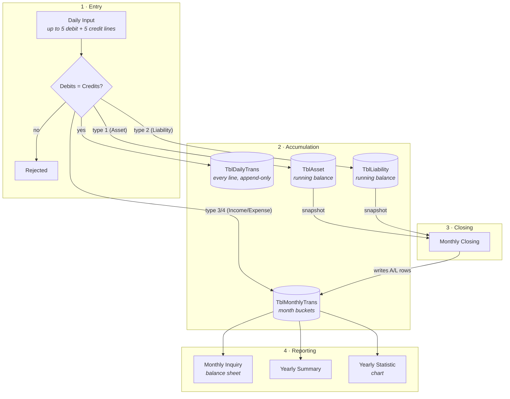
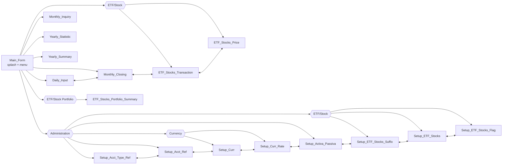
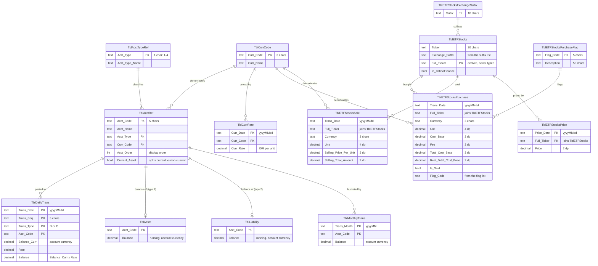

# Financial Balance

A Windows Forms double-entry bookkeeping application for tracking personal assets, liabilities,
income and expenses across multiple currencies. Transactions are entered daily as balanced
debit/credit vouchers, rolled into monthly buckets, and reported as a balance sheet, a yearly
summary, and a per-account trend chart.

Built with C# on .NET Framework 4.8 against a password-protected Microsoft Access (Jet) database.

---

## Table of contents

- [How it works](#how-it-works)
- [Screens](#screens)
- [Data model](#data-model)
- [Posting rules](#posting-rules)
- [Conventions](#conventions)
- [Multi-currency handling](#multi-currency-handling)
- [Project layout](#project-layout)
- [Building and running](#building-and-running)
- [Configuration](#configuration)
- [Implementation notes](#implementation-notes)

---

## How it works

Money moves through the system in three stages: **entry**, **accumulation**, and **closing**.



The key asymmetry: **income and expense accumulate into `TblMonthlyTrans` continuously** as you
enter transactions, whereas **asset and liability rows are written into `TblMonthlyTrans` only when
you run a monthly closing**. Assets and liabilities live as running balances (a *stock*) that the
closing snapshots; income and expense are *flows* bucketed by month as they happen.

Closing a month is idempotent — it deletes existing `A`/`L` rows for that month before re-inserting
them, so you can safely re-close.

---

## Screens

Every form is a full-screen window that hides its predecessor; there is no MDI container. The
`Administration` menu is reachable from `Main_Form`, and each setup form carries a menu strip
letting you hop directly between the other setup forms.

Related pages are collected into submenus rather than sitting flat:

| Menu | Submenu | Contains |
| --- | --- | --- |
| `Process` | **ETF/Stock** | ETF/Stock Transaction, ETF/Stock Price |
| `Inquiry` | **ETF/Stock Portfolio** | ETF/Stock Portfolio Summary |
| `Administration` | **Currency** | Currency Setup, Currency Rate Setup |
| `Administration` | **ETF/Stock** | ETF/Stock Suffix Setup, ETF/Stock Setup, ETF/Stock Flag Setup |

The same grouping applies to each form's own menu strip, not just `Main_Form`. Because a form
never lists itself, a submenu can hold one fewer entry there — from `Setup_Curr` the **Currency**
submenu offers only Currency Rate Setup, and it disappears to a single child rather than being
flattened, so the layout stays the same everywhere.



| Form | Purpose |
| --- | --- |
| `Main_Form` | Splash screen with an animated marquee, clock, version label. Enables the transaction menus only once `TblAcctRef` has at least one row. |
| `Daily_Input` | Enter, amend or delete a dated voucher. Up to 5 debit and 5 credit lines; refuses to save unless the two sides balance. |
| `Monthly_Closing` | Snapshots `TblAsset` and `TblLiability` into `TblMonthlyTrans` for a chosen month. Defaults to the month after the last close. |
| `ETF_Stocks_Transaction` | Add / update / delete ETF and stock trades for one date. `Total_Cost_Base` is derived; DRIP zeroes `Real_Total_Cost_Base`. |
| `ETF_Stocks_Price` | Daily closing price per ticker. Entered by hand, or pulled from Yahoo Finance for tickers flagged `In_YahooFinance`. |
| `Monthly_Inquiry` | Balance sheet for one month: assets (split current / non-current), liabilities, income, expense, and net worth, in IDR and AUD. |
| `Yearly_Summary` | Full-year income and expense breakdown with totals. |
| `Yearly_Statistic` | Year-over-year trend for a single asset or income account, drawn with `System.Windows.Forms.DataVisualization` charting. |
| `ETF_Stocks_Portfolio_Summary` | Unsold holdings per ticker for a chosen portfolio, valued at the latest price, with profit/loss in red or green. |
| `Setup_Acct_Type_Ref` | Maintains the four account types. |
| `Setup_Acct_Ref` | Chart of accounts — code, name, type, currency, display order, current-asset flag. |
| `Setup_Curr` | Currency codes and names. |
| `Setup_Curr_Rate` | Dated exchange rates. |
| `Setup_Activa_Passiva` | Directly set the opening/running balance of an asset or liability account. |
| `Setup_ETF_Stocks_Suffix` | Maintains the list of ETF/stock exchange suffixes. |
| `Setup_ETF_Stocks` | Maintains ETF/stock tickers. `Full_Ticker` is derived, not typed. |
| `Setup_ETF_Stocks_Flag` | Maintains purchase flag codes and descriptions. |

---

## Data model

Fourteen tables. **No foreign keys or relationships are defined in the database** — the links below are
conventions the application enforces in code, not constraints Access enforces for you.



### Reference data

`TblAcctTypeRef` is fixed at four rows:

| `Acct_Type` | Name | Code prefix |
| --- | --- | --- |
| `1` | Asset | `A` |
| `2` | Liability | `L` |
| `3` | Income | `I` |
| `4` | Expense | `E` |

`TblETFStocks.Full_Ticker` is **derived, never entered by hand**. `Setup_ETF_Stocks`
recomputes it whenever the ticker or the suffix changes:

```
Exchange_Suffix == "None"  ->  Full_Ticker = Ticker
otherwise                  ->  Full_Ticker = Ticker + "." + Exchange_Suffix
```

So suffixes are stored **without** a leading dot — `AX`, not `.AX` — since the dot is added
by the rule. `Full_Ticker` is the table's primary key.

### ETF/stock transaction rules

`ETF_Stocks_Transaction` writes **two tables**: a Buy goes to `TblETFStocksPurchase`, a Sell to
`TblETFStocksSale`. There is no stored transaction type — the table a row lives in *is* its type.
The page shows both for a chosen date, purchases first.

| Field | Rule |
| --- | --- |
| `Trans_Date` | From the date picker, stored `yyyyMMdd`. |
| `Unit` | Numeric, not negative, at most 4 decimal places. Both tables. |
| `Cost_Base`, `Fee` | Buy only. Numeric, not negative, at most 2 decimal places. |
| `Total_Cost_Base` | Buy only, derived: `round(Unit x Cost_Base, 2) + Fee`. Not editable. |
| `Real_Total_Cost_Base` | Buy only. `0` when the DRIP box is ticked, otherwise `Total_Cost_Base`. |
| `Is_Sold` | Buy only. The Sold checkbox. |
| `Flag_Code` | Buy only. Dropdown from `TblETFStocksPurchaseFlag`, defaulting to `OB`. |
| `Selling_Price_Per_Unit` | Sell only. Numeric, not negative, at most 2 decimal places. |
| `Selling_Total_Amount` | Sell only, derived: `round(Unit x Selling_Price_Per_Unit, 2)`. Not editable. |

The entry area swaps with the type: a Buy shows Cost Base, Fee, the two totals, DRIP and Sold;
a Sell shows Selling Price/Unit and Selling Total Amount. Hidden fields are reset rather than
carried over, and validation only covers what is on screen.

DRIP is **not stored**. The form re-derives it on selection as `Real_Total_Cost_Base == 0`.

> **Access stores Yes/No `True` as `-1`.** A `WHERE Is_Sold = 1` matches nothing and fails
> silently. Compare against `True`/`False` instead. Likewise, `Currency` is a reserved word:
> it needs brackets in DDL (`[Currency]`), though plain DML tolerates it.

Neither table has a primary key — the same ticker can be bought twice on one day, so no
combination of columns is reliably unique. Update and delete therefore match on **all of the
row's original column values**, and each grid row remembers which table it came from. If two
identical transactions exist on one date, the form says so and asks before touching both.
Changing an existing row's type moves it between the tables (delete then insert), since an
in-place update cannot cross tables.

### ETF/stock price rules

`ETF_Stocks_Price` maintains `TblETFStocksPrice`, which is keyed on `(Price_Date, Full_Ticker)` —
**one price per ticker per day**. That key makes Add an upsert: it updates the row when the
ticker and date already exist, and inserts otherwise. The page opens with a blank ticker and
loads nothing until one is picked, then shows that ticker's most recent 5 prices.

Prices arrive two ways:

| Route | Behaviour |
| --- | --- |
| **Manual** | Pick a date and type a price — numeric, not negative, at most 2 decimal places. |
| **Sync with Yahoo Finance** | Enabled only when the ticker's `In_YahooFinance` is `True`, otherwise greyed with a note. |

The sync calls Yahoo's chart endpoint and reads two values out of the response:

```
https://query1.finance.yahoo.com/v8/finance/chart/{Full_Ticker}?interval=1d&range=1d
  regularMarketPrice  ->  Price      (rounded to 2 dp)
  regularMarketTime   ->  Price_Date (epoch, converted to LOCAL date)
```

There is no JSON library in the project, so those two fields are pulled out with regular
expressions rather than adding a dependency. An unknown ticker returns HTTP 404 and is reported
as such; network failures report the underlying error.

> The synced date is the market timestamp **converted to local time**, not the exchange's own
> date. A US close therefore lands under the following Australian date, so US and ASX tickers
> can sit on different `Price_Date` values for the same trading session.

### Portfolio summary

`ETF_Stocks_Portfolio_Summary` aggregates `TblETFStocksPurchase` into one row per `Full_Ticker`.
It only ever counts **unsold** lots (`Is_Sold = False`) — a sold lot leaves the portfolio.

The **Portfolio** dropdown offers `All` plus one entry per row in `TblETFStocksPurchaseFlag`,
showing the `Description`. Picking one filters on that flag's `Flag_Code`; `All` applies no
flag filter. The dropdown holds descriptions but the codes are kept in an index-aligned list, so
two flags sharing a description still filter correctly.

| Column | Derivation |
| --- | --- |
| `Full Ticker` | Grouping key. |
| `Total Unit` | `SUM(Unit)` |
| `Total Investment` | `SUM(Real_Total_Cost_Base)` — so DRIP lots add units but no cost. |
| `Current Price` | Latest `TblETFStocksPrice` row for the ticker, by `Price_Date`. |
| `Total Current Amount` | `round(Total Unit x Current Price, 2)` |
| `Current Real Profit/Loss` | `Total Current Amount - Total Investment`. **Green** above zero, **red** below. |
| `Percentage Current Real Profit/Loss` | `Profit / Total Investment x 100` when investment is above zero, otherwise `0`. Same colouring. |

> **A ticker with no price row shows `-`** in the four price-derived columns rather than
> computing against a price of zero, which would misreport the holding as a total loss.

The aggregate is read fully before any price lookup, so no second reader is opened on the shared
connection while the first is still live.

The sample database ships with six currencies — AUD, BHT, IDR, SGD, USD, YEN — 8 accounts,
11 tickers with their latest prices, and a single purchase flag `OB` ("Oz Betashares Direct")
which is the default the transaction page selects.

---

## Posting rules

When a voucher is saved, `Mdl1.CreUpdActivaPassivaMonthlyTrans` applies a sign to the line amount
based on the account's type and whether the line is a debit or a credit, then routes it to the
right table:

| Account type | Debit (`D`) | Credit (`C`) | Accumulates into |
| --- | --- | --- | --- |
| `1` Asset | `+` amount | `−` amount | `TblAsset.Balance` |
| `2` Liability | `−` amount | `+` amount | `TblLiability.Balance` |
| `3` Income | `−` amount | `+` amount | `TblMonthlyTrans.Balance` |
| `4` Expense | `+` amount | `−` amount | `TblMonthlyTrans.Balance` |

Every line, regardless of type, is also appended verbatim to `TblDailyTrans` — that table is the
audit trail and the source `Daily_Input` reads back when you reopen a voucher.

Amending a voucher is implemented as delete-then-reinsert:
`Mdl1.DelActivaPassivaMonthlyTrans` reverses each stored line's effect on the balance tables before
the new lines are posted.

---

## Conventions

Several conventions are load-bearing — the code depends on them and will misbehave if they are
broken.

- **Account codes are five characters**, a one-letter type prefix plus a four-digit serial
  (`A0001`, `L0012`, `I0003`, `E0044`). Queries filter on the prefix directly, e.g.
  `where left(Acct_Code,1) = 'A'`, so **the prefix must agree with `Acct_Type`.**
- **Dates are text, not date types.** `Trans_Date` and `Curr_Date` are `yyyyMMdd`; `Trans_Month`
  is `yyyyMM`. This makes lexicographic string comparison equivalent to chronological ordering,
  which is what the `order by ... desc` and `<=` range queries rely on.
- **`Trans_Seq`** is a three-character sequence distinguishing multiple vouchers on the same date.
- **Combo boxes render as `"CODE - Name"`** and the code is recovered with `.Substring(0, 5)` for
  accounts or `.Substring(0, 1)` for types. Renaming the separator format would break every lookup.
- **`Current_Asset`** splits type-1 accounts into current and non-current for the balance sheet.

---

## Multi-currency handling

Each account is denominated in one currency, and **balances are stored in that account's own
currency** — never pre-converted. Conversion happens at report time.

`TblCurrRate.Curr_Rate` holds **IDR per one unit** of the currency, so IDR is the pivot:

```
amount_IDR   = Balance × GetCurrRate(Curr_Code, month)
amount_AUD   = amount_IDR ÷ GetCurrRate("AUD", month)
```

`Mdl1.GetCurrRate` resolves a rate for a given currency and month with a three-step fallback:

1. The latest rate **within** that month.
2. Failing that, the latest rate **on or before** the first of that month.
3. Failing that, the earliest rate **on or after** the month's end.

If none exists it returns `1`, silently leaving the amount unconverted — worth knowing when a
report shows an implausible figure for a currency with no rates loaded.

The `Rate` column on `TblDailyTrans` is a separate, per-line value captured at entry time and used
only for the debit-equals-credit check; it defaults to `1` and does not read from `TblCurrRate`.

---

## Project layout

```
C#.Net/
├── README.md
├── FinancialBalance/                # Visual Studio project
│   ├── FinancialBalance.sln
│   ├── FinancialBalance.csproj
│   ├── app.config
│   ├── Program.cs                   # entry point
│   ├── Mdl1.cs                      # data access + shared helpers
│   ├── Main_Form.*                  # splash / menu
│   ├── Daily_Input.*                # voucher entry
│   ├── Monthly_Closing.*
│   ├── Monthly_Inquiry.*
│   ├── Yearly_Summary.*
│   ├── Yearly_Statistic.*
│   ├── Setup_Acct_Type_Ref.*
│   ├── Setup_Acct_Ref.*
│   ├── Setup_Curr.*
│   ├── Setup_Curr_Rate.*
│   ├── Setup_Activa_Passiva.*
│   ├── Setup_ETF_Stocks_Suffix.*
│   ├── Setup_ETF_Stocks.*
│   ├── Setup_ETF_Stocks_Flag.*
│   ├── ETF_Stocks_Transaction.*     # buy / sell entry
│   ├── ETF_Stocks_Price.*           # prices + Yahoo sync
│   ├── images/Project1.ico
│   └── bin/{Debug,Release}/         # build output + a copy of the .mdb
├── Sample Database/
│   └── Financial Balance.mdb        # reference data, no transactions
└── Publish/                         # ClickOnce output
```

`Mdl1` is a static class holding the single shared `OleDbConnection` plus roughly two dozen
helpers: combo-box population (`Fill_Acct_Code`, `Fill_Curr`, `Fill_Month`, …), input validation
(`k_Numeric`, `k_Date`, `NumericKeyPress`), formatting (`FormatAmt`, `toLongDate`, `toLongMonth`),
and the two posting routines.

---

## Building and running

**Prerequisites**

- Visual Studio 2010 or later (the solution is Format Version 11.00), or MSBuild alone
- .NET Framework 4.8 developer pack
- The 32-bit Microsoft Jet OLEDB 4.0 provider — included with Windows, no install needed

**Build**

```powershell
msbuild "FinancialBalance\FinancialBalance.csproj" /p:Configuration=Release
```

**Run**

The application opens `Financial Balance.mdb` from `Application.StartupPath` — the folder holding
the executable. Copy a database next to the binary before launching:

```powershell
Copy-Item "Sample Database\Financial Balance.mdb" `
          "FinancialBalance\bin\Release\"
.\FinancialBalance\bin\Release\FinancialBalance.exe
```

Starting with an empty chart of accounts leaves the Daily Input and Monthly Closing menus disabled;
`Main_Form` enables them only after `TblAcctRef` contains at least one row. Set up account types,
currencies, rates and accounts first, then open Daily Input.

> **The project must stay on the `x86` platform target.** Jet OLEDB 4.0 exists only as a 32-bit
> provider, so an `AnyCPU` or `x64` build fails at connect time with a "provider is not registered"
> error on 64-bit Windows.

---

## Configuration

The connection string is **hard-coded in `Mdl1.DB_Connect()`** (`Mdl1.cs:22`) and built from
`Application.StartupPath`. The two entries in `app.config` are leftovers from the Visual Studio
data-source designer and are **not read at runtime** — editing them changes nothing.

The `.mdb` files carry a database password. It is embedded in the source and in `app.config`, so
treat the database as obfuscated rather than protected.

---

## Implementation notes

Things worth knowing before changing this code.

- **SQL is built by string concatenation throughout**, including values typed by the user. There is
  no parameterisation anywhere. An apostrophe in an account name is enough to break a query, and
  the pattern is injectable. Any new query should use `OleDbParameter` instead.
- **One shared static `OleDbConnection`** (`Mdl1.conn`) is opened at startup and reused by every
  form, along with shared static `reader` / `reader2` fields. Nested reads have to use the second
  reader or close the first, and nothing here is thread-safe.
- **No transactions.** A voucher writes to two or three tables in sequence with no rollback, so a
  failure mid-save leaves balances inconsistent with `TblDailyTrans`.
- **`decimal` columns are read through `double`**, which introduces rounding on large IDR figures.
- **Forms are created, shown, and the caller hidden or closed**, so navigating in a loop
  accumulates `Main_Form` instances rather than returning to the existing one.
- **`ETF_Stocks_Price` reaches the network** on the sync button, the only outbound call in the
  app. It forces TLS 1.2, sets a `User-Agent`, and runs on the UI thread — the form freezes for
  the duration of the request. Yahoo's endpoint is undocumented and can change without notice.
- `Microsoft.Office.Interop.Excel` and `adodb` are referenced in the project file but **not used by
  any code** — both references can be dropped.

### Removed features

An earlier stock-portfolio feature (a `Setup_Stocks` form backed by `TblStocks`, `TblStocksMaster`
and `TblStocksTrn`) has been removed, along with the unused `TblHistPurchCurr` and
`TblNonCurrentAssetAcctRef` tables. Non-current assets are now flagged by the `Current_Asset`
boolean on `TblAcctRef` instead of a separate reference table.
