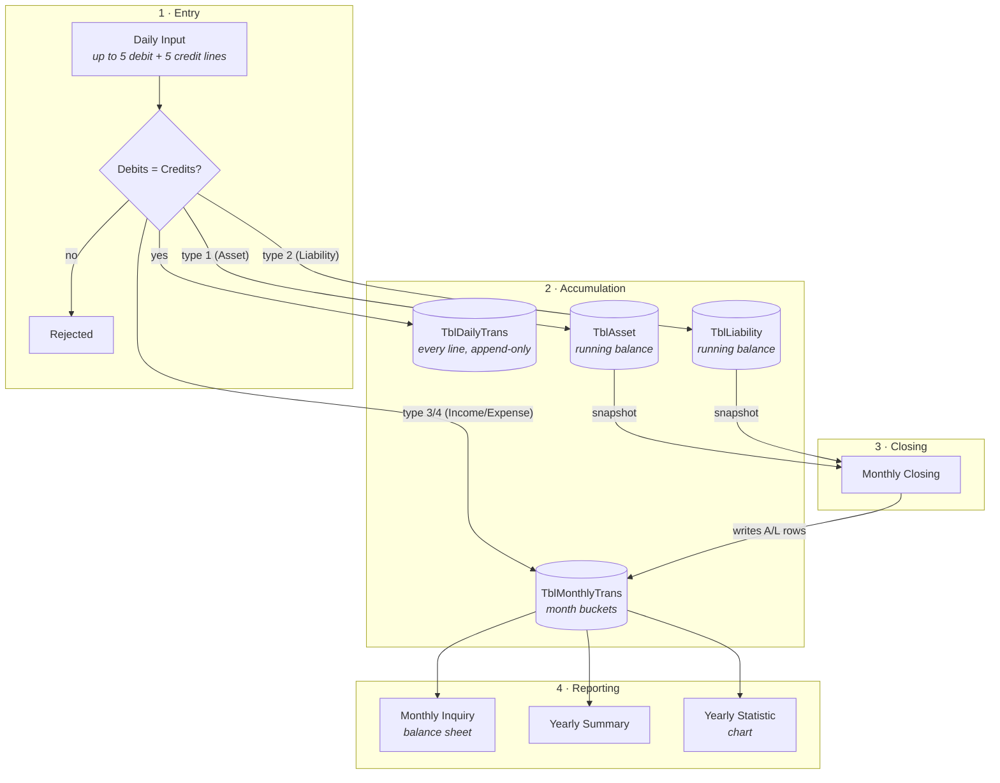
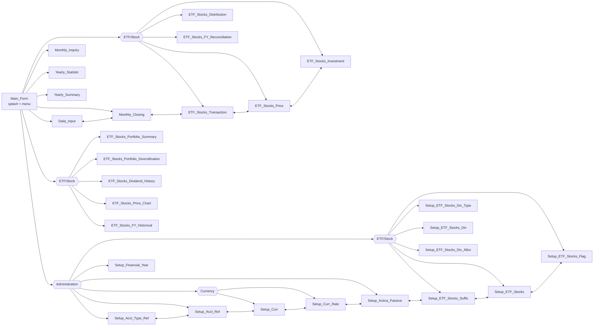

# Financial Balance

A Windows Forms double-entry bookkeeping application for tracking personal assets, liabilities,
income and expenses across multiple currencies. Transactions are entered daily as balanced
debit/credit vouchers, rolled into monthly buckets, and reported as a balance sheet, a yearly
summary, and a per-account trend chart.

Built with C# on .NET Framework 4.8 against a password-protected Microsoft Access (Jet) database.

---

## Table of contents

- [How it works](#how-it-works)
- [Screens](#screens)
- [Data model](#data-model)
- [Posting rules](#posting-rules)
- [Conventions](#conventions)
- [Multi-currency handling](#multi-currency-handling)
- [Project layout](#project-layout)
- [Building and running](#building-and-running)
- [Configuration](#configuration)
- [Implementation notes](#implementation-notes)

---

## How it works

Money moves through the system in three stages: **entry**, **accumulation**, and **closing**.



The key asymmetry: **income and expense accumulate into `TblMonthlyTrans` continuously** as you
enter transactions, whereas **asset and liability rows are written into `TblMonthlyTrans` only when
you run a monthly closing**. Assets and liabilities live as running balances (a *stock*) that the
closing snapshots; income and expense are *flows* bucketed by month as they happen.

Closing a month is idempotent — it deletes existing `A`/`L` rows for that month before re-inserting
them, so you can safely re-close.

---

## Screens

Every form is a full-screen window that hides its predecessor; there is no MDI container. The
`Administration` menu is reachable from `Main_Form`, and each setup form carries a menu strip
letting you hop directly between the other setup forms.

Related pages are collected into submenus rather than sitting flat:

| Menu | Submenu | Contains |
| --- | --- | --- |
| `Process` | **ETF/Stock** | ETF/Stock Price, ETF/Stock Investment, ETF/Stock Transaction, ETF/Stock Distribution/Dividend, ETF/Stock Financial Year Reconciliation |
| `Inquiry` | **ETF/Stock** | ETF/Stock Portfolio Summary, ETF/Stock Portfolio Diversification, ETF/Stock Dividend History, ETF/Stock Price Chart, ETF/Stock Financial Year Historical |
| `Administration` | **Currency** | Currency Setup, Currency Rate Setup |
| `Administration` | **ETF/Stock** | ETF/Stock Suffix Setup, ETF/Stock Setup, ETF/Stock Portfolio Code Setup, ETF/Stock Diversification Type Setup, ETF/Stock Diversification Setup, ETF/Stock Diversification Allocation |

The same grouping applies to each form's own menu strip, not just `Main_Form`. Because a form
never lists itself, a submenu can hold one fewer entry there — from `Setup_Curr` the **Currency**
submenu offers only Currency Rate Setup, and it disappears to a single child rather than being
flattened, so the layout stays the same everywhere.



| Form | Purpose |
| --- | --- |
| `Main_Form` | Splash screen with an animated marquee, clock, version label. Enables the transaction menus only once `TblAcctRef` has at least one row. |
| `Daily_Input` | Enter, amend or delete a dated voucher. Up to 5 debit and 5 credit lines; refuses to save unless the two sides balance. |
| `Monthly_Closing` | Snapshots `TblAsset` and `TblLiability` into `TblMonthlyTrans` for a chosen month. Defaults to the month after the last close. |
| `ETF_Stocks_Transaction` | Add / update / delete ETF and stock trades for one date. A Sell is built against the purchase lots it draws from, which it then settles. |
| `ETF_Stocks_Price` | Daily closing price per ticker. Entered by hand, or pulled from Yahoo Finance for tickers flagged `In_YahooFinance`. |
| `ETF_Stocks_Investment` | Cash paid into and taken out of each portfolio. Every movement is kept; the portfolio's running `Cash` moves with it. |
| `ETF_Stocks_Distribution` | Shown as **ETF/Stock Distribution/Dividend**. Distributions and dividends paid per ticker per portfolio, with the units they were paid on. |
| `ETF_Stocks_FY_Reconciliation` | Shown as **ETF/Stock Financial Year Reconciliation**. One financial year's result per portfolio, with an entry section that defaults every figure from the rest of the database. |
| `Monthly_Inquiry` | Balance sheet for one month: assets (split current / non-current), liabilities, income, expense, and net worth, in IDR and AUD. |
| `Yearly_Summary` | Full-year income and expense breakdown with totals. |
| `Yearly_Statistic` | Ten-year trend for any Asset, Liability, Income or Expense account — or a whole category — drawn with `System.Windows.Forms.DataVisualization` charting. |
| `ETF_Stocks_Portfolio_Summary` | Unsold holdings for a chosen portfolio, optionally main portfolios only — summarised per ticker, or drilled into one ticker's individual purchases. |
| `ETF_Stocks_Portfolio_Diversification` | The same holdings re-cut as one pie chart per diversification type. |
| `ETF_Stocks_Dividend_History` | What the holdings have paid — summarised per ticker, or every payment for one ticker, optionally within one financial year. |
| `ETF_Stocks_Price_Chart` | One ticker's recorded price drawn as a line over time, at most eight points wide, optionally narrowed to one financial year. |
| `ETF_Stocks_FY_Historical` | Shown as **ETF/Stock Financial Year Historical**. Read-only view of one financial year's stored reconciliation rows, with twelve totals across the selection and an Excel export. |
| `Setup_Acct_Type_Ref` | Maintains the four account types. |
| `Setup_Acct_Ref` | Chart of accounts — code, name, type, currency, display order, current-asset flag. |
| `Setup_Curr` | Currency codes and names. |
| `Setup_Curr_Rate` | Dated exchange rates. |
| `Setup_Activa_Passiva` | Shown as **Asset Liability Setup**. Directly set the opening/running balance of an asset or liability account. |
| `Setup_Financial_Year` | Shown as **Financial Year Setup**. Names a financial year and the dates it runs between. |
| `Setup_ETF_Stocks_Suffix` | Maintains the list of ETF/stock exchange suffixes. |
| `Setup_ETF_Stocks` | Maintains ETF/stock tickers. `Full_Ticker` is derived, not typed. |
| `Setup_ETF_Stocks_Flag` | Shown as **ETF/Stock Portfolio Code Setup**. Maintains portfolio codes, descriptions and the `Is_Main` marker. |
| `Setup_ETF_Stocks_Div_Type` | Maintains the diversification types — the categories a holding can be classified along. |
| `Setup_ETF_Stocks_Div` | Maintains the values within each type. |
| `Setup_ETF_Stocks_Div_Alloc` | Splits a ticker across one diversification type's values. Refuses to save unless the type totals 100. |

---

## Data model

Twenty-two tables. **No foreign keys or relationships are defined in the database** — the links below are
conventions the application enforces in code, not constraints Access enforces for you.

```mermaid
erDiagram
    TblAcctTypeRef  ||--o{ TblAcctRef      : "classifies"
    TblCurrCode     ||--o{ TblAcctRef      : "denominates"
    TblCurrCode     ||--o{ TblCurrRate     : "priced by"
    TblAcctRef      ||--o{ TblDailyTrans   : "posted to"
    TblAcctRef      ||--o| TblAsset        : "balance of (type 1)"
    TblAcctRef      ||--o| TblLiability    : "balance of (type 2)"
    TblAcctRef      ||--o{ TblMonthlyTrans : "bucketed by"
    TblETFStocksExchangeSuffix ||--o{ TblETFStocks : "suffixes"
    TblETFStocks    ||--o{ TblETFStocksPurchase : "bought"
    TblETFStocks    ||--o{ TblETFStocksSale : "sold"
    TblCurrCode     ||--o{ TblETFStocksPurchase : "denominates"
    TblCurrCode     ||--o{ TblETFStocksSale : "denominates"
    TblETFStocks    ||--o{ TblETFStocksPrice : "priced by"
    TblETFStocksPortfolioCode ||--o{ TblETFStocksPurchase : "codes"
    TblETFStocksPortfolioCode ||--o{ TblETFStocksSale : "codes"
    TblETFStocksPortfolioCode ||--o{ TblETFStocksDistributionDividend : "codes"
    TblETFStocksPortfolioCode ||--o{ TblETFStocksFinancialYear : "codes"
    TblFinancialYear ||--o{ TblETFStocksFinancialYear : "covers"
    TblETFStocks    ||--o{ TblETFStocksDistributionDividend : "pays"
    TblCurrCode     ||--o{ TblETFStocksDistributionDividend : "denominates"
    TblETFStocksPortfolioCode ||--o| TblETFStocksPortfolio : "describes"
    TblETFStocksPortfolioCode ||--o{ TblETFStocksPortfolioInvestment : "codes"
    TblETFStocksPortfolio ||--o{ TblETFStocksPortfolioInvestment : "moved by"
    TblCurrCode     ||--o{ TblETFStocksPortfolio : "denominates"
    TblETFStocksDiversificationType ||--o{ TblETFStocksDiversification : "groups"
    TblETFStocksDiversification ||--o{ TblETFStocksDiversificationAllocation : "allocated by"
    TblETFStocks ||--o{ TblETFStocksDiversificationAllocation : "split across"

    TblAcctTypeRef {
        text Acct_Type PK "1 char: 1-4"
        text Acct_Type_Name
    }
    TblAcctRef {
        text Acct_Code PK "5 chars"
        text Acct_Name
        text Acct_Type FK
        text Curr_Code FK
        int  Acct_Order "display order"
        bool Current_Asset "splits current vs non-current"
    }
    TblCurrCode {
        text Curr_Code PK "3 chars"
        text Curr_Name
    }
    TblCurrRate {
        text    Curr_Date PK "yyyyMMdd"
        text    Curr_Code PK
        decimal Curr_Rate "IDR per unit"
    }
    TblDailyTrans {
        text    Trans_Date PK "yyyyMMdd"
        text    Trans_Seq PK "3 chars"
        text    Trans_Type PK "D or C"
        text    Acct_Code PK
        decimal Balance_Curr "account currency"
        decimal Rate
        decimal Balance "Balance_Curr x Rate"
    }
    TblAsset {
        text    Acct_Code PK
        decimal Balance "running, account currency"
    }
    TblLiability {
        text    Acct_Code PK
        decimal Balance "running, account currency"
    }
    TblMonthlyTrans {
        text    Trans_Month PK "yyyyMM"
        text    Acct_Code PK
        decimal Balance "account currency"
    }
    TblETFStocksExchangeSuffix {
        text Suffix PK "10 chars"
    }
    TblETFStocks {
        text Ticker "20 chars"
        text Exchange_Suffix "from the suffix list"
        text Full_Ticker PK "derived, never typed"
        bool In_YahooFinance
    }
    TblETFStocksPurchase {
        text    Trans_Date "yyyyMMdd"
        text    Full_Ticker "joins TblETFStocks"
        text    Currency "3 chars"
        decimal Unit "4 dp"
        decimal Cost_Base "2 dp"
        decimal Fee "2 dp"
        decimal Total_Cost_Base "2 dp"
        decimal Real_Total_Cost_Base "2 dp"
        bool    Is_Sold
        text    Portfolio_Code "from the portfolio code list"
        text    Sold_Date "yyyyMMdd, null unless sold"
    }
    TblETFStocksSale {
        text    Trans_Date "yyyyMMdd"
        text    Full_Ticker "joins TblETFStocks"
        text    Currency "3 chars"
        decimal Unit "4 dp"
        decimal Selling_Price_Per_Unit "2 dp"
        decimal Selling_Total_Amount "2 dp"
        decimal Profit_Or_Loss_On_Paper "2 dp"
        decimal Real_Profit_Or_Loss "2 dp"
        text    Portfolio_Code "5 chars"
    }
    TblETFStocksPrice {
        text    Price_Date PK "yyyyMMdd"
        text    Full_Ticker PK "joins TblETFStocks"
        decimal Price "2 dp"
        text    Currency "3 chars"
    }
    TblETFStocksPortfolioCode {
        text Portfolio_Code PK "5 chars"
        text Description "50 chars"
        bool Is_Main
    }
    TblETFStocksFinancialYear {
        text    Financial_Year "joins TblFinancialYear"
        text    Portfolio_Code "5 chars"
        text    Currency "3 chars"
        decimal Previous_Investment "2 dp"
        decimal Investment "2 dp"
        decimal Sold_Amount "2 dp"
        decimal Ending_Investment "2 dp"
        decimal On_Paper_Ending_Value "2 dp"
        decimal On_Paper_Profit_Or_Loss "2 dp"
        decimal Percentage_On_Paper_Profit_Or_Loss "2 dp"
        decimal Total_DistributionDividend "2 dp"
        decimal Total_DistributionDividend_Yield "2 dp"
        decimal Total_DistributionDividend_Reinvested "2 dp"
        decimal Total_DistributionDividend_Not_Reinvested "2 dp"
        decimal Capital_Gains_On_Paper "2 dp"
        decimal Real_Capital_Gains "2 dp"
        decimal Investment_Loan_Interest "2 dp"
        decimal Tax "2 dp"
        decimal Real_Profit_Or_Loss "2 dp"
        decimal Percentage_Real_Profit_Or_Loss "2 dp"
    }
    TblFinancialYear {
        text Name PK "9 chars"
        text Start_Date "yyyyMMdd"
        text End_Date "yyyyMMdd"
    }
    TblETFStocksDistributionDividend {
        text    Pay_Date "yyyyMMdd"
        text    Full_Ticker "joins TblETFStocks"
        text    Portfolio_Code "5 chars"
        text    Currency "3 chars"
        decimal Entitled_Unit "4 dp"
        decimal Amount_Per_Unit "4 dp"
        decimal Total_Amount "2 dp"
        bool    Is_Reinvested
    }
    TblETFStocksPortfolio {
        text    Portfolio_Code PK "5 chars"
        text    Currency "3 chars"
        decimal Cash "2 dp, running balance"
        decimal Investment_Amount "2 dp"
    }
    TblETFStocksPortfolioInvestment {
        text    Investment_Date "yyyyMMdd"
        text    Portfolio_Code "joins TblETFStocksPortfolioCode"
        text    Investment_Type "1 char: + or -"
        text    Currency "3 chars"
        decimal Amount "2 dp, always positive"
    }
    TblETFStocksDiversificationType {
        text Name PK "50 chars"
    }
    TblETFStocksDiversification {
        text Type PK "matches a Type Name"
        text Name PK "50 chars"
    }
    TblETFStocksDiversificationAllocation {
        text Full_Ticker PK "joins TblETFStocks"
        text Diversification_Type PK "50 chars"
        text Diversification_Name PK "50 chars"
        int  Percentage "whole number"
    }
```



### Reference data

`TblAcctTypeRef` is fixed at four rows:

| `Acct_Type` | Name | Code prefix |
| --- | --- | --- |
| `1` | Asset | `A` |
| `2` | Liability | `L` |
| `3` | Income | `I` |
| `4` | Expense | `E` |

`TblETFStocks.Full_Ticker` is **derived, never entered by hand**. `Setup_ETF_Stocks`
recomputes it whenever the ticker or the suffix changes:

```
Exchange_Suffix == "None"  ->  Full_Ticker = Ticker
otherwise                  ->  Full_Ticker = Ticker + "." + Exchange_Suffix
```

So suffixes are stored **without** a leading dot — `AX`, not `.AX` — since the dot is added
by the rule. `Full_Ticker` is the table's primary key.

#### Financial years

`Setup_Financial_Year` maintains `TblFinancialYear`: a `Name` of up to 9 characters (`FY2025-26`
fits exactly) and the two dates the year runs between, both stored `yyyyMMdd` like every other date
in the database and shown as `dd-MMM-yyyy`. The list reads chronologically, by `Start_Date`.

`Name` is treated as the key, the same way `Full_Ticker` is on ETF/Stock Setup: **Add / Update** is
an upsert on it and **Delete** matches on it. Editing a row remembers the name it was loaded under,
so changing the name *renames that year* rather than leaving the old row behind — and renaming onto
a name that already exists is refused rather than merging two years into one. **Clear** abandons the
edit and returns to entering a new year.

A year whose `End_Date` falls before its `Start_Date` is rejected.

`TblETFStocksFinancialYear` holds one row per financial year per portfolio code, carrying that
year's opening and closing investment, what was sold, the on-paper and realised results,
distribution totals, capital gains, loan interest and tax. **No screen reads or writes either table
yet** beyond Financial Year Setup maintaining the years themselves — both stand ready for whatever
is built on them.

### ETF/stock transaction rules

`ETF_Stocks_Transaction` writes **two tables**: a Buy goes to `TblETFStocksPurchase`, a Sell to
`TblETFStocksSale`. There is no stored transaction type — the table a row lives in *is* its type.
The page shows both for a chosen date, purchases first.

| Field | Rule |
| --- | --- |
| `Trans_Date` | From the date picker, stored `yyyyMMdd`. |
| `Unit` | Buy: typed, numeric, not negative, at most 4 decimal places. **Sell: derived** — see below. |
| `Cost_Base`, `Fee` | Buy only. Numeric, not negative, at most 2 decimal places. |
| `Total_Cost_Base` | Buy only, derived: `round(Unit x Cost_Base, 2) + Fee`. Not editable. |
| `Real_Total_Cost_Base` | Buy only. `0` when the **Reinvestment** box is ticked, otherwise `Total_Cost_Base`. |
| `Is_Sold` | Buy only. The Sold checkbox. |
| `Sold_Date` | Buy only. Shown only while Sold is ticked; stored `yyyyMMdd`, otherwise `Null`. |
| `Portfolio_Code` | **Both types**, from a dropdown labelled **Portfolio** filled from `TblETFStocksPortfolioCode` and defaulting to `OB`. Each type has its own dropdown, and the chosen code's `Description` is shown beside it (`-` when blank). On a Sell it also **filters the lots on offer** — see below. Appears as **Portfolio Code** in the grid. |
| `Selling_Price_Per_Unit` | Sell only. Numeric, not negative, at most 2 decimal places. |
| `Selling_Total_Amount` | Sell only, derived: `round(Unit x Selling_Price_Per_Unit, 2)`. Not editable. |
| `Profit_Or_Loss_On_Paper` | Sell only, derived on **Add** from the lots being sold — see below. Not shown on screen. |
| `Real_Profit_Or_Loss` | Sell only, derived on **Add**, ignoring what the DRIP lots cost — see below. Not shown on screen. |

The entry area swaps with the type: a Buy shows Cost Base, Fee, the two totals, Reinvestment, Sold
and Portfolio; a Sell shows Selling Price/Unit, Selling Total Amount, its own Portfolio and the lot
grid below. Hidden fields are reset rather than carried over, and validation only covers what is
on screen. Each Portfolio dropdown carries its own description label, and both are refreshed
whenever the halves swap — the dropdowns are filled while events are suppressed, so a dropdown
that has never been touched would otherwise sit beside an empty description.

#### Selling against lots

A Sell is not entered as a bare quantity. Choosing **Sell** lists the ticker's unsold purchases
**held in the chosen Portfolio**, and the units come from the lots they are actually being taken
out of. Changing either the ticker or the Portfolio redraws the list, because units can only be
sold out of the portfolio holding them — selling from one portfolio leaves another's lots alone.
The code chosen here is stored on the sale as its `Portfolio_Code`:

| Column | Source |
| --- | --- |
| `Purchase Date` | `Trans_Date`, shown `dd-MMM-yyyy`. |
| `Unit` | `Unit` — how many are held in that lot. |
| `Purchase Price / Unit` | `Cost_Base` |
| `Real Purchase Amount` | `Real_Total_Cost_Base` — `0` for a DRIP lot, so a reinvested holding is visible as costing nothing. |
| `Sold Unit` | **Editable.** Numeric-only keystrokes, not negative, at most 4 decimal places, and never more than that lot's `Unit`. |

The **Unit** box becomes read-only and holds the sum of every `Sold Unit`, so `Selling_Total_Amount`
follows the lots automatically. Adding a Sell with nothing allocated is refused.

**Add** writes the `TblETFStocksSale` row and then settles each lot it drew from:

| Case | Effect on `TblETFStocksPurchase` |
| --- | --- |
| Whole lot sold | The row is closed as it stands — `Is_Sold = True`, `Sold_Date` set. |
| Part of a lot sold | The row is cut down to the units **sold** and closed, keeping the original `Fee`; a **new open row** carries the remainder with `Fee = 0`. |

So a 10-unit lot at 50.00 with a 9.95 fee, selling 3, leaves a closed `3 @ 50.00` row totalling
`159.95` and an open `7 @ 50.00` row totalling `350.00`. The portfolio still shows 7 units held —
the closed side is the part that left.

#### Profit recorded against a sale

Add also works out what the units being sold originally cost, and stores two figures on the sale
row. Both start from `Selling_Total_Amount` and subtract a cost totalled over the lots the sale
draws from, where each lot contributes:

```
lot cost = round(round(Sold Unit x Purchase Price / Unit, 2) + Fee, 2)
```

The `Fee` there is **that purchase lot's own fee**, not a fee on the sale, and the closed part of a
lot carries the whole of it — the same rule the split below uses.

| Field | Cost subtracted |
| --- | --- |
| `Profit_Or_Loss_On_Paper` | Every lot contributes its `lot cost`. |
| `Real_Profit_Or_Loss` | A lot whose `Real_Total_Cost_Base` is `0` contributes **nothing**; every other lot contributes its `lot cost`. |

So a DRIP lot costs nothing real, and all of its proceeds land in `Real_Profit_Or_Loss` — which is why
`Real_Profit_Or_Loss` is the larger of the two whenever a reinvested lot is sold. Selling 10 units bought
at 100.00 with a 9.95 fee, 5 DRIP units, and 3 of a lot bought at 120.00 with a 5.00 fee, at
150.00 each, gives proceeds of `2,700.00` against `1,924.95` on paper and `1,374.95` real —
`775.05` and `1,325.05`.

This arithmetic deliberately mirrors the settlement below, so the profit on a sale always agrees
with the cost left behind on the closed purchase rows.

> Both figures are written **on Add only**. Updating an existing Sell changes
> `Selling_Total_Amount` but leaves the profits at their original values, because by then the lots
> have been settled and the sale row does not record its own cost basis. This matches the existing
> behaviour that updating a Sell does not re-settle lots either.

`Total_Cost_Base` is recomputed on both rows, and `Real_Total_Cost_Base` follows the DRIP rule:
**zero stays zero**, so splitting a reinvested lot leaves both halves at `0` rather than
inventing a cost. Because the purchase table has no key, each lot row remembers the values it was
read with and the update matches on all of them.

**Sold Date** is nested one level deeper: it appears only when the Sold box is ticked on a Buy,
and unticking clears the value as well as hiding it, so a stale date cannot survive out of sight.
Both date pickers share the single `MonthCalendar` on the form, routed by a `CalTarget` flag —
picking a transaction date reloads the day's grid, picking a sold date deliberately does not.

The **Reinvestment** checkbox is **not stored**. The form re-derives it on selection as
`Real_Total_Cost_Base == 0` — a lot bought with no real money is one that was reinvested. It was
labelled *DRIP* until it was renamed; the identifier `chkDRIP` and the grid heading `DRIP` on the
same page still carry the older word, so searching the code for the on-screen label will not find
it.

> **Access stores Yes/No `True` as `-1`.** A `WHERE Is_Sold = 1` matches nothing and fails
> silently. Compare against `True`/`False` instead — the same applies to `In_YahooFinance` and
> `Is_Main`, which are written as literals rather than `1`/`0`. Likewise, `Currency` is a reserved
> word: it needs brackets in DDL (`[Currency]`), though plain DML tolerates it.
>
> A Yes/No column **added to an existing table lands as `False` on every row**, so a migration that
> wants `Yes` has to follow the `ALTER` with an `UPDATE`.

Neither table has a primary key — the same ticker can be bought twice on one day, so no
combination of columns is reliably unique. Update and delete therefore match on **all of the
row's original column values**, and each grid row remembers which table it came from. If two
identical transactions exist on one date, the form says so and asks before touching both.
Changing an existing row's type moves it between the tables (delete then insert), since an
in-place update cannot cross tables.

### Diversification

Holdings can be classified along several axes at once. `TblETFStocksDiversificationType` names the
axes, and `TblETFStocksDiversification` holds the values available within each one — its `Type`
column carries the `Name` of a row in the type table.

| Type | Values |
| --- | --- |
| `Asset Class` | Stock, Commodity, Defensive Asset |
| `Investment Style` | High Growth, High Yield, Market Capitalization Driven, Other |
| `Geographic` | Australia, US, Ex Australia and Ex US, Other |

The diversification table is keyed on **`(Type, Name)`**, so the same name can appear under two
different types — `Other` exists under both Investment Style and Geographic — while a duplicate
within one type is rejected.

Deleting a type that still has values is refused with a count of what depends on it. Nothing in
the database enforces that link, so the check lives in `Setup_ETF_Stocks_Div_Type`.

#### Allocation

`Setup_ETF_Stocks_Div_Alloc` splits one ticker across the values of **one type at a time**. It
lists every value of the chosen type with an editable percentage, shows a running total that is
green at 100 and red otherwise, and **refuses to save at any other total**.

Saving rewrites that ticker-and-type in one pass — delete, then re-insert — so the stored data can
never be left part-way at a total other than 100. Only non-zero rows are written, so an unused
value simply has no row. `Clear All` drops the whole type for that ticker after a confirmation.

`TblETFStocksDiversificationAllocation` is keyed on **`(Full_Ticker, Diversification_Type,
Diversification_Name)`**. The type is stored rather than looked up by name, because names repeat
across types: without it a ticker could not hold both an Investment Style `Other` and a Geographic
`Other`, and the per-type totals could not be grouped correctly.

### Portfolio diversification

`ETF_Stocks_Portfolio_Diversification` takes the same **Portfolio** dropdown and **Main Only**
checkbox as the summary page — same filters, same defaults — and re-cuts the holdings as **one pie
chart per diversification type**. The charts are built at run time from
`TblETFStocksDiversificationType`, so adding a type adds a chart with no code change.

A slice is a ticker's weight in the portfolio, split by how that ticker is allocated:

```
slice(type, name) = SUM over tickers of  portfolio share of ticker  x  allocation %  / 100
```

where the portfolio share is the same `Total Current Amount / Total Portfolio Current Amount`
the summary page shows in its **Percentage from whole portfolio** column. An unpriced holding has
no current amount, so it carries no weight into any pie.

Because each ticker's allocation totals 100 within a type, and the shares themselves total 100,
a fully allocated portfolio produces pies that total 100 %. **Any shortfall is drawn as a grey
`(unallocated)` slice** rather than left out — a pie normalises to the sum of its slices, so
omitting the gap would silently inflate every other wedge.

### ETF/stock price rules

`ETF_Stocks_Price` maintains `TblETFStocksPrice`, which is keyed on `(Price_Date, Full_Ticker)` —
**one price per ticker per day**. That key makes Add an upsert: it updates the row when the
ticker and date already exist, and inserts otherwise. The page opens with a blank ticker and
loads nothing until one is picked, then shows that ticker's most recent 5 prices.

Prices arrive two ways:

| Route | Behaviour |
| --- | --- |
| **Manual** | Pick a date, a currency and type a price — numeric, not negative, at most 2 decimal places. |
| **Sync with Yahoo Finance** | One ticker. Enabled only when its `In_YahooFinance` is `True`, otherwise greyed with a note. |
| **Sync all with Yahoo Finance** | Every ticker flagged `In_YahooFinance`, in one pass. |

A grid at the top of the page lists **every** ticker in `TblETFStocks` with the currency and
latest stored price, whether that price came from Yahoo or was typed in; a ticker with no price
shows `-`. It refreshes after any add, update, delete or sync, so it never goes stale. Its
columns are `Full Ticker`, `Currency`, `Current Price`; the per-ticker grid below shows
`Price Date`, `Currency`, `Price`.

The bulk sync attempts each ticker independently — one failure does not abort the run. Results
are reported once at the end as *"n of m ticker(s) updated"*, with any failures listed, rather
than a dialog per ticker. Both sync buttons disable while it runs.

The sync calls Yahoo's chart endpoint and reads three values out of the response:

```
https://query1.finance.yahoo.com/v8/finance/chart/{Full_Ticker}?interval=1d&range=1d
  regularMarketPrice  ->  Price      (rounded to 2 dp)
  regularMarketTime   ->  Price_Date (epoch, converted to LOCAL date)
  currency            ->  Currency   (as quoted by the exchange)
```

There is no JSON library in the project, so those three fields are pulled out with regular
expressions rather than adding a dependency. An unknown ticker returns HTTP 404 and is reported
as such; network failures report the underlying error.

> The synced date is the market timestamp **converted to local time**, not the exchange's own
> date. A US close therefore lands under the following Australian date, so US and ASX tickers
> can sit on different `Price_Date` values for the same trading session.

#### Currency on a price

Every price records the currency it is quoted in. A sync takes that straight from the exchange,
so an ASX ticker stores `AUD` and a US ticker stores `USD` without anyone choosing it. Manual
entry uses the **Currency** dropdown, which is filled from `TblCurrCode` and defaults to `AUD`
(`Fill_Curr` defaults to `IDR` for the accounting pages, so this page overrides it).

Two cases are worth knowing:

- **Yahoo returns a currency the database has never seen.** It is still what the price is quoted
  in, so it is stored as-is and *added to the dropdown* rather than dropped. Silently discarding
  it would leave the dropdown disagreeing with the stored row.
- **Yahoo returns no currency at all.** Rather than guess, the sync falls back to whatever that
  ticker was last priced in, and only then to `AUD`.

> Rows that predate the column were backfilled to `AUD`, then `GOOGL` — the one holding not
> quoted in Australian dollars — was corrected to `USD`, so the stored currencies now match the
> exchanges. Worth remembering when **adding a ticker quoted somewhere new**: a manually entered
> price takes whatever the dropdown is showing, and that defaults to `AUD`. A sync sets it from
> the exchange instead. Prices written before the column existed read back as null and display
> as `-`.

### ETF/stock investment rules

`ETF_Stocks_Investment` keeps track of the **cash sitting in each portfolio** — money paid in and
taken out, separate from what has been spent on securities. It writes two tables:

| Table | Holds |
| --- | --- |
| `TblETFStocksPortfolioInvestment` | Every movement, one row each, never amended. |
| `TblETFStocksPortfolio` | One running row per portfolio code: its currency, `Cash` and `Investment_Amount`. |

The grid shows the running rows, with `Portfolio` resolved from `TblETFStocksPortfolioCode` by
matching `Portfolio_Code`. `Cash` and `Investment_Amount` follow the same rule as everywhere else —
a `$` for AUD and USD, bare otherwise, and a negative reads `-$1,234.56`. A code with no matching
description shows `-` rather than a blank.

Adding a movement takes a date, a portfolio code, a type, a currency and an amount. The chosen
code's `Description` is shown beside the dropdown, since a five-character code on its own is easy
to pick wrongly; a code with a blank description shows `-`. **The amount is
always positive; the sign lives in Investment Type** (`+` pays in, `-` takes out), which is why that
box uses the same digits-only keypress guard as every other amount field in the app. The entry is
appended to `TblETFStocksPortfolioInvestment`, and then:

- **The portfolio already exists** — `Cash` moves by the signed amount.
- **It does not** — a row is created with the chosen currency, `Cash` set to the signed amount and
  `Investment_Amount` set to `0`.

> `Investment_Amount` is **not** touched by adding a movement. It only changes through the edit
> panel. Paying cash in does not by itself mean it has been invested.

Selecting a row in the grid reveals an edit panel for that portfolio's `Currency`, `Cash` and
`Investment_Amount`. Those two amounts are running balances that can legitimately go negative, so
they accept a leading minus that the shared numeric guard would otherwise reject.

Two things are worth knowing:

- **A movement whose currency disagrees with the portfolio is refused.** Adding a USD amount to an
  AUD balance would quietly corrupt the running total, so the entry is blocked with both currencies
  named rather than silently added.
- **A `-` on a portfolio that does not exist yet creates it with negative cash.** That is taken as a
  real state — money owed — rather than an error to reject.

There is no delete on this page. A movement, once recorded, stays; a balance is corrected through the
edit panel, which leaves the movement history intact.

### ETF/stock distribution and dividend rules

`ETF_Stocks_Distribution` records what a holding actually **paid** — distributions and dividends —
in `TblETFStocksDistributionDividend`, one row per payment.

The page is filtered rather than dated. Two dropdowns at the top choose a **Full Ticker** and a
**Portfolio**, and the table below shows that combination's payments **newest first** by `Pay_Date`.
The portfolio dropdown carries a description label, as everywhere else. There is no `All` option on
either filter, so the table always shows one ticker in one portfolio.

A second, independent set of inputs below the table is what actually writes:

| Field | Rule |
| --- | --- |
| `Pay_Date` | From the date picker, stored `yyyyMMdd`. |
| `Full_Ticker` | Dropdown from `TblETFStocks`. |
| `Portfolio_Code` | Dropdown from `TblETFStocksPortfolioCode`, with its `Description` beside it. |
| `Currency` | Dropdown from `TblCurrCode`, defaulting to `AUD`. |
| `Entitled_Unit` | Numeric, not negative, at most 4 decimal places. |
| `Amount_Per_Unit` | Numeric, not negative, at most 4 decimal places. |
| `Total_Amount` | Derived as `round(Entitled_Unit x Amount_Per_Unit, 2)` — **but editable**. |
| `Is_Reinvested` | The **Reinvested** checkbox, for a payment taken as units rather than cash. Shown as **Reinvested** in the table too. |

**Total Amount is derived but not locked.** It is recomputed whenever Entitled Unit or Amount Per
Unit changes, and a figure typed over it stands until one of those two changes again. That matters
because a registry's rounding or a withholding deduction can leave the paid total slightly off the
product of the two.

> The rounding is `Math.Round`, which is **banker's rounding** — `round(12.345, 2)` gives `12.34`,
> not `12.35`. This is the same helper every other derived total in the app uses, so the behaviour
> is consistent across pages rather than correct in isolation.

Add, Update and Delete all work. The entry area defaults its ticker and portfolio to whatever the
filter is showing, and after a save the filter moves to the row just written — otherwise a payment
saved outside the current filter would vanish with no explanation. Clicking a row loads it for
editing; **Clear** abandons the edit and returns to entering a new payment.

Like the transaction tables, this one has **no primary key** — the same ticker can pay twice on one
date — so update and delete match on **all eight of the row's original column values**, re-read from
the table rather than taken from the display, and the form warns before touching more than one
identical row.

### Financial year reconciliation

`ETF_Stocks_FY_Reconciliation` reads `TblETFStocksFinancialYear` back out: a **Financial Year**
dropdown listing `TblFinancialYear.Name` newest-closing first, plus the **Portfolio** dropdown and
**Main Only** checkbox the other ETF pages use, and a table of the matching rows.

The year dropdown has **no `All` option** — a reconciliation is read one year at a time — and it
selects the most recently closing year when the page opens. Sixteen of the table's twenty columns
are shown; `Investment`, `Sold_Amount`, `Investment_Loan_Interest` and `Tax` are stored but not
displayed.

Six columns are coloured **red below zero and green above it**, zero left alone: both profit/loss
figures, both percentages, and both capital gains. The plain money columns are never coloured.

Each row carries its own `Currency`, shown as the third column and driving the `$` on every money
column beside it — a row left without one displays `-` and its amounts stay bare, the same rule the
other ETF pages follow.

#### Entering a reconciliation

Below the table an entry section adds, updates and deletes rows. **`Financial_Year` and
`Portfolio_Code` together identify a reconciliation** — one per portfolio per year — so Add refuses
a pair that already exists, and Update and Delete match on that pair. Clicking a row in the table
loads it back exactly as stored, without re-deriving anything.

Choosing a year or a portfolio pulls a default for almost every figure out of the rest of the
database, all of them still editable afterwards:

| Field | Default |
| --- | --- |
| `Previous_Investment` | The preceding year's `Ending_Investment` for the same code — the year whose `End_Date` falls latest before this one starts. `0` when there is none. |
| `Investment` | Money **in less money out** from `TblETFStocksPortfolioInvestment` inside the year: `SUM(Amount)` where `Investment_Type` is `+`, less `SUM(Amount)` where it is `-`. |
| `Sold_Amount` | `SUM(Real_Total_Cost_Base)` from sold purchases inside the year. |
| `Ending_Investment` | `Previous_Investment + Investment - Sold_Amount`. |
| `On_Paper_Ending_Value` | Each still-open ticker's units, **bought on or before the year closed**, times the price below. |
| `Total_DistributionDividend` and its reinvested / not-reinvested split | `SUM(Total_Amount)` from distributions inside the year. |
| `Capital_Gains_On_Paper`, `Real_Capital_Gains` | `SUM` of the two profit columns on sales inside the year. |
| `Investment_Loan_Interest`, `Tax` | `0` — nothing in the database records them. |

A note beside the box reads *"Please minus any amount in cash"*, since money paid in but left
uninvested is not part of the year's investment.

> `Amount` on a portfolio movement is **always stored positive**, with the direction held in
> `Investment_Type`, so the two signs must be summed apart and subtracted. Adding the column
> outright would count a withdrawal as money going in. A year of withdrawals alone gives a
> negative `Investment`, which then carries into `Ending_Investment`.

`On_Paper_Ending_Value` looks for a price in three places, in order, and stops at the first that
has one:

1. the **latest price inside the financial year**;
2. failing that, the **last price before** the year started;
3. failing that, the **first price after** the year ended.

A ticker never priced at all contributes nothing rather than being guessed at. The fallback matters
because a holding bought late, or one whose prices were only recorded later, would otherwise be
valued at zero and drag the whole figure down.

The rest are derived and re-derive as their inputs change: `On_Paper_Profit_Or_Loss` is
`On_Paper_Ending_Value - Ending_Investment`, `Real_Profit_Or_Loss` is
`Distribution + Real_Capital_Gains - Loan_Interest - Tax`, and the three percentages divide by
`Ending_Investment`.

> Every derived box stays editable, and a typed figure stands **until something it depends on
> changes again** — editing Ending Investment then changing Investment replaces it, the same rule
> the Distribution page uses for its total. The chain only ever runs one way, so nothing loops.
>
> A percentage whose `Ending_Investment` is not above zero reports `0` rather than being left
> undefined, and the minus key is accepted here because a loss, a capital loss or a negative
> percentage is a legitimate result.

### Financial year historical

`ETF_Stocks_FY_Historical`, shown as **ETF/Stock Financial Year Historical** under `Inquiry` ▸
ETF/Stock, is the read-only companion to
[ETF/Stock Financial Year Reconciliation](#financial-year-reconciliation). It shows what is
already stored in `TblETFStocksFinancialYear` and never writes: no entry section, no defaults,
no recalculation chain.

| Filter | Comes from | Default |
| --- | --- | --- |
| Financial Year | `TblFinancialYear.Name`, newest closing year first | the most recently closed year |
| Portfolio | `All`, then `TblETFStocksPortfolioCode.Description` | `All` |
| Main Only | tick box | unticked |

There is deliberately **no "All" on Financial Year**. A row is one portfolio's result for one
year, so stacking several years into one table would list the same portfolio more than once and
the totals underneath would double-count it.

`Main Only` narrows the Portfolio list itself, so a non-main portfolio cannot be left selected
while it is ticked — otherwise the page would show an empty table with nothing to explain it.
On `All`, `Main Only` still applies, and a row carrying no portfolio code belongs to no main
portfolio, so it drops out with the rest.

#### The table

The same sixteen columns as the reconciliation page, in the same order, with the same
formatting and the same red/green rules — negative red, positive green, zero left alone on
On Paper Profit/Loss, Percentage On Paper Profit/Loss, Capital Gains On Paper, Real Capital
Gains, Real Profit/Loss and Percentage Real Profit/Loss. Rows are ordered by portfolio code.

#### The totals

Twelve figures sit under the table, in two columns of six. **They appear only while Portfolio is
`All`** — choosing one portfolio puts them away rather than repeating that portfolio's own row
back at the reader.

| Label | How it is worked out | Coloured |
| --- | --- | --- |
| Total Ending Investment | sum of `Ending Investment` | no |
| Total On Paper Ending Value | sum of `On Paper Ending Value` | no |
| Total On Paper Profit/Loss | sum of `On Paper Profit/Loss` | yes |
| Percentage Total On Paper Profit/Loss | `Total On Paper Profit/Loss` ÷ `Total Ending Investment` × 100, or 0 when the investment is not above zero | yes |
| Total Distribution/Dividend | sum of `Distribution/Dividend` | no |
| Total Distribution/Dividend Yield | `Total Distribution/Dividend` ÷ `Total Ending Investment` × 100, or 0 | no |
| Total Distribution/Dividend Reinvested | sum of `Distribution/Dividend Reinvested` | no |
| Total Distribution/Dividend Not Reinvested | sum of `Distribution/Dividend Not Reinvested` | no |
| Total Capital Gains On Paper | sum of `Capital Gains On Paper` | no |
| Total Real Capital Gains | sum of `Real Capital Gains` | no |
| Total Real Profit/Loss | sum of `Real Profit/Loss` | yes |
| Percentage Real Profit/Loss | `Total Real Profit/Loss` ÷ `Total Ending Investment` × 100, or 0 | yes |

Every percentage divides by **Total Ending Investment**, including the two that measure real
rather than on-paper results, and each guards its own divide-by-zero.

Amounts carry a dollar sign under the same rule as the rest of the app: only when the rows that
fed the total all share one dollar currency (AUD or USD). A selection spanning AUD and USD
totals to a number that is in neither, so it is shown bare rather than labelled with a currency
it is not in — and a selection with no rows at all has no currency to name, so its zeros are
bare too, matching [Dividend history](#dividend-history).

#### Generate Excel

Writes what is on screen to a `.xlsx` — the filters, the note, the twelve totals (only when they
are showing), then the table. The file is named:

```
yyyyMMddHHmmss _ <Financial Year> _ <Portfolio> _ <Yes|No for Main Only> .xlsx
```

for example `20260905143012_2025-2026_All_No.xlsx`. Every cell is written as text for the reason
given under [Portfolio summary](#portfolio-summary): left to itself Excel re-reads the values and
throws away the formatting on screen, so `-$489.75` comes back as a red `($489.75)` and
`4.10 %` turns into a fraction.

---

### Dividend history

`ETF_Stocks_Dividend_History` reads `TblETFStocksDistributionDividend` back out. It shares the
**Portfolio** dropdown and **Main Only** checkbox with the portfolio summary — descriptions shown,
codes filtered on, Main Only ticked when the page opens and narrowing the dropdown as well as the
data — and adds a **Financial Year** dropdown listing `TblFinancialYear.Name` newest-closing first,
plus `All`.

Picking a financial year brackets `Pay_Date` between that year's `Start_Date` and `End_Date`. All
three are stored `yyyyMMdd`, so a plain string comparison *is* a date comparison. `All` applies no
date filter.

The **Full Ticker** dropdown chooses between two tables, the same way the portfolio summary does:

| Full Ticker | Table |
| --- | --- |
| `All` | One row per ticker: `Investment`, `Total`, `Yield`, `Total Reinvested`, `Total Not Reinvested`. |
| a ticker | Every payment for it, newest first, with `Amount`, `Amount Reinvested` and `Amount Not Reinvested`. |

`Investment` is the **money actually put in and not yet taken back out**, as at a cut-off date —
today when the Financial Year is `All`, otherwise the day the chosen year closes:

```
Investment = SUM(Real_Total_Cost_Base) from TblETFStocksPurchase  up to the cut-off
           - SUM(Selling_Total_Amount) from TblETFStocksSale      up to the cut-off
```

Both sums are filtered to the row's own `Full_Ticker` and `Portfolio_Code`. It is a **cost** figure,
not a market valuation — no price is consulted, and the page never reads `TblETFStocksPrice`.
`Real_Total_Cost_Base` is `0` on a reinvested purchase, so units that arrived as a DRIP add no cost,
which is the point of using that field rather than `Total_Cost_Base`.

> Proceeds can exceed cost, so `Investment` can legitimately go **negative** — a holding bought for
> `100.00` and sold for `150.00` reads `-$50.00`. Since the yield rule only divides when
> `Investment` is above zero, such a row shows `0.00 %` rather than a negative yield.

> The column only appears on rows the table already has, and the table is driven by dividends. A
> ticker that paid nothing in the chosen financial year is absent entirely, so its holding is not
> shown for that year even if it was held throughout.

`Yield` sits directly after `Total` and measures the payments against that holding —
`Total / Investment x 100`, or `0` when `Investment` is not above zero. A holding that has never
been priced therefore reads `-` for `Investment` and `0.00 %` for `Yield`, rather than dividing by
nothing. The columns run in the same order as the totals underneath, so a row reads the same way
as the summary beneath it.

The reinvested split is a single `Sum(IIf(...))` pass rather than three queries. In the per-payment
table a payment is either reinvested or it is not, so its amount lands in one of those two columns
and the other reads zero. Amounts carry a `$` for AUD and USD and stay bare otherwise, as elsewhere.

Totals sit under whichever table is showing, in five fixed slots filled from the top so neither
view leaves a gap and the two sets can never appear at once:

| Slot | Summary view | Payment view |
| --- | --- | --- |
| 1 | `Grand Total Investment` | `Total Investment` |
| 2 | `Grand Total` | `Total Amount` |
| 3 | `Yield` | `Yield` |
| 4 | `Grand Total Reinvested` | `Total Amount Reinvested` |
| 5 | `Grand Total Not Reinvested` | `Total Amount Not Reinvested` |

`Grand Total Investment` is the **same two sums without the ticker filter** — every holding the
current Portfolio and Main Only selection covers, not just the ones that paid a dividend. So it is
**not the Investment column added up**: on real data the column summed to `$2,800.86` across the
dividend-paying rows while the grand total came to `$3,315.61`, the difference being holdings that
paid nothing and are absent from the table.

Because it drops the ticker filter rather than walking every ticker in turn, it costs two queries
regardless of how many holdings there are. `Yield` then measures the payments against it —
`Grand Total / Grand Total Investment x 100`, or `0` when that is not above zero.

The payment view carries the same two figures for the one ticker on screen. `Total Investment` runs
the identical sums narrowed to that ticker, and `Yield` is `Total Amount / Total Investment x 100`.

> Both are still filtered by the **Portfolio dropdown and Main Only**, not by any one row's code.
> So a ticker held in two portfolios reports different figures as that filter changes: seeded with
> `100.00` and `40.00` in a main portfolio and `25.00` in a non-main one, `Total Investment` reads
> `140.00` with Main Only ticked, `165.00` unticked, and `25.00` with the non-main portfolio
> selected on its own.

> A total carries a `$` **only when every row feeding it shares one dollar currency**. Adding AUD to
> USD does not produce an amount in either, so a mixed selection is left bare rather than labelled
> with a currency it is not in. An empty table shows `0.00`, since with no rows there is no currency
> to claim.

> **The summary groups by ticker, portfolio code *and currency*.** Currency is not part of the
> grouping the page was specified with, but without it a ticker paying in two currencies would have
> its amounts added together into one meaningless `Total`, and the `Currency` column would show
> whichever row happened to come last. The extra key only ever splits a row where summing would
> have been wrong.

A note line under the filters says how many rows are showing and which filters are narrowing them,
so an empty table is explainable rather than mysterious.

### Price chart

`ETF_Stocks_Price_Chart`, shown as **ETF/Stock Price Chart** under `Inquiry` ▸ ETF/Stock, plots
what `TblETFStocksPrice` holds for a single ticker. It reads and never writes.

Two filters drive it, and changing either redraws immediately:

| Filter | Comes from | Default |
| --- | --- | --- |
| Full Ticker | `TblETFStocks.Full_Ticker`, alphabetical | the first ticker |
| Financial Year | `All`, then `TblFinancialYear.Name` newest closing year first | `All` |

`All` charts every price on record for the ticker. Naming a year restricts the prices to
`Price_Date` between that year's `Start_Date` and `End_Date` inclusive — so the earliest and
latest points become the first and last prices *within the year*, not overall.

#### Choosing which prices to plot

At most **eight** points are drawn, which is as many as the axis can label before the dates run
together. When the ticker has eight prices or fewer in range, all of them are plotted. Above
that, the points are chosen by walking evenly across the ordered list:

```
index = round( i × (count - 1) / 7 )   for i = 0 .. 7
```

Because `i / 7` runs exactly 0 to 1, the first and last prices are always kept — they are the
ends of the range being shown — and the six in between land at even intervals. Twenty prices,
for instance, plot as positions 0, 3, 5, 8, 11, 14, 16, 19.

Spreading them this way rather than taking any eight matters for real data: a ticker priced
daily for one week and then not again for a year would otherwise chart as a single flat week.

> **The points are chosen evenly, not at random.** The request asked for "random price in
> between ... with as big as spread as possible". Even spacing is what produces the largest
> possible spread, and it also means the same ticker draws the same chart every time it is
> opened — a genuinely random pick would move the line about on each viewing and make two
> readings of the same data disagree. If randomness is actually wanted, `Spread` in
> `ETF_Stocks_Price_Chart.cs` is the single method to change.

#### What is displayed

- The **currency label** shows the `Currency` of the *first* price in range — the earliest one —
  and the Y axis title repeats it. A ticker whose prices are not all in one currency is not
  detected here; see [Multi-currency handling](#multi-currency-handling).
- The **X axis** carries the full date, formatted `dd-MMM-yyyy` in `en-AU` — the same format the
  rest of the app uses for a date. Labels are the plotted dates themselves, so every point is
  distinct even when several prices fall in one month. The axis is a series of points in date
  order, not a calendar: the gap between two labels is one price to the next, not elapsed time,
  so an eight-point line spanning two years and one spanning a week look alike. The note line
  under the filters gives the real range.
- The **Y axis** is the price, with each point labelled `#,##0.00` and carrying a tooltip of its
  date and amount. It is **not anchored at zero** (`IsStartedFromZero = false`): a share
  moving $24 to $38 is the whole point of the chart, and a zero baseline squeezes that into
  the top third. This is the usual way a price series is drawn, but it does mean the
  vertical scale exaggerates movement compared with a zero-based chart — read the axis, not
  the slope.
- A **note line** under the filters reports how many of how many prices were plotted and the
  range they span, e.g. `8 of 20 price(s) plotted, 15-Jan-2025 to 15-Aug-2026 - spread evenly across
  the range`.
- A ticker with no price in range draws nothing and says so in the note rather than showing an
  empty grid.

---

### Portfolio summary

`ETF_Stocks_Portfolio_Summary` aggregates `TblETFStocksPurchase` into one row per `Full_Ticker`.
It only ever counts **unsold** lots (`Is_Sold = False`) — a sold lot leaves the portfolio.

The **Portfolio** dropdown offers `All` plus one entry per row in `TblETFStocksPortfolioCode`,
showing the `Description`. Picking one filters on that row's `Portfolio_Code`; `All` applies no
code filter. The dropdown holds descriptions but the codes are kept in an index-aligned list, so
two portfolio codes sharing a description still filter correctly.

A **Main Only** checkbox narrows everything to portfolio codes marked `Is_Main`, and is **ticked when the
page opens**, so the default view is main portfolios only. It filters the Portfolio dropdown as
well as the data, so a non-main portfolio cannot be selected while it is ticked —
otherwise the page would show an empty table with no explanation. A purchase carrying **no
portfolio code at all** is excluded too, since it belongs to no main portfolio. The note line says when the
filter is on.

A second **Full Ticker** dropdown chooses between two views. It is filled from the tickers the
selected portfolio actually holds — taken from the summary result rather than a separate query,
so the two views cannot disagree — and resets to `All` whenever the portfolio changes.

| Full Ticker | View |
| --- | --- |
| `All` | The per-ticker summary below, with its four totals. |
| a ticker | That ticker's individual unsold purchases, with its own five totals. Summary and its totals are hidden. |

| Column | Derivation |
| --- | --- |
| `Full Ticker` | Grouping key. |
| `Total Unit` | `SUM(Unit)` |
| `Total Investment` | `SUM(Real_Total_Cost_Base)` — so DRIP lots add units but no cost. |
| `Current Price` | Latest `TblETFStocksPrice` row for the ticker, by `Price_Date`. |
| `Total Current Amount` | `round(Total Unit x Current Price, 2)` |
| `Current Real Profit/Loss` | `Total Current Amount - Total Investment`. **Green** above zero, **red** below. |
| `Percentage Current Real Profit/Loss` | `Profit / Total Investment x 100` when investment is above zero, otherwise `0`. Same colouring. |
| `Percentage from whole portfolio` | `Total Current Amount / Total Portfolio Current Amount x 100` when that total is above zero, otherwise `0`. Not coloured. |

> **A ticker with no price row shows `-`** in the five price-derived columns rather than
> computing against a price of zero, which would misreport the holding as a total loss. It is
> left out of the portfolio total as well, so the remaining shares still add up to 100 %.

`Percentage from whole portfolio` divides by a figure that is only known once every row has been
priced, so the grid is built in **two passes** — the first works out each row and the running
totals, the second renders. Prices are still fetched once per ticker.

Four totals sit below the grid, each the sum of its own column:

| Total | Derivation |
| --- | --- |
| `Total Portfolio Investment` | Sum of `Total Investment` across every row. |
| `Total Portfolio Current Amount` | Sum of `Total Current Amount`. |
| `Total Portfolio Current Real Profit/Loss` | Sum of `Current Real Profit/Loss`. **Green** above zero, **red** below. |
| `Percentage Portfolio Current Real Profit/Loss` | `Profit / Investment x 100` when investment is above zero, otherwise `0`. Same colouring. |

> An **unpriced holding has a known investment but no current value**, so it lifts the investment
> total while contributing nothing to the other two. The three money figures then stop
> reconciling, and the note line says how many holdings were left out. With every holding priced,
> `Current - Investment == Profit` holds exactly.

#### Single-ticker view

Picking a ticker lists every unsold purchase behind it, under the same portfolio filter:

| Column | Source |
| --- | --- |
| `Date` | `Trans_Date`, shown `dd-MMM-yyyy`. |
| `Unit` | `Unit` |
| `Cost Base Per Unit` | `Cost_Base` |
| `Fee` | `Fee` |
| `Total Cost Base` | `Total_Cost_Base` |
| `Real Total Cost Base` | `Real_Total_Cost_Base` |
| `Real Current Profit/Loss` | `Unit x latest price - Real_Total_Cost_Base`. **Green** above zero, **red** below. |
| `Portfolio Code` | `Portfolio_Code` |

Its five totals: `Total Unit`, `Grand Total Cost Base`, `Grand Total Real Cost Base`,
`Total Real Current Profit/Loss` (coloured), and `Percentage Total Real Current Profit/Loss` —
the profit over the **real** cost base when that is above zero, otherwise `0`.

A DRIP purchase is where the two cost-base totals separate: it has a `Total_Cost_Base` but a
`Real_Total_Cost_Base` of `0`, so its whole current value counts as profit, and the percentage
divides by the smaller real figure. If the ticker has no price at all, the profit column and
both profit totals read `-`, while the unit and cost-base totals still compute.

#### Money formatting

`Total_Cost_Base` and friends are stored as bare numbers, and the currency lives on the purchase.
Where a figure is denominated in **AUD or USD** it is shown with a `$`; any other currency prints
the bare amount. A negative reads `-$75.30`, not `$-75.30`.

Unit counts and percentages never take a sign. A **total** only takes one when *every* row
feeding it is AUD or USD — mixing currencies into one sum is already approximate, so stamping a
dollar sign on the result would overstate it. The summary reads each ticker's currency with
`Max([Currency])` rather than grouping by it, which would otherwise split one ticker across
several rows.

The aggregate is read fully before any price lookup, so no second reader is opened on the shared
connection while the first is still live.

The sample database ships with six currencies — AUD, BHT, IDR, SGD, USD, YEN — 8 accounts,
11 tickers with their latest prices, and a single portfolio code `OB` ("Oz Betashares Direct")
which is the default the transaction page selects.

---

## Posting rules

When a voucher is saved, `Mdl1.CreUpdActivaPassivaMonthlyTrans` applies a sign to the line amount
based on the account's type and whether the line is a debit or a credit, then routes it to the
right table:

| Account type | Debit (`D`) | Credit (`C`) | Accumulates into |
| --- | --- | --- | --- |
| `1` Asset | `+` amount | `−` amount | `TblAsset.Balance` |
| `2` Liability | `−` amount | `+` amount | `TblLiability.Balance` |
| `3` Income | `−` amount | `+` amount | `TblMonthlyTrans.Balance` |
| `4` Expense | `+` amount | `−` amount | `TblMonthlyTrans.Balance` |

Every line, regardless of type, is also appended verbatim to `TblDailyTrans` — that table is the
audit trail and the source `Daily_Input` reads back when you reopen a voucher.

Amending a voucher is implemented as delete-then-reinsert:
`Mdl1.DelActivaPassivaMonthlyTrans` reverses each stored line's effect on the balance tables before
the new lines are posted.

### Yearly statistic categories

`Yearly_Statistic` charts ten years for one account, or for a whole category. The **Category**
dropdown offers all four account types, and each is read the way its `Acct_Type` is maintained:

| Category | `Acct_Type` | Code prefix | Read as | Current year comes from |
| --- | --- | --- | --- | --- |
| Asset | `1` | `A` | closing balance | `TblAsset` (live) |
| Liability | `2` | `L` | closing balance | `TblLiability` (live) |
| Income | `3` | `I` | total for the year | `TblMonthlyTrans` |
| Expense | `4` | `E` | total for the year | `TblMonthlyTrans` |

Asset and Liability are **stocks** — a balance at a point in time — so past years take the balance
at that year's last closed month, and the current year reads the live balance table. Income and
Expense are **flows**, summed across every month of the year.

Picking a single account shows it in its own currency; picking `ALL <category> (as a whole)`
converts every account to AUD using December's rate for that year.

---

## Conventions

Several conventions are load-bearing — the code depends on them and will misbehave if they are
broken.

- **Account codes are five characters**, a one-letter type prefix plus a four-digit serial
  (`A0001`, `L0012`, `I0003`, `E0044`). Queries filter on the prefix directly, e.g.
  `where left(Acct_Code,1) = 'A'`, so **the prefix must agree with `Acct_Type`.**
- **Dates are text, not date types.** `Trans_Date` and `Curr_Date` are `yyyyMMdd`; `Trans_Month`
  is `yyyyMM`. This makes lexicographic string comparison equivalent to chronological ordering,
  which is what the `order by ... desc` and `<=` range queries rely on.
- **`Trans_Seq`** is a three-character sequence distinguishing multiple vouchers on the same date.
- **Combo boxes render as `"CODE - Name"`** and the code is recovered with `.Substring(0, 5)` for
  accounts or `.Substring(0, 1)` for types. Renaming the separator format would break every lookup.
- **`Current_Asset`** splits type-1 accounts into current and non-current for the balance sheet.
- **Every page answers Escape, via `Form.CancelButton = this.CmdBack`.** It is set in the
  designer, not by a key handler, and it is what makes Escape behave as a click on **Back**.
  A new page that omits it looks and works correctly until someone presses Escape and nothing
  happens. Every form except `Main_Form` — the launcher, which has no Back button — sets it.
  New pages should also carry the shared form background, `Color.FromArgb(255, 247, 238)`;
  the named `Color.OldLace` is a near-miss at `(253, 245, 230)` and shows as a subtly
  different shade beside the other pages.
- **`Main_Form` hides, every other form closes.** `Program.Main` runs `Application.Run(new
  Main_Form())`, so Main_Form *is* the message loop — a menu handler there must call `this.Hide()`.
  Every other form navigates with `this.Show()` on the target followed by `this.Close()` on itself.
  Calling `Close()` from a Main_Form handler quits the application instead of opening the page,
  with no error to explain it.

---

## Multi-currency handling

Each account is denominated in one currency, and **balances are stored in that account's own
currency** — never pre-converted. Conversion happens at report time.

`TblCurrRate.Curr_Rate` holds **IDR per one unit** of the currency, so IDR is the pivot:

```
amount_IDR   = Balance × GetCurrRate(Curr_Code, month)
amount_AUD   = amount_IDR ÷ GetCurrRate("AUD", month)
```

`Mdl1.GetCurrRate` resolves a rate for a given currency and month with a three-step fallback:

1. The latest rate **within** that month.
2. Failing that, the latest rate **on or before** the first of that month.
3. Failing that, the earliest rate **on or after** the month's end.

If none exists it returns `1`, silently leaving the amount unconverted — worth knowing when a
report shows an implausible figure for a currency with no rates loaded.

The `Rate` column on `TblDailyTrans` is a separate, per-line value captured at entry time and used
only for the debit-equals-credit check; it defaults to `1` and does not read from `TblCurrRate`.

---

## Project layout

```
C#.Net/
├── README.md
├── FinancialBalance/                # Visual Studio project
│   ├── FinancialBalance.sln
│   ├── FinancialBalance.csproj
│   ├── app.config
│   ├── Program.cs                   # entry point
│   ├── Mdl1.cs                      # data access + shared helpers
│   ├── Main_Form.*                  # splash / menu
│   ├── Daily_Input.*                # voucher entry
│   ├── Monthly_Closing.*
│   ├── Monthly_Inquiry.*
│   ├── Yearly_Summary.*
│   ├── Yearly_Statistic.*
│   ├── Setup_Acct_Type_Ref.*
│   ├── Setup_Acct_Ref.*
│   ├── Setup_Curr.*
│   ├── Setup_Curr_Rate.*
│   ├── Setup_Activa_Passiva.*
│   ├── Setup_Financial_Year.*
│   ├── Setup_ETF_Stocks_Suffix.*
│   ├── Setup_ETF_Stocks.*
│   ├── Setup_ETF_Stocks_Flag.*       # portfolio codes
│   ├── Setup_ETF_Stocks_Div_Type.*
│   ├── Setup_ETF_Stocks_Div.*
│   ├── Setup_ETF_Stocks_Div_Alloc.*
│   ├── ETF_Stocks_Transaction.*      # buy / sell entry
│   ├── ETF_Stocks_Price.*            # prices + Yahoo sync
│   ├── ETF_Stocks_Investment.*       # cash in / out of a portfolio
│   ├── ETF_Stocks_Distribution.*     # distributions and dividends
│   ├── ETF_Stocks_FY_Reconciliation.*
│   ├── ETF_Stocks_FY_Historical.*     # read-only view of the above
│   ├── ETF_Stocks_Portfolio_Summary.*
│   ├── ETF_Stocks_Portfolio_Diversification.*
│   ├── ETF_Stocks_Dividend_History.*
│   ├── ETF_Stocks_Price_Chart.*      # price line chart
│   ├── images/Project1.ico
│   └── bin/{Debug,Release}/         # build output + a copy of the .mdb
├── Sample Database/
│   └── Financial Balance.mdb         # reference data, no transactions
├── Current Database/
│   ├── Financial Balance.mdb         # the live data
│   └── FinancialBalance.exe          # the copy actually run day to day
└── Publish/                          # ClickOnce output
```

`Mdl1` is a static class holding the single shared `OleDbConnection` plus roughly two dozen
helpers: combo-box population (`Fill_Acct_Code`, `Fill_Curr`, `Fill_Month`, …), input validation
(`k_Numeric`, `k_Date`, `NumericKeyPress`), formatting (`FormatAmt`, `toLongDate`, `toLongMonth`),
and the two posting routines.

---

## Building and running

**Prerequisites**

- Visual Studio 2010 or later (the solution is Format Version 11.00), or MSBuild alone
- .NET Framework 4.8 developer pack
- The 32-bit Microsoft Jet OLEDB 4.0 provider — included with Windows, no install needed

**Build**

```powershell
msbuild "FinancialBalance\FinancialBalance.csproj" /p:Configuration=Release
```

**Run**

The application opens `Financial Balance.mdb` from `Application.StartupPath` — the folder holding
the executable. Copy a database next to the binary before launching:

```powershell
Copy-Item "Sample Database\Financial Balance.mdb" `
          "FinancialBalance\bin\Release\"
.\FinancialBalance\bin\Release\FinancialBalance.exe
```

Starting with an empty chart of accounts leaves the Daily Input and Monthly Closing menus disabled;
`Main_Form` enables them only after `TblAcctRef` contains at least one row. Set up account types,
currencies, rates and accounts first, then open Daily Input.

> **The project must stay on the `x86` platform target.** Jet OLEDB 4.0 exists only as a 32-bit
> provider, so an `AnyCPU` or `x64` build fails at connect time with a "provider is not registered"
> error on 64-bit Windows.

---

## Configuration

The connection string is **hard-coded in `Mdl1.DB_Connect()`** (`Mdl1.cs:22`) and built from
`Application.StartupPath`. The two entries in `app.config` are leftovers from the Visual Studio
data-source designer and are **not read at runtime** — editing them changes nothing.

The `.mdb` files carry a database password. It is embedded in the source and in `app.config`, so
treat the database as obfuscated rather than protected.

---

## Implementation notes

Things worth knowing before changing this code.

- **SQL is built by string concatenation throughout**, including values typed by the user. There is
  no parameterisation anywhere. An apostrophe in an account name is enough to break a query, and
  the pattern is injectable. Any new query should use `OleDbParameter` instead.
- **One shared static `OleDbConnection`** (`Mdl1.conn`) is opened at startup and reused by every
  form, along with shared static `reader` / `reader2` fields. Nested reads have to use the second
  reader or close the first, and nothing here is thread-safe.
- **No transactions.** A voucher writes to two or three tables in sequence with no rollback, so a
  failure mid-save leaves balances inconsistent with `TblDailyTrans`.
- **`decimal` columns are read through `double`**, which introduces rounding on large IDR figures.
- **Forms are created, shown, and the caller hidden or closed**, so navigating in a loop
  accumulates `Main_Form` instances rather than returning to the existing one.
- **`ETF_Stocks_Price` reaches the network** on either sync button, the only outbound calls in
  the app. It forces TLS 1.2, sets a `User-Agent`, and runs on the UI thread — the form freezes
  for the duration. **Sync all** makes one request per flagged ticker in sequence, so the freeze
  scales with how many you track. Yahoo's endpoint is undocumented and can change without notice.
- **The older "Flag" naming survives inside the code.** Nothing on screen says Flag any more:
  `Setup_ETF_Stocks_Flag` is displayed as **ETF/Stock Portfolio Code Setup**, and on
  `ETF_Stocks_Transaction` the dropdown is labelled **Portfolio** and its grid column
  **Portfolio Code**. Both edit `TblETFStocksPortfolioCode.Portfolio_Code`. The form class, its
  file and the identifiers `CmbFlagCode`, `OrgFlagCode`, `Set_Default_Flag` and
  `MnETFStocksFlagSetup` were left as they were — searching the code for the on-screen name will
  not find them.
- **`Setup_Activa_Passiva` is displayed as "Asset Liability Setup".** The class, file and the
  `Mdl1.*ActivaPassiva*` posting routines keep the older Indonesian naming, so searching the
  code for the on-screen label will not find them.
- `Microsoft.Office.Interop.Excel` and `adodb` are referenced in the project file but **not used by
  any code** — both references can be dropped.

### Removed features

An earlier stock-portfolio feature (a `Setup_Stocks` form backed by `TblStocks`, `TblStocksMaster`
and `TblStocksTrn`) has been removed, along with the unused `TblHistPurchCurr` and
`TblNonCurrentAssetAcctRef` tables. Non-current assets are now flagged by the `Current_Asset`
boolean on `TblAcctRef` instead of a separate reference table.
